# AIOS Discovery Sprint — Project Workflow & Technical Report

> **Scope.** Every statement below was traced through the actual repository at
> `D:\AI READY` (branch `main`, HEAD `9be6893 "category remove and work completion
> seperation"`, plus the uncommitted working tree). Where a capability is commonly
> expected but genuinely absent, this report says **"Not found in the codebase"**
> rather than guessing. No secret values are reproduced.
>
> **Status legend:** `[IMPLEMENTED]` · `[PARTIAL]` · `[PLANNED]` · `[DEAD/UNUSED]`
>
> ### What changed since this report was first written
>
> First written at `8742ea7`. Everything below has landed since, and every affected
> section has been updated rather than appended to:
>
> | Change | Effect on this report |
> |---|---|
> | **Navigation rebuilt** around the 12-module product plan | §2, §4.3, §4.8, §19 — the app is no longer a bare 10-screen wizard; those ten steps are now one module among several |
> | **Institution DNA** module built (3 new models, 3 nested sub-resources, new pages) | §1, §3, §4, §5, §6, §7, §8, §19, §23 |
> | **Project Status Dashboard** page added | §1, §4, §19, §25 |
> | **Sprint Setup narrowed** — no longer creates institutions, no sprint-mode picker | §2.3, §3.3, §7 |
> | **Institution delete became a hard delete**, and institution *creation* moved to the Institution DNA list page | §3.2, §5.3, §7.1 |
> | **`apps.vector_store` added** — a 12th Django app: Pinecone-backed semantic retrieval over college document text | §1, §3.11, §5, §6, §7, §9, §11, §12, §13, §17, §19, §21, §22, §24, §25, §27 |
>
> Backend test count moved **481 → 498** (Institution DNA) **→ 578** (vector store);
> migrations **20 → 21 → 22**; Django apps **11 → 12**.

---

## Table of contents

| # | Section |
|---|---|
| 1 | [Project overview](#1-project-overview) |
| 2 | [Complete project workflow](#2-complete-project-workflow) |
| 3 | [Every major feature](#3-every-major-feature) |
| 4 | [Frontend architecture](#4-frontend-architecture) |
| 5 | [Backend architecture](#5-backend-architecture) |
| 6 | [Database architecture](#6-database-architecture) |
| 7 | [API documentation](#7-api-documentation) |
| 8 | [Authentication & authorization](#8-authentication--authorization) |
| 9 | [AI / LLM workflow](#9-ai--llm-workflow) |
| 10 | [File upload & document processing](#10-file-upload--document-processing) |
| 11 | [Background jobs — Celery & Redis](#11-background-jobs--celery--redis) |
| 12 | [External services](#12-external-services) |
| 13 | [Configuration & environment variables](#13-configuration--environment-variables) |
| 14 | [Deployment architecture](#14-deployment-architecture) |
| 15 | [Complete user journeys](#15-complete-user-journeys) |
| 16 | [Error handling](#16-error-handling) |
| 17 | [Security analysis](#17-security-analysis) |
| 18 | [Performance analysis](#18-performance-analysis) |
| 19 | [Project folder structure](#19-project-folder-structure) |
| 20 | [Architecture diagrams](#20-architecture-diagrams) |
| 21 | [Technology stack](#21-technology-stack) |
| 22 | [Dependencies](#22-dependencies) |
| 23 | [Important files](#23-important-files) |
| 24 | [Project execution guide](#24-project-execution-guide) |
| 25 | [Dead / unused / scaffold code](#25-dead--unused--scaffold-code) |
| 26 | ["How the project works" — presentation script](#26-how-the-project-works--presentation-script) |
| 27 | [Final project summary](#27-final-project-summary) |

---

# 1. Project overview

## Project name

**AIOS AI Readiness Discovery Sprint Platform** — built by **InGage Technologies**.

- Frontend npm package: `aios-discovery-sprint-frontend` v1.0.0
- Celery app name: `aios_backend`
- OpenAPI title: `AIOS Discovery Sprint API` v1.0.0
- Container images: `ghcr.io/jagadesh-alpha8/ai-ready-backend`, `ghcr.io/jagadesh-alpha8/ai-ready-frontend`

The tagline shown on the login screen (`frontend/src/pages/auth/Login.tsx`):

> *"24-48 Hour Fast-Track Discovery Platform for Higher Education Institutions by InGage Technologies."*

## Project purpose — in plain language

A college or university wants to know **how ready it is to adopt AI** — in its
teaching, its labs, its faculty skills, its research, its placements, and its
governance. Answering that properly normally means a consultant spending weeks
reading through accreditation paperwork.

This platform compresses that into **24–48 hours**:

1. The institution uploads its existing paperwork — NAAC Self-Study Report, AQAR,
   AICTE approval, faculty lists, placement reports, lab inventories — either by
   dragging files in or by pasting one **Google Drive folder link**.
2. **AI reads every page** and pulls out specific facts ("Total faculty: 312",
   "AI-certified faculty: 18", "Placement rate: 84%"), always quoting the exact
   sentence it took each fact from and stating how confident it is.
3. Anything the AI is unsure about, or that contradicts another document, becomes
   a **gap** on a to-do list. The campus staff member who actually owns that data
   (the Registrar, the HR Officer, the Lab Admin…) confirms or corrects it.
4. Once the facts are confirmed, the platform computes a **Campus Readiness Index
   (CRI)** — a 0–100 score across **eight pillars**, plus a separate *confidence*
   number saying how much evidence backs that score.
5. An InGage consultant **approves the baseline**, the system generates
   **recommendations** with expected score improvements, and produces a
   downloadable **PDF/DOCX Discovery Report**.

## Business problem

| Problem | How it showed up before |
|---|---|
| AI-readiness assessment is slow and manual | A consultant reads hundreds of pages of accreditation documents by hand |
| Institutional data is scattered and inconsistent | The same number (faculty count, enrolment) appears differently in the SSR, the AQAR, and the HR list |
| No one can tell *why* a score is what it is | A consultant's spreadsheet score has no traceable evidence behind it |
| Data ownership is diffuse | The person who can confirm "how many AI-certified faculty" is not the person who uploaded the file |
| Reports are bespoke every time | Each engagement produces a hand-written deck with no reusable structure |

## Solution provided

| Capability | Implementation |
|---|---|
| Automated document ingestion | Direct upload **and** Google Drive folder import (`apps/documents`) |
| AI reading + structured extraction | Provider-agnostic LLM with strict JSON-schema output (`apps/extraction/services`) |
| Anti-hallucination guarantees | Every fact must cite a real page in the chunk it was extracted from, and a real snippet; **Python re-validates every AI field** |
| Human-in-the-loop review | Confirm / correct / reject / request-evidence, with an append-only audit trail (`apps/facts`) |
| Automatic gap detection | Five deterministic gap types + AI-adjudicated conflicts (`apps/gaps`, `apps/extraction/services/conflict_checker.py`) |
| Explainable, configurable scoring | Nine-step CRI engine reading DB-configurable pillar/criterion weights (`apps/scoring/services/cri_engine.py`) |
| Governance / sign-off | Baseline approval workflow with a locked, immutable `ScoringRun` (`apps/scoring/services/baseline.py`) |
| Actionable output | Data-derived recommendations + versioned PDF/DOCX report (`apps/recommendations`, `apps/reports`) |

## Main users / roles

Eleven roles, defined in `backend/apps/accounts/models.py` (`User.Role`). **One role
per user** — there is no many-to-many role model.

| Role key | Label | Scope | Typical actions |
|---|---|---|---|
| `super_admin` | Super Admin | **Cross-institution** | Everything, all institutions; Django admin |
| `consultant` | InGage Consultant | **Cross-institution** | Runs sprints, approves baselines, **only role (with super_admin) that may edit recommendations** |
| `institution_admin` | Institution Admin | Own institution | Create/modify sprints, approve baselines, manage documents |
| `iqac_coordinator` | IQAC Coordinator | Own institution | NAAC/AQAR evidence, review facts, manage documents |
| `registrar` | Registrar | Own institution | Enrolment/approval records, review facts |
| `hod` | Head of Department | Own institution | Curriculum/department facts |
| `hr_officer` | HR Officer | Own institution | Faculty records |
| `lab_admin` | Lab Admin | Own institution | Lab & compute infrastructure |
| `placement_officer` | Placement Officer | Own institution | Placement/industry facts |
| `faculty` | Faculty | Own institution | Course-level AI engagement facts |
| `viewer` | Viewer | Own institution | **Read-only** — excluded from every write gate |

`User.CROSS_INSTITUTION_ROLES = (SUPER_ADMIN, CONSULTANT)` is the single definition
of "sees everything", consumed by `apps/accounts/permissions.py`.

## Major features

| # | Feature | App | Status |
|---|---|---|---|
| 1 | JWT auth (login / refresh / logout-blacklist / me / change-password) | `accounts` | `[IMPLEMENTED]` |
| 2 | Institution CRUD | `institutions` | `[IMPLEMENTED]` |
| 2a | **Institution DNA** — profile + leadership + departments + IT systems + digital-maturity rating | `institutions` | `[IMPLEMENTED]` |
| 3 | Sprint lifecycle state machine (10 statuses) + one-call overview | `sprints` | `[IMPLEMENTED]` |
| 4 | Document upload: allowlist, 50 MB cap, SHA-256 dedupe, secure download | `documents` | `[IMPLEMENTED]` |
| 5 | Google Drive folder import (recursive, checklist-matched) | `documents` | `[IMPLEMENTED]` |
| 6 | 7-stage AI extraction pipeline on Celery, with retry/backoff | `extraction` | `[IMPLEMENTED]` |
| 7 | Multi-provider AI (OpenAI / Anthropic / OpenAI-compatible) | `extraction` | `[IMPLEMENTED]` |
| 8 | PDF page reading via pdfplumber + OCR-required flagging | `extraction` | `[PARTIAL]` — OCR backend is a null stub |
| 9 | Fact review: confirm/correct/reject/request-evidence + history | `facts` | `[IMPLEMENTED]` |
| 10 | Gap detection (5 types) + AI conflict adjudication | `gaps`, `extraction` | `[IMPLEMENTED]` |
| 11 | 8-pillar CRI scoring engine + run history | `scoring` | `[IMPLEMENTED]` |
| 12 | Baseline approval / provisional approval / return-for-correction | `scoring` | `[IMPLEMENTED]` |
| 13 | Recommendation generation (3 generators) + consultant editing | `recommendations` | `[IMPLEMENTED]` |
| 14 | Versioned report generation → PDF (fpdf2) + DOCX (python-docx) | `reports` | `[IMPLEMENTED]` |
| 15 | Cross-sprint dashboard with live metrics | `dashboard` | `[IMPLEMENTED]` |
| 15a | **Project Status Dashboard** — build-progress report against the 11-module plan | frontend only | `[IMPLEMENTED]` — hand-maintained data, see §25 |
| 15b | **Vector store** — chunk/embed college document text into Pinecone; institution-isolated semantic evidence search | `vector_store` | `[IMPLEMENTED]` backend + API, **optional**; no UI consumes it yet — see §3.11 |
| 16 | OpenAPI schema / Swagger / ReDoc | `config` | `[IMPLEMENTED]` |
| 17 | Celery Beat / scheduled tasks | — | **Not found in the codebase** (deliberately — see §11) |
| 17a | Benchmarking framework / benchmark vectors / college-vs-benchmark comparison | — | **Not found in the codebase.** The vector store is the retrieval layer such a framework would call; no benchmark criteria, vectors or comparison logic exist |
| 18 | User registration / self-signup | — | **Not found in the codebase** — accounts are seeded or created in Django admin |
| 19 | Password reset by email | — | **Not found in the codebase** — only authenticated `change-password` exists |
| 20 | Email/notification sending | — | **Not found in the codebase** — no mail backend configured |

## Technology stack (summary — full table in §21)

**Backend:** Python 3.12, Django 5.0.x, Django REST Framework, SimpleJWT (with
token blacklist), Celery 5.3+, Redis 5+, PostgreSQL 16 (SQLite fallback for local
dev), `drf-spectacular`, `django-filter`, `pdfplumber`, `fpdf2`, `python-docx`,
`openai>=1.50,<2`, `anthropic>=0.40,<1`, `pinecone>=5,<7` (optional — see §3.11),
Gunicorn.

**Frontend:** React 18.2, TypeScript 5.2, Vite 5.1, React Router 6.22, Axios 1.6,
Tailwind CSS 3.4, `lucide-react` icons.

**Infrastructure:** Docker + Docker Compose, GitHub Container Registry (GHCR),
GitHub Actions CI/CD, nginx 1.27-alpine (SPA + reverse proxy), deployed to a
**GCP VM** at `/opt/ai-ready`.

## High-level architecture

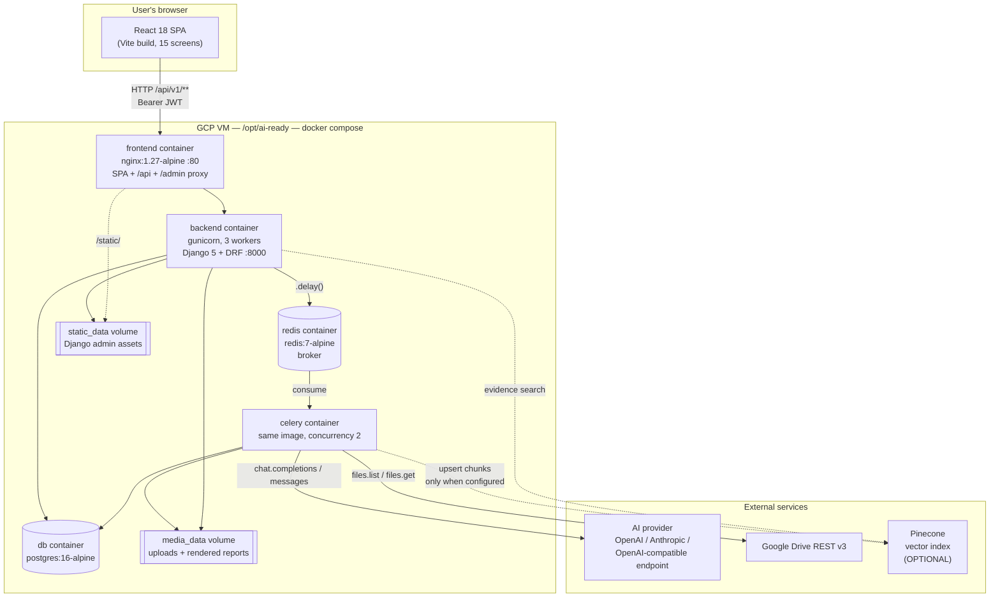

Dotted edges are the optional vector store: with `PINECONE_API_KEY` unset they do
not exist at runtime, and nothing else in the diagram changes.

**Defining architectural properties, all verified in code:**

* **Domain-per-app.** Twelve Django apps, each owning its models/views/serializers/
  services. Nested `/sprints/<id>/…` routes are composed in `apps/sprints/urls.py`
  by importing views from their owning app — so URL shape does not force logic into
  one app.
* **UUID primary keys everywhere.** No integer IDs are exposed by any endpoint.
* **Nothing is fabricated.** This is an explicit, repeated design stance in the
  code: empty sources produce honest empty sections, the AI is instructed to
  return `null` rather than guess, and Python re-validates every AI-supplied field.
* **Append-only history.** `FactReviewHistory`, `BaselineDecisionHistory`,
  `ScoringRun.pillar_snapshot`, and `Report.version` all preserve prior state
  rather than overwriting it.
* **Deterministic where possible, AI only where necessary.**
  `apps/extraction/services/gap_detector.py` states it plainly: gap detection is
  100% rule-based; AI is reserved for the one judgement that genuinely needs
  interpretation ("do these two facts actually contradict each other?").
* **Institution scoping is enforced twice** — by queryset filtering on list
  endpoints and by an explicit object-level check on nested sub-resources
  (`apps/sprints/access.py::get_authorized_sprint`).
---

# 2. Complete project workflow

The **AI Readiness Audit** is a **linear 10-step wizard** driven by a sprint's
status, and it is the flow this section traces end to end.

It is no longer the whole application, though. Since the navigation rebuild, the
sidebar (`frontend/src/components/Sidebar.tsx`) presents the approved product
plan in two groups, and those ten numbered steps sit *inside* one of its modules:

```text
WORK COMPLETION
  Project Status Dashboard          ← build-progress report (frontend only)

PLATFORM MODULES
  Dashboard                         ← live
  Institution DNA                   ← live
  AI Readiness Audit                ← live; owns the 10 steps below
     1. Sprint Setup ... 10. Report & Export
  Evidence Intelligence             ← next in the plan; inert
  Transformation Plan               ← planned; inert
  Goals & Tasks · AI Chatbot · Reminders
  Compliance Mapping · UAT Readiness · Admin / Settings
```

Only the four `live` entries are navigable. The rest render dimmed and
`aria-disabled`, so the full platform shape stays visible without offering dead
links. Nothing collapses — every step is always on screen.

## 2.1 The sprint state machine

Defined in `backend/apps/sprints/models.py::Sprint.ALLOWED_TRANSITIONS`. `archived`
is terminal and reachable from every non-terminal state.

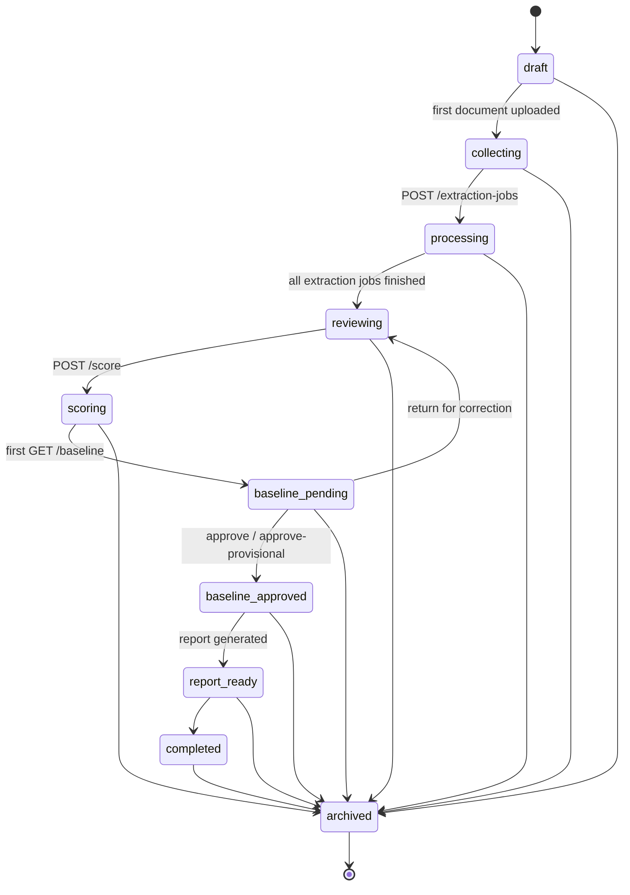

Each status carries a **deterministic completion milestone**
(`Sprint.STATUS_COMPLETION_MILESTONES`), applied automatically on a status change
unless the caller supplies an explicit `completion_percentage`:

| Status | % | Status | % |
|---|---|---|---|
| `draft` | 0 | `baseline_pending` | 80 |
| `collecting` | 15 | `baseline_approved` | 85 |
| `processing` | 35 | `report_ready` | 90 |
| `reviewing` | 55 | `completed` | 100 |
| `scoring` | 75 | `archived` | 100 |

`Sprint.BASELINE_LOCKED_STATUSES = {baseline_approved, report_ready, completed}` —
once in any of these, `POST /score` is **refused**, so an approved baseline's
numbers can never drift out from under a report generated against them.

## 2.2 The end-to-end request/data flow

```mermaid
sequenceDiagram
    actor U as User (browser)
    participant SPA as React SPA
    participant NX as nginx
    participant API as Django/DRF
    participant DB as PostgreSQL
    participant R as Redis
    participant W as Celery worker
    participant AI as AI provider
    participant GD as Google Drive

    U->>SPA: Screen 1 — create sprint
    SPA->>NX: POST /api/v1/sprints (Bearer JWT)
    NX->>API: proxy_pass backend:8000
    API->>API: JWTAuthentication → CanManageSprint → institution check
    API->>DB: INSERT sprint (status=draft)
    API-->>SPA: 201 Sprint

    U->>SPA: Screen 2 — upload files / paste Drive link
    SPA->>API: POST /sprints/{id}/upload-file (multipart)
    API->>API: extension allowlist + 50MB cap + SHA-256 dedupe
    API->>DB: INSERT document (status=uploaded); sprint draft→collecting
    Note over API,GD: Drive path instead:<br/>POST /drive-import-jobs → Celery → GD list+download → same create path

    U->>SPA: Screen 3 — Start AI Processing
    SPA->>API: POST /sprints/{id}/extraction-jobs
    API->>DB: sprint collecting→processing; INSERT ExtractionJob per document
    API->>R: run_extraction_job.delay(job_id)
    API-->>SPA: 201 [ExtractionJob]  (returns immediately)

    R->>W: deliver task
    loop 7 pipeline stages
        W->>DB: UPDATE job.current_step / progress_percentage
    end
    W->>AI: classify (1 call)
    W->>W: pdfplumber reads pages
    W->>AI: extract facts (1 call per ≤12k-char chunk)
    W->>DB: INSERT ExtractedFact rows
    W->>DB: INSERT GapItem rows (deterministic)
    W->>AI: conflict verdicts (≤10 calls)
    W->>DB: INSERT conflict GapItems; document→processed
    W->>DB: last job done → sprint processing→reviewing + sprint-wide gap pass

    loop every 3s
        SPA->>API: GET /sprints/{id}/extraction-jobs
    end

    U->>SPA: Screens 4–6 — review facts, resolve gaps
    SPA->>API: POST /facts/{id}/confirm | correct | reject | request-evidence
    API->>DB: INSERT FactReviewHistory (old value) + UPDATE fact

    U->>SPA: Screen 7 — Live CRI
    SPA->>API: POST /sprints/{id}/score
    API->>DB: run 9-step engine → PillarScore ×8 + ScoringRun + sprint.overall_cri

    U->>SPA: Screen 8 — Baseline approval
    SPA->>API: GET /sprints/{id}/baseline   (bootstraps PENDING baseline)
    SPA->>API: POST /baseline/approve
    API->>DB: Baseline→approved; sprint→baseline_approved

    U->>SPA: Screen 9 — Recommendations
    SPA->>API: POST /sprints/{id}/recommendations/generate
    API->>DB: 3 generators → Recommendation rows

    U->>SPA: Screen 10 — Report
    SPA->>API: POST /sprints/{id}/reports
    API->>R: generate_report_task.delay(report_id)
    W->>DB: build 11 sections
    W->>W: render PDF (fpdf2) + DOCX (python-docx)
    W->>DB: report→ready; sprint baseline_approved→report_ready
    SPA->>API: GET /reports/{id}/download?file=pdf
    API-->>U: FileResponse (attachment)
```

## 2.3 Per-step breakdown (the 16 dimensions requested)

### Step 1 — Create a sprint

| Dimension | Detail |
|---|---|
| **1. User does** | **Selects** an existing institution and sets the academic year. That is the whole form now — see the two narrowings below |
| **2. Frontend** | `pages/sprints/SprintSetup.tsx` (~150 lines) |
| **3–5. API** | `POST /api/v1/sprints` (plus `GET /institutions` to populate the select) |
| **6. Request** | `{institution_id, academic_year}` |
| **7. Auth** | Bearer JWT required; `CanManageSprint` → write requires `super_admin`/`consultant`/`institution_admin` |
| **8. Controller** | `apps/sprints/views.py::SprintViewSet.create` → `perform_create` |
| **9. Business logic** | `user_can_access_institution()` re-checked at create time; `Sprint.save()` auto-assigns `sprint_code = SPR-<first 8 of UUID, uppercased>` |
| **10. DB** | `sprints_sprint` (INSERT), FK → `institutions_institution`, `accounts_user` |
| **11–12. External / jobs** | None |
| **13. Sequence** | Auth → role gate → institution gate → serializer validation → INSERT |
| **14. Response** | `201` + `SprintSerializer` |
| **15. Frontend use** | Navigates to `/sprint/{id}/upload` |
| **16. User sees** | The Upload Data Pack screen, with the sprint code in the sidebar |

**Two deliberate narrowings to this screen:**

1. **It no longer creates institutions.** The inline "create new institution
   profile" form is gone; institutions are owned by Institution DNA, so one place
   is responsible for institutional master data rather than two forms that can
   disagree. With no institutions on record the screen says so and disables
   submit, instead of quietly offering a create form.
2. **There is no sprint-mode picker.** The three cards (Quick CRI / Verified CRI /
   Full Digital Twin) were removed — the platform runs one discovery method. The
   frontend now omits `sprint_mode` from the payload entirely rather than
   hardcoding a value, so `Sprint.mode`'s model default (`verified_cri`) is the
   single place that decides it. `sprint_mode` was already `required=False` on
   `SprintSerializer`, so no backend change was needed. The `SprintMode` enum and
   the `mode` column both remain, unused by the UI.

### Step 2 — Upload the data pack

| Dimension | Detail |
|---|---|
| **1. User does** | Drags PDF/DOCX/XLSX/CSV/ZIP/images against a 10-item checklist, **or** pastes one Google Drive folder link |
| **2. Frontend** | `pages/documents/UploadDataPack.tsx` (537 lines — the largest screen) |
| **3–5. API** | `POST /sprints/{id}/upload-file` (multipart) · `POST /sprints/{id}/drive-import-jobs` · `GET /sprints/{id}/documents` · `DELETE /documents/{id}` |
| **6. Request** | multipart: `file`, `document_type`, `title?`, `owner_role?` — or `{drive_url}` |
| **7. Auth** | Bearer JWT; `get_authorized_sprint()` institution check |
| **8. Controller** | `apps/documents/views.py::SprintDocumentUploadView` / `SprintDriveImportJobListCreateView` |
| **9. Business logic** | `services.create_document_from_file()` → `DocumentUploadSerializer` validates **extension allowlist**, **`MAX_DOCUMENT_UPLOAD_SIZE` (50 MB)**, and **SHA-256 checksum uniqueness per sprint**; sets `ocr_required` from the extension; `mark_sprint_collecting()` moves `draft → collecting` |
| **10. DB** | `documents_document` (+ unique constraint `unique_document_checksum_per_sprint`), `documents_driveimportjob` |
| **11. External** | Google Drive REST v3 (`files.list`, `files.get?alt=media`, `files.export`) — Drive path only |
| **12. Jobs** | `run_drive_import_job` (Drive path only; direct upload is synchronous) |
| **13. Sequence** | Auth → sprint access → validate → checksum → save file to `media/` → INSERT → sprint status bump |
| **14. Response** | `201 DocumentSerializer` (with a `download_url`) or `201 DriveImportJobSerializer` |
| **15. Frontend use** | Refreshes the checklist, ticking off matched types |
| **16. User sees** | A green tick per required document; Drive import shows found/missing/unmatched/skipped |

### Step 3 — AI processing

| Dimension | Detail |
|---|---|
| **1. User does** | Clicks "Start AI Processing", then watches a live progress board |
| **2. Frontend** | `pages/documents/AIProcessingMonitor.tsx` — polls **every 3000 ms** (`POLL_INTERVAL_MS`) |
| **3–5. API** | `POST /sprints/{id}/extraction-jobs` · `GET /sprints/{id}/extraction-jobs` · `POST /extraction-jobs/sprints/{id}/cancel` · `DELETE /extraction-jobs/{id}` |
| **6. Request** | `{}` (all eligible documents) or `{document_id}` for one |
| **7. Auth** | Bearer JWT + institution check |
| **8. Controller** | `apps/extraction/views.py::SprintExtractionJobListCreateView.create` |
| **9. Business logic** | `_eligible_documents()` = documents in `uploaded`/`failed` **excluding** any with an active job; **sprint status is flipped to `processing` *before* dispatch** (deliberate — an eager task would otherwise race the "advance to reviewing" check) |
| **10. DB** | `extraction_extractionjob` (INSERT per document); later `facts_extractedfact`, `gaps_gapitem`, `documents_document` |
| **11. External** | The configured AI provider |
| **12. Jobs** | `run_extraction_job` — `max_retries=EXTRACTION_MAX_RETRIES` (3), `acks_late=True` |
| **13. Sequence** | See the 7-stage pipeline in §9.2 |
| **14. Response** | `201 [ExtractionJobSerializer]` immediately — never waits for the AI |
| **15. Frontend use** | Renders per-document `current_step` + `progress_percentage`; `humanizeExtractionError()` rewrites raw SDK errors into readable lines |
| **16. User sees** | A 7-stage progress bar per document, then "review workspace ready" |

### Step 4–6 — Fact review, gaps, owner workspace

| Dimension | Detail |
|---|---|
| **1. User does** | Filters extracted facts, reads the source snippet, then confirms / corrects / rejects / requests evidence; separately works the gap list |
| **2. Frontend** | `pages/facts/FactsReview.tsx`, `pages/facts/ConfirmationWorkspace.tsx`, `pages/gaps/GapDashboard.tsx` |
| **3–5. API** | `GET /sprints/{id}/facts` · `POST /facts/{id}/{confirm\|correct\|reject\|request-evidence}` · `GET /sprints/{id}/gaps` · `POST /gaps/{id}/{resolve\|mark-unavailable\|skip}` |
| **6. Request** | `{comment}` or `{corrected_value, comment}` / `{value}` |
| **7. Auth** | `CanReviewFacts` / `CanResolveGaps` — **every role except `viewer`**; plus per-object institution check |
| **8. Controller** | `apps/facts/views.py::BaseFactActionView` (shared plumbing for all four actions), `apps/gaps/views.py::BaseGapActionView` |
| **9. Business logic** | The history row is written **first**, capturing `original_value` as it stood *before* the action; only then is the fact updated. There is deliberately **no generic `PATCH /facts/{id}`** — every change must go through an action so nothing bypasses the audit trail |
| **10. DB** | `facts_extractedfact`, `facts_factreviewhistory`, `gaps_gapitem` |
| **11–12.** | None — fully synchronous |
| **13. Sequence** | Auth → role gate → object institution check → serializer → INSERT history → UPDATE fact/gap |
| **14. Response** | `200 ExtractedFactDetailSerializer` / `GapItemSerializer` |
| **15. Frontend use** | Optimistically updates the row and advances to the next item |
| **16. User sees** | The fact turns green (confirmed) / amber (corrected) / grey (rejected); gap counters drop |

### Step 7 — Live CRI

| Dimension | Detail |
|---|---|
| **1. User does** | Opens the score screen; optionally clicks "Recalculate" |
| **2. Frontend** | `pages/scoring/LiveCRIPreview.tsx` |
| **3–5. API** | `GET /sprints/{id}/score` (bootstraps a first run if never scored) · `POST /sprints/{id}/score` (forced recalculation) · `GET /sprints/{id}/score/history` |
| **7. Auth** | `CanManageSprint` |
| **8. Controller** | `apps/scoring/views.py::SprintScoreView` |
| **9. Business logic** | `run_scoring_engine()` — the nine-step engine in §6.4. `POST` is **refused** if `sprint.status in BASELINE_LOCKED_STATUSES`. A successful `POST` also moves `reviewing → scoring` |
| **10. DB** | Reads `facts_extractedfact` (confirmed/corrected only) + `gaps_gapitem` (open/in_progress); writes `scoring_pillarscore` (upsert ×8), `scoring_scoringrun` (INSERT), `sprints_sprint.overall_cri/confidence_score` |
| **11–12.** | None — **no AI is involved in scoring** |
| **14. Response** | `SprintScoreSerializer`: overall CRI, confidence, 8 pillar scorecards, strengths, weaknesses, live evidence metrics, unresolved blocking gaps |
| **16. User sees** | An 8-pillar radar/bar view with a headline CRI/100 and a confidence percentage |

### Step 8 — Baseline approval

| Dimension | Detail |
|---|---|
| **1. User does** | Reviews the score, then approves / approves provisionally / returns for correction with a reason |
| **2. Frontend** | `pages/scoring/BaselineApproval.tsx` (352 lines) |
| **3–5. API** | `GET /sprints/{id}/baseline` · `POST /baseline/approve` · `POST /baseline/approve-provisional` · `POST /baseline/return` |
| **7. Auth** | `CanApproveBaseline` → `super_admin` / `consultant` / `institution_admin` only |
| **9. Business logic** | `GET` **bootstraps** a `PENDING` Baseline pinned to the latest `ScoringRun` and moves the sprint to `baseline_pending`. **Full approval is refused server-side while any blocking gap is unresolved** — provisional approval is the documented way past it. Return requires non-blank `comments` and sends the sprint back to `reviewing` |
| **10. DB** | `scoring_baseline` (FK `PROTECT` → `scoring_scoringrun`), `scoring_baselinedecisionhistory` (append-only) |
| **14. Response** | `{baseline, score, high_priority_gaps, can_approve}` on GET; `BaselineSerializer` on the actions |
| **16. User sees** | The approve button disabled with a blocking-gap count, or a confirmed approval banner |

### Step 9–10 — Recommendations and report

| Dimension | Detail |
|---|---|
| **1. User does** | Generates recommendations, edits them (consultants only), then generates and downloads the report |
| **2. Frontend** | `pages/recommendations/RecommendationsReview.tsx`, `pages/reports/ReportPreviewExport.tsx` (polls every 3 s) |
| **3–5. API** | `POST /sprints/{id}/recommendations/generate` · `PATCH /recommendations/{id}` · `POST /sprints/{id}/reports` · `GET /reports/{id}` · `GET /reports/{id}/download?file=pdf\|docx` |
| **7. Auth** | `CanManageRecommendations` to generate; **`CanEditRecommendation` (super_admin/consultant only)** to edit; `CanManageSprint` for reports |
| **9. Business logic** | Three idempotent generators (gap-driven, evidence-driven, pillar-weakness-driven). Report generation creates a **new version row** (`next_report_version`) and dispatches `generate_report_task` |
| **12. Jobs** | `generate_report_task` — **no retries by design** (it reads already-validated data; a failure is a real bug) |
| **10. DB** | `recommendations_recommendation` (+ M2M `supporting_facts`), `reports_report` (unique `(sprint, version)`) |
| **14. Response** | `202` + `ReportSerializer` while generating; `FileResponse` on download |
| **16. User sees** | An 11-section report preview and a PDF/DOCX download |

---

# 3. Every major feature

## 3.1 Authentication

**Purpose:** Issue and verify JWTs; there is no self-registration.

- **User flow:** open `/login` → either type credentials or click one of eleven
  quick-login persona buttons → land on `/dashboard`.
- **Frontend:** `pages/auth/Login.tsx`, `context/AuthContext.tsx`, `api/client.ts`.
- **API:** `POST /auth/login` → `{access_token, refresh_token, user}`;
  `GET /auth/me`; `POST /auth/logout` (blacklists the refresh token, returns `205`);
  `POST /auth/refresh`; `POST /auth/change-password`.
- **Backend:** `apps/accounts/views.py`, `serializers.py`, `tokens.py`.
- **Database:** `accounts_user`, plus SimpleJWT's `token_blacklist_*` tables.
- **External services:** none.
- **Processing:** `LoginSerializer` calls Django's `authenticate()` with
  `username=email` (the model's `USERNAME_FIELD` is `email`), rejects inactive
  accounts, then `get_tokens_for_user()` mints the pair.
- **Output:** tokens stored in `localStorage` under `aios_token` / `aios_refresh_token`.

## 3.2 Institution management

**Purpose:** The tenant boundary — every other record is ultimately scoped to one.

- **API:** `GET|POST /institutions`, `GET|PUT|PATCH|DELETE /institutions/{id}`.
- **Backend:** `apps/institutions/views.py::InstitutionViewSet`.
- **Frontend:** `pages/institutions/InstitutionList.tsx` — the list, the **create form**, and per-row delete.
- **Database:** `institutions_institution` (UUID PK). `is_active` still exists on the
  model, but **DELETE is now a hard cascade**, not a flag flip — so the field only
  lingers on institutions removed before that change. The list page hides its Status
  column entirely when nothing is inactive.
- **Notable:** list is filtered by `get_accessible_institution_ids()`, but **detail
  actions deliberately use the unscoped queryset** so an out-of-scope institution
  returns `403` (via `IsInstitutionMember`) rather than `404` — the same pattern
  is used in `SprintViewSet`.
- **Two role sets, deliberately asymmetric:** `WRITE_INSTITUTION_ROLES` =
  `super_admin` / `consultant` / `institution_admin` for create and update;
  `DELETE_INSTITUTION_ROLES` = `super_admin` / `consultant` for delete, which is
  narrower because deleting an institution takes every sprint under it with it.

## 3.2a Institution DNA

**Purpose:** The institutional baseline every discovery sprint is measured
against — who the institution is, who leads it, what departments it has, and what
IT estate it runs. Previously this lived nowhere; the sprint-setup form captured a
handful of fields and nothing else.

**User flow:** open **Institution DNA** → pick an institution (a selector appears
only when more than one is accessible) → work three tabs:

| Tab | Contents |
|---|---|
| **Institution Profile** | Name, type, location, accreditation, student/faculty counts, derived department & programme counts, leadership list, priority tags |
| **Departments** | One card per department: head, faculty / students / programmes |
| **Systems & IT** | Digital-maturity level (1–5) with its rubric description, the systems list with `Legacy` / `Manual` tags, and a current-AI-usage note |

**Frontend:** two pages. `pages/institutions/InstitutionList.tsx` (323 lines) is the
landing page — the table, the create form, and per-row delete;
`pages/institutions/InstitutionDetail.tsx` (1 035 lines) is one institution's
workspace — three tab components, an inline `Field`, a priority-tag editor, a
leadership card, and a department stat tile. Create and delete live on the *list*
because they act on the institution as a whole rather than on any field of its
profile.

**API:** `GET /institutions/{id}` (detail serializer) · `PATCH /institutions/{id}`
· `GET|POST /institutions/{id}/{leaders,departments,systems}` ·
`GET|PATCH|DELETE` on each `/{id}` beneath those. See §7.

**Backend:** `apps/institutions/` — `models.py`, `serializers.py`, `views.py`,
`constants.py`, `urls.py`, migration `0003`.

**Database:** `institutions_institution` gained `student_count`, `faculty_count`,
`priorities` (JSON), `digital_maturity_level`, `current_ai_usage`. Three new
tables: `institutions_institutionleader`, `institutions_department`,
`institutions_institutionsystem`. See §6.

**External services:** none.

**Processing / design decisions worth knowing:**

- **Derived vs. stored counts.** Department and programme counts are *computed*
  from the department rows (`department_count`, `program_count` on the detail
  serializer) and are read-only in the UI, labelled `DERIVED`. Student and
  faculty totals are *stored* on the institution, because an institution's
  official total legitimately differs from the sum of whichever departments have
  been entered so far — reporting a partial sum as the total would be wrong
  rather than merely incomplete.
- **Leader initials are derived** from the name in the serializer, never stored, so
  they cannot go stale when a name is corrected.
- **The maturity rubric is a constant, the level is data.** `constants.py` holds
  the five level descriptions; the level itself is a column. Same split
  `apps.scoring.constants` makes between pillar keys and pillar weights.
- **One access check covers all three sub-resources.** They are nested under
  `/institutions/{institution_id}/…`, and `InstitutionScopedMixin` resolves and
  authorizes the institution once, scoping every queryset to it — which is what
  makes an id from another institution a `404` on the route rather than something
  each view has to check for.

**Output:** the institution's full profile, editable in place by the roles in §8.

**Dependencies:** requires an `Institution` to exist. Sprint Setup now depends on
this module for institution creation.

## 3.3 Sprint management

**Purpose:** The unit of work. Everything else hangs off a sprint.

- **API:** full CRUD plus `GET /sprints/{id}/overview` — a single call returning the
  sprint, institution, document counts by status (7 buckets), fact counts by status
  (6 buckets), gap counts (5 buckets), the scorecard, recommendations, reports, and
  the latest extraction job.
- **Backend:** `apps/sprints/views.py`, `serializers.py`, `filters.py`, `access.py`.
- **Notable:** `DELETABLE_STATUSES = {draft, completed, archived}` — an in-progress
  sprint cannot be hard-deleted, only archived. `overview` calls
  `build_score_snapshot(sprint, bootstrap=False)` specifically so that *loading a
  dashboard does not persist new scoring rows*.
- **Dependency:** every other feature requires a sprint.

## 3.4 Document management + Google Drive import

**Purpose:** Get institutional evidence into the system safely.

- **User flow (Drive):** paste `https://drive.google.com/drive/folders/<id>` →
  job created → worker walks the folder tree breadth-first → each filename is
  matched against `DRIVE_IMPORT_CHECKLIST` keywords → matched files are downloaded
  (Google-native docs are **exported** to PDF/XLSX first) → imported through the
  *same* `create_document_from_file()` path as a manual upload.
- **API:** `POST /sprints/{id}/drive-import-jobs`, `GET` the same path.
- **Backend:** `apps/documents/{views,services,tasks,drive_import,constants}.py`.
- **Database:** `documents_document`, `documents_driveimportjob` (`results` JSON
  holds per-checklist-slot `found`/`missing`, plus `unmatched_files` and
  `skipped_files` with reasons).
- **External:** Google Drive REST v3, authenticated with a **single server-side API
  key** — no OAuth, no per-institution tokens. This requires the folder to be
  shared *"Anyone with the link — Viewer"*.
- **Safety caps:** `GOOGLE_DRIVE_IMPORT_MAX_FILES` (200),
  `GOOGLE_DRIVE_IMPORT_MAX_FOLDERS` (200), `visited` set against cycles,
  30 s list timeout / 60 s download timeout, 3 retries with exponential backoff.
- **Known inconsistency (documented in the code):** `DRIVE_IMPORT_CHECKLIST` slugs
  (`aqar_report`, `faculty_master`, `research_publications`, `syllabi_curriculum`,
  `ai_policy_doc`) **deliberately differ** from `DOCUMENT_TYPES` /
  `REQUIRED_DOCUMENT_TYPES` (`aqar`, `faculty_master_list`, …). The constants file
  says so explicitly and marks it out of scope. **Consequence:** a Drive-imported
  AQAR is stored as `aqar_report`, which does **not** satisfy the
  `missing_document` gap check for `aqar`. This is a real, live defect (see §17/§27).

## 3.5 AI extraction — see §9 for the deep dive

## 3.6 Fact review

**Purpose:** Human confirmation is what turns an AI guess into scoring evidence.

- Only `confirmed` and `corrected` facts count toward the CRI
  (`cri_engine._EVIDENCE_STATUSES`).
- Five statuses: `extracted` → `confirmed` | `corrected` | `rejected` |
  `evidence_requested`.
- `ExtractedFact.document` (extraction lineage, set once) is deliberately separate
  from `ExtractedFact.source_document` (the *current* evidence citation, which a
  correction may repoint) — so a correction never rewrites where the fact came from.
- Filtering/ordering via `django-filter` on `field_key`, status, confidence, etc.

## 3.7 Gap management

Five gap types, each with its own dedup key enforced by **three partial unique
constraints** on `GapItem`:

| Gap type | Scoped by | Raised by | Priority |
|---|---|---|---|
| `missing_document` | `(sprint, gap_type, title)` | sprint-wide pass only | **blocking** |
| `unconfirmed_fact` | `source_fact` | per-document + sprint-wide | medium |
| `low_confidence` | `source_fact` | per-document + sprint-wide | high (<0.5) / medium (<0.7) |
| `conflict` | `title` (stable per `field_key`) | AI conflict checker + sprint-wide | high |
| `stale_data` | `related_document` | per-document + sprint-wide | medium |

`create_gap_if_new()` is the single shared idempotency primitive — an `exists()`
check plus an `IntegrityError` catch for the race, so the per-document detector and
the end-of-sprint pass can both run without duplicating rows.

## 3.8 CRI scoring — see §6.4

## 3.9 Baseline approval, recommendations, reports — covered in §2.3

## 3.10 Dashboard

`GET /api/v1/dashboard` returns seven live metrics (`active_sprints`,
`completion_percentage`, `reports_ready`, `pending_confirmations`,
`high_priority_gaps`, `sprint_count`, `institution_count`) plus the accessible
sprint list. The code comments explicitly explain why each metric is its own query
rather than one combined `.aggregate()` — mixing `Count()` over multiple reverse
FKs fans out the join and inflates results.

## 3.11 Vector store — semantic evidence retrieval `[IMPLEMENTED]`

`apps/vector_store/` (2 703 lines across 15 modules) indexes the **text of a
college's uploaded documents** into **Pinecone** so that a natural-language
question — *"AI-certified faculty and faculty AI training"* — returns the passages
that answer it, each citable back to a document and a page.

**It is entirely optional.** With `PINECONE_API_KEY` / `PINECONE_INDEX_NAME` unset,
`indexer.is_enabled()` is `False`: no task is queued, no row is written, and upload,
extraction, scoring, approval and reports behave exactly as they did before the app
existed. The three endpoints answer **`503` with a stated reason**, not `500` and not
a silently empty list — "not configured" and "no results" must be distinguishable.
`pinecone` is imported lazily inside `pinecone_client`, so the project boots and the
whole suite passes with the SDK absent.

### What it is not

Stated explicitly because the scope is easy to overread:

| Not this | Why |
|---|---|
| A replacement for PostgreSQL | Postgres remains the source of truth for **every** structured record. Pinecone holds embeddings plus the metadata needed to filter and cite them — nothing else is copied across |
| Part of CRI scoring | The 9-step engine (§6.4) is untouched and still fully deterministic. No vector influences a score |
| A benchmarking framework | **No benchmark criteria, benchmark vectors or comparison logic exist.** This is the retrieval layer such a framework would call. `source_type` is already pinned to `college_document` on every write *and* every query, so benchmark vectors could later share the index without either kind leaking into the other |
| Coupled to one vendor | `EmbeddingService` is an ABC; `OpenAIEmbeddingService` is one implementation, and `EMBEDDING_BASE_URL` points it at any OpenAI-compatible endpoint. `pinecone_client` is the **only** module that imports the SDK |

### The indexing pipeline

`services/indexer.py::index_document` — read → hash → chunk → embed → upsert:

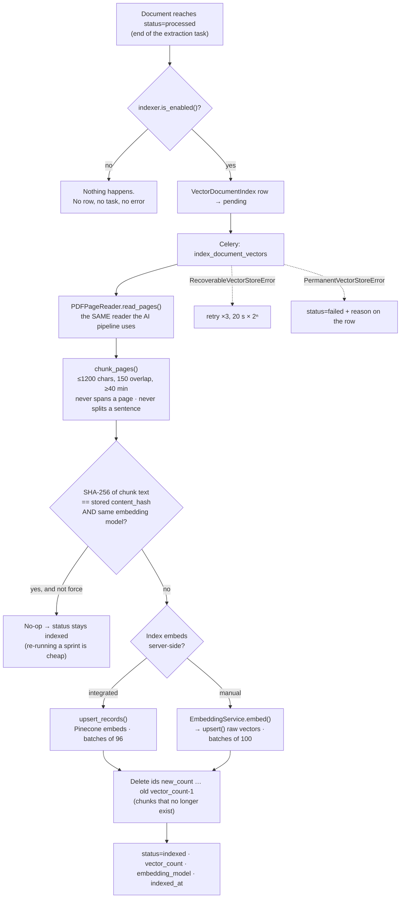

Three details worth naming:

- **A chunk never spans a page.** The page number *is* the citation this platform
  promises, so a chunk straddling a page boundary could not be cited honestly.
- **The content hash is over extracted text, not the file.** Re-uploading the same
  PDF with different metadata is a no-op; a file whose text extraction *improved*
  re-embeds. `Document.checksum` cannot express either.
- **Vector ids are deterministic** —
  `college_{institution}_document_{document}_chunk_{n}` — so a re-index overwrites
  in place instead of duplicating. That, plus the stale-id delete, is what makes
  indexing idempotent.

### Institution isolation

The hard requirement: one college must never retrieve another's documents.

```python
metadata_filter = {
    'college_id':  {'$eq': str(institution_id)},
    'source_type': {'$eq': SOURCE_TYPE_COLLEGE_DOCUMENT},
}
```

- The filter is **built inside `search.build_filter()`**, never accepted from the
  caller, so no call site can omit or widen it.
- `institution_id` comes from **the sprint in the URL**, never the request body — the
  search serializer has no institution field at all.
- Filtering happens **server-side in Pinecone**, not by discarding rows after
  retrieval.
- `pinecone_client._require_filter()` raises rather than issuing an unfiltered
  query: *"an unfiltered query would cross institutions."*

### Vector metadata

Exactly nine keys, doing exactly two jobs — isolation and traceability:

| Key | Job |
|---|---|
| `college_id`, `sprint_id`, `source_type` | Isolation (filtered on, server-side) |
| `document_id`, `document_name`, `document_type`, `page_number`, `chunk_index` | Traceability — so a hit renders as *"Faculty_Report.pdf, page 17"* |
| `text` | The chunk itself, so a result is readable without a second round trip |

Nothing else from PostgreSQL is copied in; a field that is neither filtered nor
cited would only be a second copy that drifts. **The original PDF/DOCX is never
uploaded to Pinecone** — only extracted text.

### Two Pinecone modes

The index may embed server-side or take raw vectors, and the two use *different
APIs* — which is why this is a mode, not just another embedding provider:

| Mode | Who embeds | Pinecone API | Batch cap |
|---|---|---|---|
| `integrated` | Pinecone (e.g. `llama-text-embed-v2`) | `upsert_records` / `search` | **96** |
| `manual` | This app, via `EmbeddingService` | `upsert` / `query` | 100 |
| `auto` *(default)* | Detected once per process via a cached `describe_index`, never in the request path | — | — |

Because Anthropic publishes no embedding endpoint, `EMBEDDING_API_KEY` is separate
from `AI_API_KEY`: a deployment running Claude for extraction still needs an
OpenAI-compatible key *for manual mode only*. Integrated mode needs no embedding key
at all, and `is_enabled()` knows not to demand one.

### Observability

`VectorDocumentIndex` (one row per document) is the retryable, inspectable record —
the same role `ExtractionJob` plays for extraction. It stores *that* a document is
indexed, with which model, how many vectors, when, and why it failed. **It stores no
embeddings**: those live in Pinecone, and a second copy here would have no reader.

### Endpoints

Three, all sprint-scoped — see §7.1. Pinecone is never exposed: no index name, no
host, no key, and no raw match object reaches the client.

## 3.12 Feature dependency graph

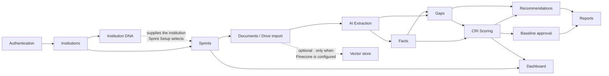

Institution DNA sits alongside the audit rather than inside it: it holds the
institution's standing baseline, which every sprint is then measured against. It is
also where institutions are **created** — Sprint Setup only selects one — but the
audit pipeline does not read DNA records; connecting the two (for example, checking
an extracted faculty count against the recorded one) is not implemented.

The vector store hangs off documents as a **leaf**: extraction feeds it, and nothing
downstream depends on it. Removing it, or never configuring it, changes no other
edge in this graph.
---

# 4. Frontend architecture

## 4.1 Framework and build

**React 18.2 + TypeScript 5.2 + Vite 5.1**, no meta-framework, no SSR. Built with
`tsc && vite build` into `dist/`, then baked into an nginx image.

Dev server: `vite --host 0.0.0.0 --port 3000`, with a proxy sending `/api` →
`http://localhost:8000` (`vite.config.ts`). In production nginx does the same job.

## 4.2 Structure

```
frontend/src/
├── main.tsx              # ReactDOM.createRoot bootstrap
├── App.tsx               # Router + all 17 route entries, ProtectedLayout
├── api/                  # 14 axios modules, one per backend domain
│   └── client.ts         # the shared axios instance + interceptors
├── context/
│   ├── AuthContext.tsx   # user/token/login/logout/loading
│   └── ThemeContext.tsx  # light/dark
├── hooks/useApiResource.ts   # the single data-fetching hook
├── layouts/AppShell.tsx      # Navbar + Sidebar + content
├── components/           # Navbar, Sidebar, ApiStates
├── pages/                # 14 screens across 11 folders
├── types/                # 12 type modules, re-exported by types/index.ts
├── utils/errors.ts       # getErrorMessage + humanizeExtractionError
└── index.css             # Tailwind + design tokens
```

## 4.3 Routing

All routes are declared in `App.tsx`. **There is no lazy loading** — every page is
a static top-level import, so the whole app ships as one bundle.

| Path | Guard | Component |
|---|---|---|
| `/login` | `LoginRoute` — redirects to `/dashboard` if a session exists | `Login` |
| `/dashboard` | `ProtectedLayout` | `Dashboard` |
| `/status-dashboard` | `ProtectedLayout` | `StatusDashboard` — "Project Status Dashboard" |
| `/institution-dna` | `ProtectedLayout` | `InstitutionList` — the list, create form and delete |
| `/institution-dna/:institutionId` | `ProtectedLayout` | `InstitutionDetail` — one institution's 3-tab workspace |
| `/sprint/setup` | `ProtectedLayout` | `SprintSetup` |
| `/sprint/:sprintId/upload` | `ProtectedLayout` | `UploadDataPack` |
| `/sprint/:sprintId/monitor` | `ProtectedLayout` | `AIProcessingMonitor` |
| `/sprint/:sprintId/facts` | `ProtectedLayout` | `FactsReview` |
| `/sprint/:sprintId/gaps` | `ProtectedLayout` | `GapDashboard` |
| `/sprint/:sprintId/confirmation` | `ProtectedLayout` | `ConfirmationWorkspace` |
| `/sprint/:sprintId/score` | `ProtectedLayout` | `LiveCRIPreview` |
| `/sprint/:sprintId/approval` | `ProtectedLayout` | `BaselineApproval` |
| `/sprint/:sprintId/recommendations` | `ProtectedLayout` | `RecommendationsReview` |
| `/sprint/:sprintId/report` | `ProtectedLayout` | `ReportPreviewExport` |
| `/`, `*` | — | `Navigate → /dashboard` |

**`ProtectedLayout` checks only for a session (`user`), never a role.** All
role enforcement is server-side. This is a deliberate simplification, but it means
a `viewer` can open the Baseline Approval screen and only discover they cannot act
when the API returns `403`.

## 4.4 State management

There is **no Redux/Zustand/React Query**. State is:

1. **`AuthContext`** — the only global state (user, token, loading).
2. **`ThemeContext`** — light/dark.
3. **`useApiResource<T>(fetcher, deps, enabled)`** — a custom hook giving
   `{data, setData, loading, error, refetch}`. It stores the fetcher in a ref so
   callers can pass a fresh inline arrow on every render without retriggering the
   effect; only `deps`/`enabled` do that. `enabled` exists so a page can skip the
   request while its `sprintId` is still a placeholder, without violating the rules
   of hooks.
4. **Local `useState`** per page for forms and optimistic updates.

## 4.5 API communication

`api/client.ts` is a single axios instance with `baseURL: '/api/v1'` and two
interceptors:

**Request interceptor** — attaches `Authorization: Bearer <aios_token>` from
`localStorage`.

**Response interceptor — silent refresh on 401:**

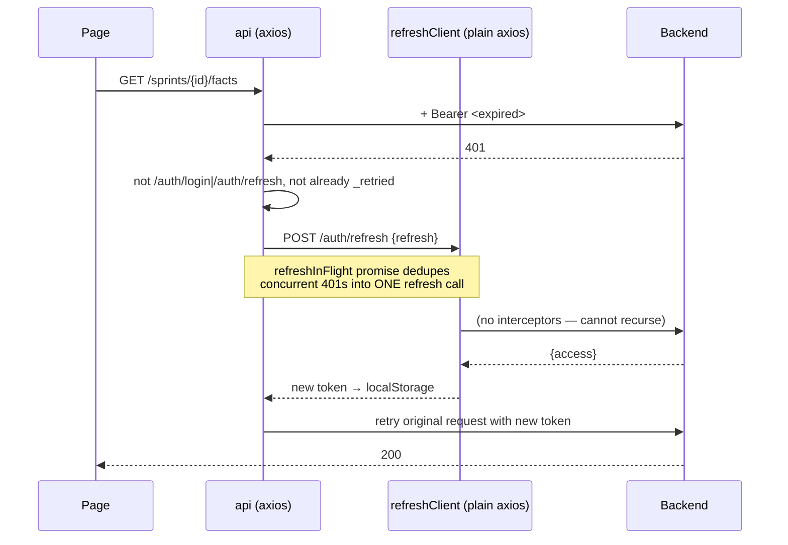

If the refresh fails, `clearSessionAndRedirect()` wipes both tokens and hard-navigates
to `/login` (guarding against a redirect loop when already there).

## 4.6 Token / session handling

| Concern | Implementation |
|---|---|
| Storage | `localStorage`: `aios_token` (access), `aios_refresh_token` (refresh) |
| Rehydration | `AuthContext` effect calls `GET /auth/me` whenever `token` changes; a failure clears the session |
| Logout | Best-effort `POST /auth/logout` to blacklist the refresh token, **then** clear locally — the comment explains the ordering matters because clearing first would race the outgoing request's `Authorization` header out from under it |
| Refresh rotation | Access token replaced in place; the refresh token is **not** rotated (backend has `ROTATE_REFRESH_TOKENS: False`) |

## 4.7 Forms, uploads, errors, loading

- **Forms:** plain controlled `useState` inputs. No form library.
- **File upload:** `FormData` + `api.post(..., {headers: {'Content-Type': 'multipart/form-data'}})` in `api/documents.ts`.
- **File download:** `api.get('/reports/{id}/download', {responseType: 'blob'})`.
- **Errors:** `utils/errors.ts::getErrorMessage()` normalises all three DRF error
  shapes — `{detail}`, `{non_field_errors: [...]}`, and `{field: [msg]}` — into one
  display string. `humanizeExtractionError()` additionally rewrites known backend
  extraction errors (rate limit, timeout, unreachable, corrupt PDF, unconfigured
  key) into user-facing guidance, and correctly suppresses "this will retry
  automatically" once retries are exhausted.
- **Loading/empty/error UI:** shared in `components/ApiStates.tsx`.
- **Polling:** `AIProcessingMonitor` and `ReportPreviewExport` both `setInterval`
  at **3000 ms**, using a ref to the latest refetch so the interval isn't rebuilt.

## 4.8 Page / component table

| Page or component | Purpose | APIs used | Important logic |
|---|---|---|---|
| `pages/auth/Login.tsx` (147) | Sign in | `POST /auth/login` | Ships an **11-persona quick-login list with a hardcoded password** — see §17 |
| `pages/dashboard/Dashboard.tsx` (231) | Cross-sprint overview | `GET /dashboard` | Renders 7 metric tiles + sprint cards |
| `pages/status/StatusDashboard.tsx` (~300) | Build-progress report | — | **No API calls.** Every figure is a module-level constant; the headline counts are derived from that list rather than typed. See §25 |
| `pages/institutions/InstitutionList.tsx` (323) | Institution DNA landing page | `GET/POST /institutions`, `DELETE /institutions/{id}` | Create gated to `WRITE_INSTITUTION_ROLES`, delete to the narrower `DELETE_INSTITUTION_ROLES`; blank optional fields are omitted from the POST rather than sent as `""` |
| `pages/institutions/InstitutionDetail.tsx` (1 035) | One institution, 3 tabs | `GET/PATCH /institutions/{id}`, `+/leaders`, `+/departments`, `+/systems` | Derived vs. stored counts; write actions offered only to the roles in §8 |
| `pages/sprints/SprintSetup.tsx` (~150) | Audit step 1 | `GET /institutions`, `POST /sprints` | **Selects** an institution — no longer creates one, and no mode picker |
| `pages/documents/UploadDataPack.tsx` (537) | Screen 2 | `GET/POST /sprints/{id}/documents`, `upload-file`, `drive-import-jobs`, `DELETE /documents/{id}` | Holds `REQUIRED_CHECKLIST`, the frontend twin of `DRIVE_IMPORT_CHECKLIST` — **kept in sync by hand** |
| `pages/documents/AIProcessingMonitor.tsx` (256) | Screen 3 | `GET/POST /sprints/{id}/extraction-jobs`, cancel, `DELETE` | 3 s polling; `humanizeExtractionError` |
| `pages/facts/FactsReview.tsx` (249) | Screen 4 | `GET /sprints/{id}/facts`, 4 fact actions | Filter by status/pillar/confidence |
| `pages/gaps/GapDashboard.tsx` (192) | Screen 5 | `GET /sprints/{id}/gaps`, resolve/skip/mark-unavailable | Groups by priority |
| `pages/facts/ConfirmationWorkspace.tsx` (193) | Screen 6 | facts + fact actions | Owner-role-oriented queue |
| `pages/scoring/LiveCRIPreview.tsx` (127) | Screen 7 | `GET/POST /sprints/{id}/score` | Shows 8 pillars + confidence |
| `pages/scoring/BaselineApproval.tsx` (352) | Screen 8 | `GET /baseline`, approve, approve-provisional, return | Disables approve when `can_approve === false` |
| `pages/recommendations/RecommendationsReview.tsx` (200) | Screen 9 | `GET/POST recommendations`, `PATCH /recommendations/{id}` | Renders `trigger_gap` as the citation |
| `pages/reports/ReportPreviewExport.tsx` (247) | Screen 10 | `GET/POST reports`, `GET /reports/{id}/download` | 3 s polling until `ready`; blob download |
| `components/Sidebar.tsx` (~250) | Whole-platform nav | — | Two groups (Work Completion / Platform Modules); the 10 audit steps nest under AI Readiness Audit and never collapse; unbuilt modules render dimmed + `aria-disabled` rather than as dead links |
| `components/Navbar.tsx` (66) | User menu | — | Uses `user.name` from the serializer |
| `components/ApiStates.tsx` (53) | Loading/error/empty | — | Shared across every page |
| `layouts/AppShell.tsx` (25) | Chrome | — | Navbar + Sidebar + `activeSprintId` |
| `hooks/useApiResource.ts` (49) | Fetch hook | all | Ref-stabilised fetcher, `enabled` gate |
| `api/client.ts` (80) | HTTP core | all | Token attach + dedupe-safe silent refresh |

## 4.9 Frontend execution flow

```
main.tsx
  └─ <App>
       └─ ThemeProvider
            └─ BrowserRouter
                 └─ AuthProvider          ← reads localStorage token, GET /auth/me
                      └─ AppRoutes
                           ├─ /login  → LoginRoute → Login
                           └─ /*      → ProtectedLayout
                                          ├─ loading?  → FullScreenLoading
                                          ├─ no user?  → <Navigate to="/login">
                                          └─ AppShell(activeSprintId)
                                               ├─ Navbar
                                               ├─ Sidebar (10 numbered steps)
                                               └─ <Page>
                                                     └─ useApiResource(...)
                                                          └─ api.get(...) → interceptors → /api/v1
```

---

# 5. Backend architecture

## 5.1 Framework

**Django 5.0.x + Django REST Framework**, served by **Gunicorn** (3 sync workers,
120 s timeout). `config/asgi.py` exists and `uvicorn` is in
`requirements/production.txt`, but **the compose file runs WSGI/gunicorn** — ASGI
is present but unused.

## 5.2 Structure

```
backend/
├── manage.py
├── config/
│   ├── settings.py        # single settings module; prod hardening under `if not DEBUG`
│   ├── urls.py            # root router + drf-spectacular schema/docs
│   ├── celery.py          # Celery('aios_backend'), autodiscover_tasks()
│   ├── pagination.py      # OptionalPageNumberPagination
│   ├── wsgi.py / asgi.py
├── apps/
│   ├── accounts/          models, serializers, views, tokens, permissions, management/commands/seed_demo_users
│   ├── institutions/      models (Institution + Leader/Department/System), serializers, views, constants, filters
│   ├── sprints/           models (state machine), views (+overview), access.py, filters
│   ├── documents/         models, serializers, views, services, tasks, drive_import, constants, utils, exceptions
│   ├── extraction/        models, serializers, views, tasks, exceptions, services/ (11 modules)
│   ├── facts/             models, serializers, views, filters
│   ├── gaps/              models, serializers, views, services, filters, constants
│   ├── scoring/           models, serializers, views, constants, services/{cri_engine, baseline}
│   ├── recommendations/   models, serializers, views, services
│   ├── reports/           models, serializers, views, services, tasks, rendering, utils
│   ├── dashboard/         serializers, views     ← no models; pure aggregation
│   └── vector_store/      models, serializers, views, tasks, exceptions, services/ (5 modules)
├── requirements/{base,development,production}.txt
├── docs/{API_CONTRACT.md, openapi.yaml, VECTOR_STORE.md}
├── Dockerfile, docker-entrypoint.sh, .dockerignore
```

## 5.3 Module table

| App | Purpose | Important files | Main responsibility |
|---|---|---|---|
| `config` | Project wiring | `settings.py`, `urls.py`, `celery.py`, `pagination.py` | Settings, root routing, Celery app, opt-in pagination |
| `accounts` | Identity + authorization | `models.py`, `permissions.py` (190 L), `tokens.py`, `management/commands/seed_demo_users.py` (163 L) | Custom `User`, 11 roles, **all reusable permission classes and the institution-scoping helpers** |
| `institutions` | Tenant **+ Institution DNA** | `models.py` (4 models), `serializers.py`, `views.py`, `constants.py`, `urls.py` | Institution CRUD (**DELETE is a hard cascade** — see §7.1); leadership, departments and IT systems as nested sub-resources; the digital-maturity rubric |
| `sprints` | Workflow spine | `models.py` (124 L, state machine), `views.py` (130 L), `access.py`, `urls.py` (144 L) | Sprint lifecycle, one-call overview, **composes every nested `/sprints/<id>/…` route** |
| `documents` | Evidence intake | `services.py`, `tasks.py` (154 L), `drive_import.py` (157 L), `constants.py` (84 L) | Upload validation, checksum dedupe, Drive import, authenticated download |
| `extraction` | The AI pipeline | `services/` (11 modules, ~1 700 L), `tasks.py` (114 L) | 7-stage pipeline, provider-agnostic AI, retry policy |
| `facts` | Human review | `models.py`, `views.py` (136 L) | 4 review actions + append-only `FactReviewHistory` |
| `gaps` | Data-gap tracking | `services.py` (208 L), `models.py` (114 L, 3 partial constraints) | 5 detectors + `create_gap_if_new` idempotency primitive |
| `scoring` | CRI engine | `services/cri_engine.py` (340 L), `services/baseline.py` (144 L), `models.py` (218 L) | 9-step deterministic scoring; baseline approval workflow |
| `recommendations` | Actionable output | `services.py` (204 L) | 3 idempotent generators |
| `reports` | Deliverable | `services.py` (203 L), `rendering.py` (204 L), `tasks.py` (80 L) | 11-section report data + PDF/DOCX rendering |
| `dashboard` | Aggregation | `views.py` (90 L) | Cross-sprint metrics; **owns no models** |
| `vector_store` | Semantic retrieval | `services/pinecone_client.py` (470 L), `services/indexer.py` (300 L), `services/embeddings.py` (221 L), `services/search.py` (157 L), `services/chunking.py` (145 L) | Chunk → embed → upsert college document text; institution-isolated evidence search. **Entirely optional** — see §3.11 |

## 5.4 How a request travels through the backend

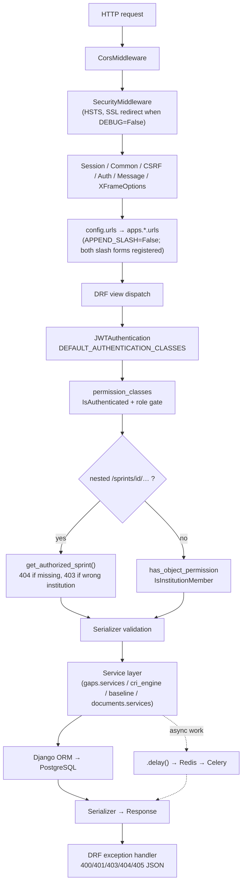

**Verified specifics:**

- `APPEND_SLASH = False`, and **every collection/action route is registered twice**
  (with and without a trailing slash) because the frontend's axios calls are
  inconsistent about it. The settings comment explains why the default redirect was
  unacceptable: it turns a `POST` body into a dropped `GET`.
- `DEFAULT_PERMISSION_CLASSES = (IsAuthenticated,)` — **everything is authenticated
  by default**; only `LoginView` opts out with `AllowAny`.
- Pagination is **opt-in**: without `?page`/`?page_size`, list endpoints return a
  bare JSON array (what the frontend's `.map()` expects); adding either switches to
  `{count, next, previous, results}`.

## 5.5 The permission model

`apps/accounts/permissions.py` separates two orthogonal questions:

**(a) Role gates** — may this *kind* of user do this *kind* of action?

| Class | Write allowed for |
|---|---|
| `CanManageSprint` | `super_admin`, `consultant`, `institution_admin` |
| `CanApproveBaseline` | same three (baseline approval is a management decision) |
| `CanReviewFacts` | **every role except `viewer`** |
| `CanResolveGaps` | **every role except `viewer`** |
| `CanManageRecommendations` | `super_admin`, `consultant`, `institution_admin`, `iqac_coordinator` |
| `CanEditRecommendation` | **`super_admin`, `consultant` only** |
| `CanManageDocument` (in `documents/views.py`) | owner always; DELETE also needs `super_admin`/`consultant`/`institution_admin`/`iqac_coordinator` |
| `CanManageInstitution` (in `institutions/views.py`) | writes: `super_admin`, `consultant`, `institution_admin`; **DELETE: `super_admin`, `consultant` only** |
| `CanManageInstitutionDna` (in `institutions/views.py`) | `super_admin`, `consultant`, `institution_admin` — **including DELETE** |
| `IsSuperAdmin` / `IsConsultant` / `IsInstitutionAdmin` | single-role gates (defined; used sparingly) |

The last two look redundant but are not, and the difference is deliberate:
`CanManageInstitution` restricts DELETE to platform staff because deleting an
*institution* orphans every sprint hanging off it. Removing one department row or
one IT system is an ordinary correction to a list the institution admin maintains,
so `CanManageInstitutionDna` lets DELETE follow the same rule as any other write.
Reusing the stricter class for the sub-resources left institution admins able to
add and edit departments but not remove them — caught by a test, not by review.

All of these return `True` for `SAFE_METHODS`, so **reading is open to any
authenticated user within their institution scope**.

**(b) Institution scoping** — may this user touch *this particular* record?

- `IsInstitutionMember.has_object_permission()` → `user_can_access_institution()`.
- `_resolve_institution_id(obj)` handles an `Institution` directly, anything with
  `institution_id` (Sprint), or anything nested under a sprint (Document, Fact, Gap,
  Report) via `.sprint`.
- `get_accessible_institution_ids(user)` returns `None` (unrestricted) for
  cross-institution roles, else `{user.institution_id}`.
- `require_institution_access(user, obj)` raises `PermissionDenied` — used by the
  nested views that look up their object manually.

## 5.6 Validation

- **Serializer-level:** `DocumentUploadSerializer` (extension, size, checksum
  dedupe), `LoginSerializer` (`authenticate()` + `is_active`),
  `ChangePasswordSerializer` (old-password check + Django's
  `validate_password` against `AUTH_PASSWORD_VALIDATORS`),
  `DriveImportJobCreateSerializer` (URL parseable to a folder ID before any job runs).
- **Model-level:** `RegexValidator` on phone and `document_type`;
  `MinValueValidator`/`MaxValueValidator` on every 0–1 confidence and 0–100 score;
  `UniqueConstraint`s (see §6).
- **Service-level:** the sprint state machine, `DELETABLE_STATUSES`,
  `BASELINE_LOCKED_STATUSES`, blocking-gap check on full baseline approval.
- **AI-output-level:** every AI field is re-validated in Python — see §9.4.
---

# 6. Database architecture

**Engine:** PostgreSQL 16 in production (via `dj-database-url` / `DATABASE_URL`);
**SQLite fallback** (`db.sqlite3`) when `DATABASE_URL` is unset — which is how local
development currently runs. `conn_max_age=600` (10-minute persistent connections).

**Every model uses a UUID4 primary key** (`models.UUIDField(primary_key=True,
default=uuid.uuid4, editable=False)`), except Django's own built-ins.

**22 migrations** across 12 apps, including one data migration
(`scoring/0002_seed_pillars.py`) that seeds the eight pillars.

## 6.1 Model-by-model reference

### `accounts.User` — `accounts_user`
- **Purpose:** identity + role + institution binding. Extends `AbstractBaseUser` + `PermissionsMixin`.
- **PK:** `id` (UUID).
- **Key fields:** `email` (**unique, USERNAME_FIELD**), `username` (unique), `first_name`, `last_name`, `phone` (regex-validated), `role` (11 choices, default `viewer`), `department_name`, `is_active`, `is_staff`, `date_joined`, `updated_at`.
- **FK:** `institution → institutions.Institution` (`SET_NULL`, `related_name='users'`) — null for cross-institution roles.
- **Property:** `is_cross_institution`.
- **Meta:** `ordering = ['email']`.

### `institutions.Institution` — `institutions_institution`
- **Purpose:** the tenant, and (since Institution DNA) the institutional baseline record.
- **Key fields:** `name`, `short_name`, `institution_type`, `university_affiliation`, `website_url`, `location`, `city`, `state`, `country` (default `'India'`), `accreditation_details`, `contact_email`, `contact_phone`, `is_active`.
- **Institution DNA fields:** `student_count`, `faculty_count` (both nullable — an unset count reads as "not recorded", never as zero), `priorities` (JSON list of labels), `digital_maturity_level` (1–5 `IntegerChoices`, nullable), `current_ai_usage` (text).
- **FK:** `created_by → User` (`SET_NULL`, `related_name='created_institutions'`).
- **Not stored:** department and programme counts. Both are derived in `InstitutionDetailSerializer` from the department rows, so a stored copy cannot drift.

### `institutions.InstitutionLeader` — `institutions_institutionleader`
- **Purpose:** one named person on the institution's leadership list.
- **Key fields:** `name`, `role`, `email`, `display_order`.
- **FK:** `institution` (`CASCADE`, `related_name='leaders'`).
- **Notable:** deliberately **not** a link to `accounts.User` — the Director named here is a fact about the org chart, and recording them must not depend on whether they hold a login. `initials` is derived in the serializer, never stored.
- **Meta:** `ordering = ['display_order', 'name']`.

### `institutions.Department` — `institutions_department`
- **Purpose:** an academic department and the headcounts it reports for itself.
- **Key fields:** `name`, `head_name`, `faculty_count`, `student_count`, `program_count`, `display_order`.
- **FK:** `institution` (`CASCADE`, `related_name='departments'`).
- **Constraint:** `UniqueConstraint(['institution', 'name'], name='unique_department_name_per_institution')`. The serializer additionally rejects duplicates **case-insensitively**, so the DB constraint never surfaces as a 500.

### `institutions.InstitutionSystem` — `institutions_institutionsystem`
- **Purpose:** one system in the institution's current IT estate.
- **Key fields:** `name`, `tag` (`legacy` | `manual` | blank), `notes`, `display_order`.
- **FK:** `institution` (`CASCADE`, `related_name='systems'`).
- **Notable:** `tag` marks the two states that matter to an AI-readiness assessment — a legacy system and a still-manual process are both obstacles. It is not a general-purpose category field.

### `sprints.Sprint` — `sprints_sprint`
- **Purpose:** one discovery engagement; the spine every other record hangs off.
- **Key fields:** `name`, `sprint_code` (**unique**, auto `SPR-XXXXXXXX`), `mode` (3 choices), `status` (10 choices), `academic_year`, `description`, `start_date`, `target_completion_date`, `completion_percentage` (0–100), **`overall_cri`** and **`confidence_score`** (denormalized from the latest `ScoringRun` by the engine).
- **FK:** `institution` (`CASCADE`, `related_name='sprints'`), `created_by → User` (`SET_NULL`).
- **Class constants:** `ALLOWED_TRANSITIONS`, `BASELINE_LOCKED_STATUSES`, `STATUS_COMPLETION_MILESTONES`.
- **Meta:** `ordering = ['-created_at']`.

### `documents.Document` — `documents_document`
- **Purpose:** one uploaded evidence file.
- **Key fields:** `document_type` (snake_case slug, regex-validated — **free text, not a `choices=` enum**, so a new type needs no migration), `title`, `file` (FileField → `document_upload_path`), `original_filename`, `mime_type`, `file_size`, **`checksum`** (SHA-256 hex, `db_index=True`), `status` (6 choices), `page_count`, `quality_score`, `ocr_required`, `ocr_warnings` (JSON list), `processing_status` (free-text sub-stage), `uploaded_at`, `processed_at`.
- **FK:** `sprint` (`CASCADE`, `related_name='documents'`), `uploaded_by → User` (`SET_NULL`).
- **Constraint:** `UniqueConstraint(fields=['sprint','checksum'], condition=~Q(checksum=''), name='unique_document_checksum_per_sprint')` — **the same file cannot be uploaded twice to one sprint**.

### `documents.DriveImportJob` — `documents_driveimportjob`
- **Purpose:** one Google Drive folder import run.
- **Key fields:** `drive_url`, `status` (5 choices), **`results`** (JSON: per-checklist-slot `{status, filename, document_id}` + `unmatched_files` + `skipped_files`), `files_scanned`, `files_imported`, `error_message`, `celery_task_id`, timestamps.
- **FK:** `sprint` (`CASCADE`, `related_name='drive_import_jobs'`), `created_by → User` (`SET_NULL`).

### `extraction.ExtractionJob` — `extraction_extractionjob`
- **Purpose:** one document's trip through the pipeline.
- **Key fields:** `status` (6: pending/running/retrying/completed/failed/cancelled), **`current_step`** (7 fixed stages), `progress_percentage` (0–100), `started_at`, `completed_at`, `error_message`, `retry_count`, `celery_task_id`.
- **FK:** `sprint` (`CASCADE`, `related_name='extraction_jobs'`), `document` (`CASCADE`, `related_name='extraction_jobs'`).

### `facts.ExtractedFact` — `facts_extractedfact`
- **Purpose:** one structured fact pulled out of a document.
- **Key fields:** `field_name` (human label), `field_key` (snake_case machine key), **`value`** (JSON, nullable — a correction may legitimately set "unknown"), `normalized_value` (JSON), `data_type` (7 choices), `pillar` (one of the 8 keys), `owner_role`, `source_page`, **`source_snippet`**, `confidence_score` (0–1), `confidence_reason`, `extraction_method`, `status` (5 choices), `reviewed_at`.
- **FK:** `sprint` (`CASCADE`, `related_name='facts'`); **`document`** (`SET_NULL`, `related_name='extracted_facts'`) = extraction lineage, set once; **`source_document`** (`SET_NULL`, `related_name='+'`) = current evidence citation, repointable by a correction; `reviewed_by → User` (`SET_NULL`).

### `facts.FactReviewHistory` — `facts_factreviewhistory`
- **Purpose:** append-only audit of every review action.
- **Key fields:** `action` (4 choices), `original_value` (JSON — the value *before* this action), `new_value` (JSON, only for corrections), `reason`, `created_at`.
- **FK:** `fact` (`CASCADE`, `related_name='review_history'`), `user` (`SET_NULL`).

### `gaps.GapItem` — `gaps_gapitem`
- **Purpose:** something missing, unconfirmed, contradictory, stale, or low-confidence.
- **Key fields:** `gap_type` (5), `title`, `description`, `pillar`, `priority` (4: blocking/high/medium/optional), `status` (5: open/in_progress/resolved/unavailable/skipped), `resolution`, `resolved_at`; conflict-only: `conflict_value_a`, `conflict_value_b` (immutable snapshots), `conflict_confidence` (0–1).
- **FK:** `sprint` (`CASCADE`, `related_name='gaps'`), `source_fact → ExtractedFact` (`SET_NULL`, `related_name='gaps'`), `related_document → Document` (`SET_NULL`, `related_name='gaps'`), `conflict_fact_b → ExtractedFact` (`SET_NULL`), `resolved_by → User` (`SET_NULL`).
- **Three partial unique constraints** (all conditioned on `status__in=['open','in_progress']`):
  1. `unique_active_gap_per_fact_and_type` — `(gap_type, source_fact)` where `source_fact` is not null
  2. `unique_active_gap_per_document_and_type` — `(gap_type, related_document)` where document set and fact null
  3. `unique_active_gap_per_sprint_type_title` — `(sprint, gap_type, title)` where both null
- **Class constant:** `ACTIVE_STATUSES = [open, in_progress]`.

### `scoring.Pillar` — `scoring_pillar`
- **Purpose:** one of the eight CRI pillars, **as a configurable DB row**, so an admin can retune a weight without a deploy.
- **Key fields:** `key` (**unique slug** — the same string stored as `pillar` on Fact/Gap/Recommendation; they join by **string equality, not FK**), `name`, `description`, `weight` (0–1), `display_order`, `is_active`.
- Seeded by `scoring/migrations/0002_seed_pillars.py`.

### `scoring.PillarCriterion` — `scoring_pillarcriterion`
- **Purpose:** a named, weighted check within a pillar.
- **Key fields:** `key`, `name`, `weight` (0–1, normalised against active siblings at evaluation time), **`fact_field_keys`** (JSON list — empty means "every confirmed fact tagged to this pillar"), `is_active`.
- **FK:** `pillar` (`CASCADE`, `related_name='criteria'`); `unique_together = ('pillar','key')`.

### `scoring.PillarScore` — `scoring_pillarscore`
- **Purpose:** the **current** score for one pillar of one sprint. **Overwritten in place** each run.
- **Key fields:** `raw_score` (0–100, pre-weight), `weighted_score` (`raw × pillar.weight`), `confidence_score` (0–1), `status` (not_started/at_risk/developing/strong), `evidence_count`, `gap_count`, `calculation_version`, `calculated_at`.
- **FK:** `sprint` (`CASCADE`, `related_name='pillar_scores'`), `pillar` (`CASCADE`); `unique_together = ('sprint','pillar')`.

### `scoring.ScoringRun` — `scoring_scoringrun`
- **Purpose:** the immutable audit trail of one engine execution.
- **Key fields:** `calculation_version`, `overall_cri`, `overall_confidence`, `evidence_count`, `gap_count`, **`pillar_snapshot`** (JSON — freezes each pillar's numbers, because `PillarScore` rows get overwritten by the next run).
- **FK:** `sprint` (`CASCADE`, `related_name='scoring_runs'`), `triggered_by → User` (`SET_NULL`).

### `scoring.Baseline` — `scoring_baseline`
- **Purpose:** one approval decision-cycle, pinned to an exact `ScoringRun`.
- **Key fields:** `status` (pending/approved/provisional/returned), `approved_at`, `comments`.
- **FK:** `sprint` (`CASCADE`, `related_name='baselines'`), **`scoring_run` (`PROTECT`)** — the pinned run can never be deleted while a baseline references it; `approved_by → User` (`SET_NULL`).
- **Invariant:** once `APPROVED`, never modified again (enforced in `services/baseline.py::_require_pending`). A returned baseline is not reused — a new row is created for the next cycle.

### `scoring.BaselineDecisionHistory` — `scoring_baselinedecisionhistory`
- **Purpose:** append-only log of every submit/approve/approve-provisional/return.
- **FK:** `baseline` (`CASCADE`, `related_name='history'`), `user` (`SET_NULL`).

### `recommendations.Recommendation` — `recommendations_recommendation`
- **Purpose:** one actionable, traceable suggestion.
- **Key fields:** `title`, `description` (always states the triggering data point), `trigger_gap` (display citation), `pillar`, `owner_role`, `priority` (4), `timeline`, **`expected_cri_lift`** (0–100), `support_offering`, `consultant_notes`, `status` (draft/accepted/edited/hidden/completed).
- **FK:** `sprint` (`CASCADE`), `source_gap → GapItem` (`SET_NULL`, `related_name='recommendations'`), `created_by`/`updated_by → User` (`SET_NULL`).
- **M2M:** `supporting_facts → ExtractedFact` (`related_name='recommendations'`).

### `reports.Report` — `reports_report`
- **Purpose:** one generated Discovery Report, **versioned, never overwritten**.
- **Key fields:** `version` (sequential per sprint), `status` (draft/generating/ready/failed), `executive_summary`, `overall_cri`, `confidence_score`, `generated_at`, `pdf_file`, `docx_file`, **`report_data`** (JSON, all 11 sections, `DjangoJSONEncoder`).
- **FK:** `sprint` (`CASCADE`, `related_name='reports'`), `generated_by → User` (`SET_NULL`).
- **Constraint:** `UniqueConstraint(['sprint','version'], name='unique_report_version_per_sprint')`.
- **Meta:** `ordering = ['-version']`.

### `vector_store.VectorDocumentIndex` — `vector_store_vectordocumentindex`
- **Purpose:** tracks one document's presence in the Pinecone index, so indexing is **observable and retryable**. Pinecone cannot answer *"did this document ever index, and if not why"*; this row can. Same role `ExtractionJob` plays for extraction.
- **Key fields:** `status` (pending/processing/indexed/failed), `vector_count`, `embedding_model`, **`content_hash`** (SHA-256 of the extracted *text*, `db_index=True` — not of the file, because text is what gets embedded), `indexed_at`, `error_message`, `celery_task_id`.
- **FK:** `document` (**`OneToOneField`**, `CASCADE`) — re-indexing updates the row rather than accumulating history; `sprint` (`CASCADE`), `institution` (`CASCADE`).
- **`institution` is denormalised** from `document.sprint.institution` so status can be listed per institution without a two-table join on every read. Safe to copy: a document never moves between institutions.
- **Holds no embedding arrays** — those live in Pinecone; a second copy here would have no reader.
- **Index:** `models.Index(['sprint','status'], name='ix_vecidx_sprint_status')` — the only hand-written composite index in the project.
- **Meta:** `ordering = ['-updated_at']`.

## 6.2 Entity-relationship diagram

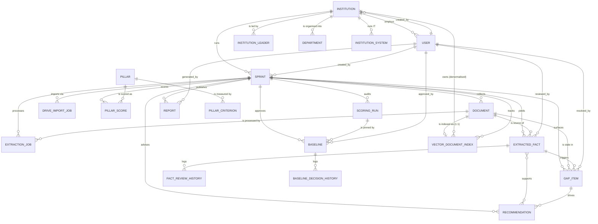

**Note on `Pillar` ↔ facts/gaps/recommendations:** these are **not** foreign keys.
`ExtractedFact.pillar`, `GapItem.pillar`, and `Recommendation.pillar` are
`CharField(choices=PILLAR_CHOICES)`, joined to `scoring_pillar.key` by string
equality. The rationale is stated in `apps/scoring/constants.py`: the eight keys are
a closed set the CRI framework itself defines (a constant), whereas *weights and
criteria* are configuration (DB rows).

## 6.3 Constraints & indexes summary

| Constraint / index | Table | Purpose |
|---|---|---|
| `email` unique, `username` unique | `accounts_user` | Identity |
| `sprint_code` unique | `sprints_sprint` | Human-readable sprint id |
| `unique_document_checksum_per_sprint` (partial) | `documents_document` | Same file cannot be uploaded twice |
| `checksum` `db_index=True` | `documents_document` | Fast dedupe lookup |
| `unique_active_gap_per_fact_and_type` (partial) | `gaps_gapitem` | No duplicate active gap per fact |
| `unique_active_gap_per_document_and_type` (partial) | `gaps_gapitem` | No duplicate active stale-data gap |
| `unique_active_gap_per_sprint_type_title` (partial) | `gaps_gapitem` | No duplicate active missing-document gap |
| `unique_together (pillar, key)` | `scoring_pillarcriterion` | One criterion key per pillar |
| `unique_together (sprint, pillar)` | `scoring_pillarscore` | One current score per pillar per sprint |
| `unique_report_version_per_sprint` | `reports_report` | Version numbers never reused |
| `scoring_run` FK `on_delete=PROTECT` | `scoring_baseline` | An approved baseline's run cannot be deleted |
| `unique_department_name_per_institution` | `institutions_department` | No two departments share a name within one institution |
| `document` **`OneToOneField`** (implicit unique) | `vector_store_vectordocumentindex` | One index-tracking row per document; a re-index updates it rather than appending |
| `content_hash` `db_index=True` | `vector_store_vectordocumentindex` | Skip re-embedding unchanged text |
| `ix_vecidx_sprint_status` (composite) | `vector_store_vectordocumentindex` | The status endpoint's exact filter |

**Explicit `db_index` on `checksum` and `content_hash`; exactly one composite index**
(`ix_vecidx_sprint_status`, added with the vector store). Foreign keys get Django's
automatic indexes. On a large deployment the hot filters — `facts(sprint_id,
status)`, `gaps(sprint_id, status, priority)`, `documents(sprint_id, status)` — would
each benefit from a composite index of the same shape (see §18).

## 6.4 The CRI scoring engine — nine steps

`apps/scoring/services/cri_engine.py`. **Fully deterministic:** every input is a DB
aggregation or a configuration read; there is no randomness, no wall-clock
dependence, and no external call anywhere in the calculation.

| Step | Function | What it does |
|---|---|---|
| 1 | `_confirmed_facts_for_criterion` | Reads `confirmed`/`corrected` facts for the pillar, narrowed to `criterion.fact_field_keys` if set |
| 2 | `_unresolved_gaps_for_pillar` | Reads `open`/`in_progress` gaps tagged to the pillar |
| 3 | `_evaluate_criterion` | Criterion fulfilment = **average confidence of backing facts × 100**; honestly `0` if none |
| 4 | `_evaluate_pillar` | Weighted average of active criteria, **minus** `GAP_PRIORITY_SCORE_PENALTY` summed over unresolved gaps; clamped to 0–100 |
| 5 | `run_scoring_engine` | `overall_cri = Σ weighted_score`, clamped 0–100 |
| 6 | (in 4 & 5) | Evidence confidence at both levels; `overall_confidence = Σ (pillar_confidence × weight)` |
| 7 | `_persist_pillar_scores` + run creation | Upserts 8 `PillarScore` rows, inserts one `ScoringRun`, updates `Sprint.overall_cri/confidence_score` |
| 8 | `_compute_calculation_version` | `"1.0+<sha256[:12] of active pillar/criterion weights>"` — **an admin retuning a weight automatically changes the version**, flagging older runs as computed under different configuration |
| 9 | `build_score_snapshot` | Returns the explainable payload: pillars, strengths, weaknesses, **live** evidence metrics, unresolved blocking gaps |

**Gap penalty rubric** (`apps/gaps/constants.py`), shared with recommendations as
"expected CRI lift":

| Priority | Penalty / lift |
|---|---|
| `blocking` | 8.0 |
| `high` | 5.0 |
| `medium` | 3.0 |
| `optional` | 1.0 |

**Pillar status rubric** (`apps/scoring/constants.py`), applied in a fixed order:

1. `evidence_count == 0` → **`not_started`**, regardless of score.
2. any unresolved **blocking** gap, or `raw_score < 40` → **`at_risk`**.
3. `raw_score < 70` → **`developing`**.
4. otherwise → **`strong`**.

**Honest non-renormalisation:** if the active pillars' weights do not sum to 1.0,
`overall_cri` is simply the sum of the weighted scores — it is *not* renormalised,
and a deactivated pillar contributes zero rather than redistributing its weight. The
docstring states this is deliberate.

**`build_score_snapshot(bootstrap=...)`** — `True` (used by `GET`/`POST /score` and
report generation) computes a first run on the spot; `False` (used by the read-only
sprint overview) returns `None`, so *loading a dashboard never has the side effect of
persisting scoring rows*.

## 6.5 The eight pillars

| Key | Label |
|---|---|
| `governance_strategy` | Governance & Strategy |
| `curriculum_academic_readiness` | Curriculum & Academic Readiness |
| `faculty_ai_capability` | Faculty AI Capability |
| `student_ai_readiness` | Student AI Readiness |
| `infrastructure_digital_capability` | Infrastructure & Digital Capability |
| `research_innovation` | Research & Innovation |
| `industry_placement` | Industry & Placement Outcomes |
| `evidence_quality` | Evidence Quality & Data Confidence |
---

# 7. API documentation

**Base URL:** `/api/v1`. **Auth:** `Authorization: Bearer <access_token>` on
everything except `POST /auth/login` and `POST /auth/refresh`.
**Trailing slashes:** both forms work everywhere (`APPEND_SLASH=False` +
dual registration). **IDs:** UUID4 strings.
**Pagination:** opt-in — add `?page=` or `?page_size=` (default 20, max 100) to
switch a list from a bare array to `{count, next, previous, results}`.

**Interactive docs:** `/api/schema` (OpenAPI YAML), `/api/docs` (Swagger UI),
`/api/redoc`. A checked-in contract also exists at `backend/docs/API_CONTRACT.md`
and `backend/docs/openapi.yaml`.

## 7.1 Full endpoint table

### Authentication — `/api/v1/auth`

| Method | Endpoint | Purpose | Auth | Request | Response |
|---|---|---|---|---|---|
| POST | `/auth/login` | Sign in | **None** | `{email, password}` | `200 {access_token, refresh_token, user}` |
| POST | `/auth/refresh` | New access token | **None** (refresh token is the credential) | `{refresh}` | `200 {access}` |
| POST | `/auth/logout` | Blacklist a refresh token | JWT | `{refresh}` | `205` empty |
| GET | `/auth/me` | Current user | JWT | — | `200 User` |
| POST | `/auth/change-password` | Change own password | JWT | `{old_password, new_password}` | `200 {detail}` |

### Institutions — `/api/v1/institutions`

| Method | Endpoint | Purpose | Auth | Notes |
|---|---|---|---|---|
| GET | `/institutions` | List | JWT | Scoped by `get_accessible_institution_ids`. Returns the **lean** serializer — no leaders, no derived counts |
| POST | `/institutions` | Create | `CanManageInstitution` — `super_admin` / `consultant` / `institution_admin` | Reached from the **Institution DNA list page**; Sprint Setup no longer creates institutions |
| GET | `/institutions/{id}` | Detail | JWT + `IsInstitutionMember` | Returns `InstitutionDetailSerializer`: adds `leaders[]`, `department_count`, `program_count`, `digital_maturity_label`, `digital_maturity_description` |
| PUT/PATCH | `/institutions/{id}` | Update | `CanManageInstitution` | Also how the DNA profile and the Systems & IT assessment are saved |
| DELETE | `/institutions/{id}` | **Hard delete** | `super_admin` / `consultant` only | Cascades to departments, leaders, systems, sprints and everything scoped to those sprints. `perform_destroy` clears `Baseline` rows first, inside a transaction, to dodge the `PROTECT`-vs-`CASCADE` collector trap on `Baseline.scoring_run` |

Out-of-scope detail requests give **403**, not 404 — the queryset is deliberately
unscoped for detail actions so an authorization failure isn't masked as "missing".

### Institution DNA sub-resources — `/api/v1/institutions/{institution_id}/…`

All three follow the identical shape. `InstitutionScopedMixin` resolves and
authorizes the parent institution once, and scopes every queryset to it — so an id
belonging to another institution is a **404 on this route**, not a leak.

| Method | Endpoint | Purpose | Auth |
|---|---|---|---|
| GET / POST | `…/leaders` | List / add a leadership entry | read: any member · write: `CanManageInstitutionDna` |
| GET / PATCH / DELETE | `…/leaders/{id}` | One leader | same |
| GET / POST | `…/departments` | List / add a department | same |
| GET / PATCH / DELETE | `…/departments/{id}` | One department | same |
| GET / POST | `…/systems` | List / add an IT system | same |
| GET / PATCH / DELETE | `…/systems/{id}` | One system | same |

**Validation worth noting:** a duplicate department name is rejected
case-insensitively by the serializer (`400`), rather than being left to the
database's unique constraint; an unknown system `tag` is a `400`; and
`priorities` on the institution PATCH is cleaned of blanks and duplicates before
it is stored.

### Sprints — `/api/v1/sprints`

| Method | Endpoint | Purpose | Auth | Notes |
|---|---|---|---|---|
| GET | `/sprints` | List | JWT | Filter (`SprintFilter`) + order + optional pagination |
| POST | `/sprints` | Create | `CanManageSprint` | Institution re-checked in `perform_create` |
| GET | `/sprints/{id}` | Detail | JWT + institution | |
| PUT/PATCH | `/sprints/{id}` | Update | `CanManageSprint` | Status transitions validated against `ALLOWED_TRANSITIONS` |
| DELETE | `/sprints/{id}` | Hard delete | `CanManageSprint` | **Only** from `draft`/`completed`/`archived` |
| GET | `/sprints/{id}/overview` | Everything in one call | JWT + institution | Uses `bootstrap=False` — no scoring side effect |

### Documents

| Method | Endpoint | Purpose | Auth | Notes |
|---|---|---|---|---|
| GET | `/sprints/{id}/documents` | List | JWT + sprint access | Read-only view |
| POST | `/sprints/{id}/upload-file` | **Upload** | JWT + sprint access | `multipart/form-data`; `file`, `document_type`, `title?`, `owner_role?` |
| GET | `/sprints/{id}/drive-import-jobs` | List import jobs | JWT + sprint access | |
| POST | `/sprints/{id}/drive-import-jobs` | Start Drive import | JWT + sprint access | `{drive_url}` |
| GET/PUT/PATCH | `/documents/{id}` | Detail / edit | `CanManageDocument` | Owner, or any non-viewer |
| DELETE | `/documents/{id}` | Delete + remove file | `CanManageDocument` | Owner, or one of 4 manage roles |
| GET | `/documents/{id}/download` | **Authenticated download** | `IsInstitutionMember` | `FileResponse`, `as_attachment=True` |

### Extraction

| Method | Endpoint | Purpose | Auth | Notes |
|---|---|---|---|---|
| GET | `/sprints/{id}/extraction-jobs` | Job list (polled every 3 s) | JWT + sprint access | |
| POST | `/sprints/{id}/extraction-jobs` | Start extraction | JWT + sprint access | `{}` = all eligible, or `{document_id}` |
| GET | `/extraction-jobs/{id}` | Job detail | `IsInstitutionMember` | |
| DELETE | `/extraction-jobs/{id}` | Delete a job | `IsInstitutionMember` | **Only `failed` jobs** |
| POST | `/extraction-jobs/sprints/{id}/cancel` | Cancel all active | `IsInstitutionMember` | Revokes Celery tasks (`terminate=True`), reverts sprint `processing → collecting` |

### Facts

| Method | Endpoint | Purpose | Auth |
|---|---|---|---|
| GET | `/sprints/{id}/facts` | List (filter + order + optional pagination) | JWT + sprint access |
| GET | `/facts/{id}` | Detail | `IsInstitutionMember` |
| POST | `/facts/{id}/confirm` | Confirm | `CanReviewFacts` |
| POST | `/facts/{id}/correct` | Correct the value | `CanReviewFacts` |
| POST | `/facts/{id}/reject` | Reject | `CanReviewFacts` |
| POST | `/facts/{id}/request-evidence` | Ask the owner for evidence | `CanReviewFacts` |

> There is deliberately **no `PATCH /facts/{id}`** — every value change must go
> through an action so `FactReviewHistory` can never be bypassed.

### Gaps

| Method | Endpoint | Purpose | Auth |
|---|---|---|---|
| GET | `/sprints/{id}/gaps` | List | JWT + sprint access |
| GET | `/gaps/{id}` | Detail | `IsInstitutionMember` |
| POST | `/gaps/{id}/resolve` | Mark resolved | `CanResolveGaps` |
| POST | `/gaps/{id}/mark-unavailable` | Data does not exist | `CanResolveGaps` |
| POST | `/gaps/{id}/skip` | Skip for now | `CanResolveGaps` |

> Gaps are **never created by a client POST** — only by the detectors.

### Scoring & baseline

| Method | Endpoint | Purpose | Auth |
|---|---|---|---|
| GET | `/sprints/{id}/score` | Current CRI (bootstraps first run) | `CanManageSprint` |
| POST | `/sprints/{id}/score` | Force recalculation | `CanManageSprint` — **refused if baseline-locked** |
| GET | `/sprints/{id}/score/history` | Every past `ScoringRun` | JWT + sprint access |
| GET | `/sprints/{id}/baseline` | Baseline + score + blocking gaps + `can_approve` | `CanApproveBaseline` — **bootstraps a PENDING baseline** |
| POST | `/sprints/{id}/baseline/approve` | Full approval | `CanApproveBaseline` — **refused while blocking gaps exist** |
| POST | `/sprints/{id}/baseline/approve-provisional` | Provisional approval | `CanApproveBaseline` — allowed despite blocking gaps |
| POST | `/sprints/{id}/baseline/return` | Return for correction | `CanApproveBaseline` — **`comments` required** |
| GET | `/scoring/config` | Live pillar/criterion config | JWT |

### Recommendations & reports

| Method | Endpoint | Purpose | Auth |
|---|---|---|---|
| GET | `/sprints/{id}/recommendations` | List | `CanManageRecommendations` |
| POST | `/sprints/{id}/recommendations/generate` | Run the 3 generators | `CanManageRecommendations` |
| PATCH | `/recommendations/{id}` | Edit | **`CanEditRecommendation` — consultant/super_admin only** |
| GET | `/sprints/{id}/reports` | Version history | `CanManageSprint` |
| POST | `/sprints/{id}/reports` **or** `/reports/generate` | Generate next version | `CanManageSprint` → `202` |
| GET | `/reports/{id}` | Detail (polled) | `IsInstitutionMember` |
| GET | `/reports/{id}/download?file=pdf\|docx` | Download | `IsInstitutionMember` |

> `?file=` rather than `?format=` **on purpose** — DRF reserves `format` for content
> negotiation and would intercept it before the view.

### Vector store & evidence search — `[IMPLEMENTED]`, optional

Registered in `apps/sprints/urls.py` alongside every other `/sprints/{id}/…`
sub-resource, so institution scoping is the same `get_authorized_sprint()` check.
`apps/vector_store/urls.py` exists but is **deliberately empty** — the app owns a
URLConf only in case a non-nested route is ever needed.

| Method | Endpoint | Purpose | Auth | Notes |
|---|---|---|---|---|
| POST | `/sprints/{id}/vector-index` | Queue every **processed** document in the sprint for indexing | `CanManageSprint` | `202` with the tracking rows. Body: `{force?: bool}` — `force` re-embeds even when the content hash is unchanged. `200` (not an error) when the sprint has no processed documents yet |
| GET | `/sprints/{id}/vector-index/status` | Per-document indexing status | JWT + sprint access | `status`, `vector_count`, `embedding_model`, `content_hash`, `indexed_at`, `error_message`. Optional pagination |
| POST | `/sprints/{id}/evidence-search` | Semantic search over this college's indexed text | JWT + sprint access (**read-only, so any member**) | Body: `{query (3–2000 chars), top_k?, document_type?, scope_to_sprint? (default true)}`. **No institution field** — it is taken from the URL's sprint, which is what makes the filter un-spoofable |

All three return **`503` with a stated reason** when Pinecone is unconfigured, rather
than `500` or a silently empty list. A search whose provider is rate-limited or down
is also `503` ("temporarily unavailable"); a malformed query is `400`. **No Pinecone
index name, host, key or raw match object is ever serialized to the client.**

Each result carries `score`, `text`, `document_id`, `document_name`,
`document_type`, `page_number`, `chunk_index`, `sprint_id`, `institution_id` — there
is no code path that returns an anonymous vector, because a downstream LLM must be
able to say *"according to Faculty_Report.pdf, page 17"*.

### Dashboard & docs

| Method | Endpoint | Purpose | Auth |
|---|---|---|---|
| GET | `/dashboard` | 7 metrics + accessible sprint list | JWT |
| GET | `/api/schema`, `/api/docs`, `/api/redoc` | OpenAPI / Swagger / ReDoc | Public |
| — | `/admin/` | Django admin | Session auth |

## 7.2 Detailed specs for the pivotal endpoints

### `POST /api/v1/auth/login`
- **Auth / permission:** `AllowAny`.
- **Body:** `{"email": str, "password": str}`.
- **Validation:** `LoginSerializer` → `authenticate(username=email, password=...)`; rejects `is_active=False`.
- **Processing:** `get_tokens_for_user(user)` mints an HS256 pair signed with `JWT_SECRET_KEY` (falling back to `SECRET_KEY`).
- **DB:** SELECT on `accounts_user`. `UPDATE_LAST_LOGIN` is **False**, so `last_login` is never written.
- **External:** none.
- **Response `200`:** `{access_token, refresh_token, user: {id, institution_id, username, name, first_name, last_name, email, phone, role, department_name, is_active, is_staff, date_joined, updated_at}}`.
- **Errors:** `400 {"non_field_errors": ["Invalid login credentials"]}` or `["This account has been disabled"]`.

### `POST /api/v1/sprints/{id}/upload-file`
- **Permission:** JWT + `get_authorized_sprint()`.
- **Parsers:** `MultiPartParser`, `FormParser`.
- **Body:** `file` (required), `document_type` (required, `^[a-z][a-z0-9_]*$`), `title`, `owner_role`.
- **Validation, in order:** size ≤ `MAX_DOCUMENT_UPLOAD_SIZE` (50 MB) → extension ∈ `ALLOWED_UPLOAD_EXTENSIONS` (`.pdf .doc .docx .xls .xlsx .csv .zip .png .jpg .jpeg`) → SHA-256 checksum not already present in this sprint.
- **Processing:** compute checksum → derive `mime_type` → default `title` from the filename → `Document.objects.create(status=uploaded, ocr_required=ext in OCR_REQUIRED_EXTENSIONS)` → `mark_sprint_collecting()`.
- **DB:** INSERT `documents_document`; possible UPDATE `sprints_sprint.status`.
- **Response `201`:** `DocumentSerializer` including a computed absolute `download_url`.
- **Errors:** `400` (too large / unsupported type / duplicate file / bad `document_type`), `403` (wrong institution), `404` (no such sprint).

### `POST /api/v1/sprints/{id}/extraction-jobs`
- **Body:** `{}` or `{"document_id": uuid}`.
- **Processing:** resolve eligible documents (`uploaded`/`failed`, no active job) → **flip sprint to `processing` before dispatch** → per document: INSERT `ExtractionJob` → `run_extraction_job.delay(job.id)` → store `celery_task_id` → `refresh_from_db()`.
- **Broker down:** the `except Exception` branch marks the job `failed` with `"Could not reach the Celery broker: …"` — **the API stays usable and returns 201 rather than 500**.
- **Response `201`:** array of `ExtractionJobSerializer`.
- **Errors:** `404` (document not in this sprint), `403`.

### `POST /api/v1/sprints/{id}/score`
- **Permission:** `CanManageSprint`.
- **Guard:** `400` if `sprint.status ∈ {baseline_approved, report_ready, completed}`.
- **Processing:** `run_scoring_engine(sprint, triggered_by=user)` → 8 `PillarScore` upserts + 1 `ScoringRun` insert + `Sprint` denormalised fields; then `reviewing → scoring`.
- **Response `200`:** `SprintScoreSerializer` — `overall_cri`, `overall_confidence`, `calculation_version`, `calculated_at`, `pillar_scores[8]`, `strengths[]`, `weaknesses[]`, `evidence_metrics{}`, `unresolved_blocking_gaps[]`.

### `POST /api/v1/sprints/{id}/baseline/approve`
- **Permission:** `CanApproveBaseline`.
- **Validation:** the latest baseline must exist and be `pending`; **`400` if any `blocking` gap is `open`/`in_progress`**, with the count and a pointer to approve-provisionally.
- **Processing:** `Baseline.status = approved`, `approved_by`, `approved_at`, `comments` → `BaselineDecisionHistory` row → `sprint.status = baseline_approved`.
- **Response `200`:** `BaselineSerializer`.

---

# 8. Authentication & authorization

## 8.1 Mechanism

**JWT via `djangorestframework-simplejwt`**, HS256.

| Setting | Value | Source |
|---|---|---|
| `ACCESS_TOKEN_LIFETIME` | **60 minutes** (`JWT_ACCESS_TOKEN_LIFETIME_MINUTES`) | `config/settings.py` |
| `REFRESH_TOKEN_LIFETIME` | **1 day** (`JWT_REFRESH_TOKEN_LIFETIME_DAYS`) | same |
| `ROTATE_REFRESH_TOKENS` | **False** | same |
| `BLACKLIST_AFTER_ROTATION` | **False** | same |
| `UPDATE_LAST_LOGIN` | **False** | same |
| `ALGORITHM` | `HS256` | same |
| `SIGNING_KEY` | `JWT_SECRET_KEY` **falling back to `SECRET_KEY`** | same |
| `AUTH_HEADER_TYPES` | `('Bearer',)` | same |
| `USER_ID_CLAIM` | `user_id` | same |

`rest_framework_simplejwt.token_blacklist` **is** installed, so `POST /auth/logout`
genuinely invalidates a refresh token server-side.

## 8.2 Login flow

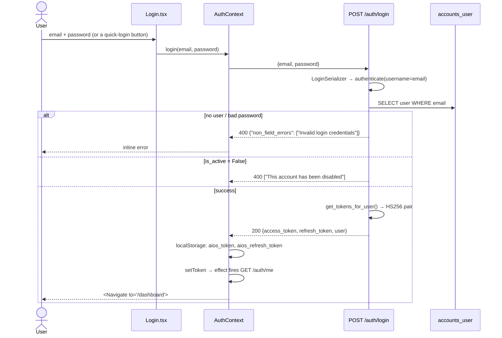

## 8.3 Token refresh flow

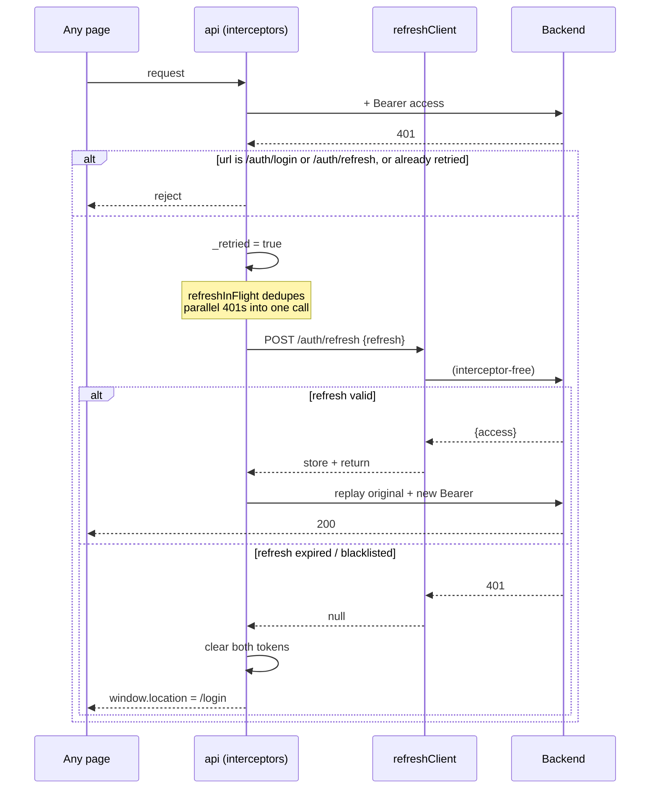

## 8.4 Registration, logout, password

- **Registration:** **Not found in the codebase.** There is no signup endpoint or
  screen. Accounts come from `python manage.py seed_demo_users`,
  `createsuperuser`, or the Django admin.
- **Logout:** `POST /auth/logout {refresh}` → `RefreshToken(...).blacklist()` →
  `205`. The frontend clears local state *after* the call settles.
- **Password change:** `POST /auth/change-password` — verifies `old_password`, runs
  `validate_password` against Django's four validators (similarity, min length,
  common-password list, numeric-only), then `set_password`.
- **Password reset by email:** **Not found in the codebase.**
- **Password storage:** Django's default PBKDF2 hasher.
- **Account lockout / brute-force protection:** **Not found in the codebase.**
- **Rate limiting / DRF throttling:** **Not found in the codebase.**

## 8.5 Authorization — the two-layer model

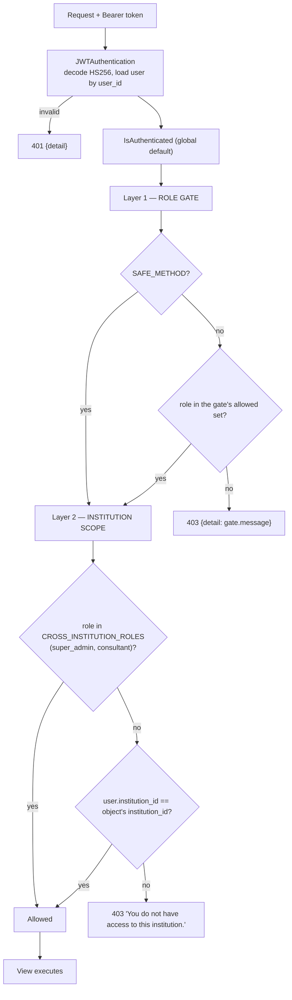

- **List endpoints** apply layer 2 by *filtering the queryset*
  (`get_accessible_institution_ids`).
- **Detail endpoints** apply it via `IsInstitutionMember.has_object_permission`,
  deliberately using the **unscoped** queryset so an out-of-scope record returns
  `403` rather than `404`.
- **Nested `/sprints/{id}/…` endpoints** call `get_authorized_sprint()` explicitly,
  because they fetch their sprint from a URL kwarg rather than through DRF's
  generic `get_object()`.

## 8.6 Protected frontend routes

`ProtectedLayout` in `App.tsx` gates on **session presence only**. There is no
role-aware routing on the client; a `viewer` can navigate to any screen and will
receive `403`s from the API when they try to act.
---

# 9. AI / LLM workflow

This is the heart of the product. Three call sites, one provider-agnostic factory,
and a hard rule that **Python re-validates everything the model returns**.

## 9.1 Provider selection

`apps/extraction/services/ai_service.py::get_ai_service()`.

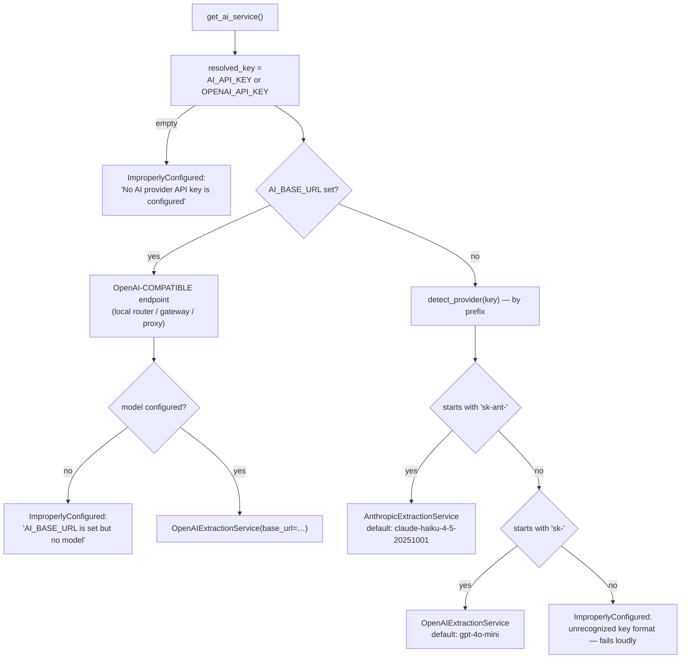

Three points worth naming:

1. **Prefixes are checked longest-first** (`sk-ant-` before `sk-`), because a naive
   `sk-` check would swallow Anthropic keys.
2. **`AI_BASE_URL` wins outright** over key detection — a custom endpoint already
   states where to send requests, and its keys follow neither provider's format.
3. **`OPENAI_EXTRACTION_MODEL` is only honoured when the key is actually an OpenAI
   key** — otherwise a leftover `gpt-4o-mini` would be handed to a Claude client the
   moment someone swaps the key.

Both concrete services implement the identical contract:

```python
extract_structured_data(*, system_prompt, user_content,
                        response_schema, schema_name, timeout=60) -> dict
```

and raise the same `RecoverableExtractionError` / `PermanentExtractionError`
taxonomy — so nothing downstream knows or cares which provider answered.

| | OpenAI | Anthropic |
|---|---|---|
| Structured output | `response_format={'type':'json_schema', 'json_schema':{…, 'strict': True}}` | **Forced single tool call** whose `input_schema` *is* the requested schema, `strict: True`, `disable_parallel_tool_use: True` |
| Result read from | `choices[0].message.content` → `json.loads` | the matching `tool_use` block's `.input` |
| Truncation detected via | `finish_reason == 'length'` | `stop_reason == 'max_tokens'` |
| Also detects | `finish_reason == 'content_filter'` | `stop_reason == 'refusal'`, `'model_context_window_exceeded'` |
| Output cap | provider default | **`DEFAULT_MAX_TOKENS = 16000`** — the comment explains 4096 silently truncated dense fact chunks |

## 9.2 The seven-stage pipeline

`apps/extraction/services/pipeline.py::ExtractionPipeline.run(job)`.

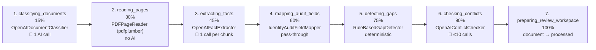

Each stage is defined as an ABC in `services/base.py`
(`DocumentClassifier`, `PageReader`, `OCRProvider`, `FactExtractor`,
`AuditFieldMapper`, `GapDetector`, `ConflictChecker`), and `ExtractionPipeline`
takes each as a constructor kwarg — so any stage can be swapped without touching
orchestration or the Celery retry wrapper. `services/stub.py` holds honest
no-op defaults (empty results, never fabricated ones).

### Stage 1 — Classification
`openai_classifier.py`. Reads the first `OPENAI_CLASSIFICATION_SAMPLE_PAGES` (**3**)
pages, sends filename + uploader-tagged type + text sample, asks for
`{document_type, document_title, reporting_year, institution_name, confidence,
reasoning}` — every string field **nullable**. The prompt states plainly:
*"A null is the correct, honest answer when you don't know — it is not a failure"*
and *"The uploader's tagged document type is a hint, not ground truth."*
**Note:** the result is logged but **not written back to the Document** — only
`processing_status = 'classified'` is saved.

### Stage 2 — Page reading
`pdf_reader.py`, using **pdfplumber** (pure Python, no poppler/ghostscript). Per
page it extracts text and tables, and flags `requires_ocr` when the page has fewer
than `PDF_MIN_TEXT_CHARS_PER_PAGE` (**40**) characters. Non-PDF files are reported
honestly as `format_supported: False` — **not** silently treated as empty.
The result **corrects** the upload-time `ocr_required` guess (which was made from
the file extension alone).

### Stage 3 — Fact extraction
`openai_fact_extractor.py` — the largest and most carefully-guarded module.

- **Chunking:** `_build_chunks()` groups pages up to
  `OPENAI_FACT_EXTRACTION_MAX_CHUNK_CHARS` (**12 000**) characters, **never
  splitting a page**, and skips pages with no text entirely.
- **Hard cap:** `OPENAI_FACT_EXTRACTION_MAX_CHUNKS` (**20**) — an oversized
  document logs a warning and processes only its first 20 chunks, rather than
  making unbounded API calls.
- **Schema:** `FACT_EXTRACTION_SCHEMA` → `{facts: [FACT_ITEM_SCHEMA]}` with all ten
  fields `required` and `additionalProperties: False`. `data_type`, `pillar`, and
  `owner_role` are constrained by `enum` in the schema itself.
- **Merging:** duplicate `field_key`s across chunks are merged, keeping the
  highest-confidence version — one DB row per fact, not one per chunk.

### Stage 4 — Field mapping
`IdentityAuditFieldMapper` — a genuine pass-through, because the extractor already
returns dicts shaped exactly like `ExtractedFact` creation kwargs. Documented as
*"real, deterministic pass-through — not a stub."*

### Stage 5 — Gap detection
`gap_detector.py`. **Zero AI.** Per fact: `low_confidence` (below 0.7, escalating to
`high` priority below 0.5) or `unconfirmed_fact`. Per document: `stale_data` if
uploaded more than `GAP_STALE_DATA_DAYS` (**365**) ago. It deliberately does *not*
detect `missing_document` — that is sprint-wide and would be misleading mid-run.

### Stage 6 — Conflict checking
`conflict_checker.py`. The design principle is stated in its docstring:

> *"finding candidate conflicts … is a cheap, deterministic set comparison — AI is
> only ever consulted to interpret a pair that's already been found to disagree."*

- **Deterministic pre-filter:** pairs of non-rejected facts sharing a `field_key`
  whose `normalized_value` differs.
- **Cap:** `GAP_CONFLICT_CHECK_MAX_PAIRS` (**10**) AI calls per document.
- **The AI never picks a winner.** It answers only
  `{is_conflict, confidence, explanation}`; the two facts' values are untouched and
  a `GapItem` is raised for a human.
- It is asked to consider legitimate non-conflicts: *"different populations …
  different time periods, different units, or one is a subtotal of the other."*

### Stage 7 — Review workspace
`document.status = processed`, `processed_at = now`. When the **last** active job in
the sprint finishes, `tasks._advance_sprint_if_all_jobs_done()` moves the sprint
`processing → reviewing` and runs the sprint-wide `generate_gaps_for_sprint()` pass
(which adds `missing_document` gaps).

## 9.3 The anti-hallucination contract

The fact-extraction system prompt contains these rules verbatim:

- *"Extract only information supported by the supplied document."*
- *"Never invent numbers, names, dates, statistics or institutional information."*
- *"If information is unavailable, return no fact. Do not create a fact with a
  guessed or approximate value."*
- *"Every fact must have supporting evidence: a real snippet quoted or closely
  paraphrased from the text you were given."*
- *"Prefer null over guessing."*
- *"Only cite a page number that actually appears as a `--- Page N ---` marker in
  the text you were given."*
- *"`value` must always be a plain string … do not reformat, convert, or compute it
  yourself."*

## 9.4 Python-side validation — where AI output stops being trusted

`OpenAIFactExtractor._validate_fact()` re-checks **every field**, and
`_parse_and_normalize()` does all typing in Python:

| Field | Check |
|---|---|
| `field_name`, `field_key` | non-blank string |
| `data_type` | ∈ `ExtractedFact.DataType.values` |
| `value` | must be a `str`; then typed by `data_type` — `number`/`percentage` parsed to int/float, `currency` stripped to a numeric amount, `boolean` mapped from yes/no/true/false only, `list` split on `[;,\n]` and normalised, `string`/`date` kept as text |
| `pillar` | ∈ the eight `PILLAR_CHOICES` keys |
| `owner_role` | ∈ `FACT_OWNER_ROLE_CHOICES` (8 campus roles — **deliberately excludes `super_admin`, `consultant`, `viewer`**) |
| `source_snippet` | non-blank string |
| **`source_page`** | **must be `null` or a page number actually present in this chunk** — a citation the model invented is rejected |
| `confidence_score` | numeric (explicitly **not** `bool`) and within `[0, 1]` |
| `confidence_reason` | non-blank string |

A field that fails raises `FactValidationError` and **that one fact is dropped with
a warning** — the chunk and the document continue. The classifier and conflict
checker have their own equivalent validators
(`ClassificationValidationError`, `ConflictValidationError`).

## 9.5 Error handling, retries and cost

**Exception taxonomy** (`apps/extraction/exceptions.py`):

```
ExtractionError
├── RecoverableExtractionError   → retried with exponential backoff
└── PermanentExtractionError     → fails the job immediately
    └── AIResponseError
        ├── OpenAIResponseError
        └── AnthropicResponseError
```

| Provider condition | Classified as |
|---|---|
| Rate limit, timeout, connection error, HTTP 5xx | **Recoverable** |
| HTTP 4xx (bad request, auth) | **Permanent** |
| Empty / truncated / content-filtered / refused / unparseable JSON / missing tool call | **Permanent** (`AIResponseError`) |

**Retry policy** (`apps/extraction/tasks.py`): `EXTRACTION_MAX_RETRIES = 3`,
`countdown = EXTRACTION_RETRY_BACKOFF_SECONDS (30) × 2^retries` → **30 s, 60 s,
120 s**, then the job is marked `failed` and its document `failed`. An
**unrecognised** exception fails immediately rather than being retried, because
*"retrying blindly on an unrecognized error risks masking a real bug behind a retry
loop."*

**Logging discipline:** every AI call logs `model`, `duration_ms`, and success —
and explicitly **never the API key, never the prompt, never the response body**
(only lengths), because those carry institutional document text.

**Cost / token profile per document:**

| Stage | Calls | Input scale |
|---|---|---|
| Classification | 1 | 3 pages of text + system prompt (~700 tokens) |
| Fact extraction | 1 per chunk, **≤ 20** | ≤ 12 000 chars per chunk **+ the ~1 500-token system prompt resent every time** |
| Conflict checking | **≤ 10** | 2 values + 2 snippets + a ~250-token prompt |
| **Worst case** | **31 calls** | |

### Where tokens can be reduced without changing functionality

1. **Prompt caching (biggest single win).** `SYSTEM_PROMPT` in
   `openai_fact_extractor.py` is ~1 500 tokens and is **resent verbatim on every
   chunk** — up to 20 times per document. Both providers support prompt caching
   (Anthropic `cache_control`; OpenAI automatic prefix caching). Marking the system
   block cacheable would cut repeat input cost on chunks 2–20 substantially, with
   **zero behavioural change**.
2. **Batch the conflict checker.** Up to 10 separate requests each re-send the same
   250-token system prompt for a two-value comparison. Sending N pairs in one
   request against an array schema would collapse 10 calls into 1.
3. **Reuse stage 2's page read in stage 1.** `OpenAIDocumentClassifier` constructs
   its own `PDFPageReader` and re-reads the first 3 pages, which
   `ExtractionPipeline` then reads again in full at stage 2. Passing the already-read
   pages through would save one PDF parse per document (no token saving, but real
   wall-clock saving).
4. **Drop `tables` from the page payload when unused.** `PDFPageReader` extracts
   `page.extract_tables()` into every page dict, but no downstream consumer reads
   it — the fact extractor uses only `page['text']`. It costs memory and parse time,
   not tokens, but it is pure waste today.
5. **Skip conflict checking on the first document of a sprint.**
   `_candidate_pairs()` excludes the current document, so on the very first document
   the set is always empty — the guard already returns early, but the
   per-fact query loop still runs first (see §18).
6. **Consider a smaller model for classification.** Classification is a much easier
   task than extraction; it currently uses the same model.

## 9.6 Determinism note

**Temperature is not set anywhere.** Both clients use the provider default, so
extraction output is not deterministic run-to-run. This is not called out in the
code as a decision. Scoring, by contrast, *is* explicitly deterministic.

## 9.7 Embeddings — a second, separate AI surface

The vector store (§3.11) is the project's **only other** use of a model provider, and
it is deliberately decoupled from everything above:

| | Extraction AI | Embeddings |
|---|---|---|
| Configured by | `AI_API_KEY` / `AI_MODEL` / `AI_BASE_URL` | `EMBEDDING_API_KEY` / `EMBEDDING_MODEL` / `EMBEDDING_BASE_URL` |
| Providers | OpenAI · Anthropic · any OpenAI-compatible endpoint | Any OpenAI-compatible endpoint — **or none at all**, when the Pinecone index embeds server-side |
| Abstraction | 7 ABCs in `extraction/services/base.py` | `EmbeddingService` ABC in `vector_store/services/embeddings.py` |
| Output validated? | Yes — every field re-checked in Python (§9.4) | N/A — a vector has no semantics to validate; **the retrieved text is never treated as truth**, only as a citation to a page a human can open |

The keys are separate on purpose: **Anthropic publishes no embedding endpoint**, so a
deployment running Claude for extraction would otherwise have no way to embed.
`EMBEDDING_API_KEY` falls back to `OPENAI_API_KEY` / `AI_API_KEY` when those are
usable, so the common single-provider setup still needs only one key.

**No LLM reasons over retrieved evidence anywhere in the codebase today.** Search
returns cited passages and stops there; the component that would feed them to a model
does not exist yet.

---

# 10. File upload & document processing

## 10.1 Supported types

| Set | Extensions |
|---|---|
| `ALLOWED_UPLOAD_EXTENSIONS` | `.pdf .doc .docx .xls .xlsx .csv .zip .png .jpg .jpeg` |
| `OCR_REQUIRED_EXTENSIONS` (guess at upload time) | `.pdf .doc .docx .png .jpg .jpeg` |
| **Actually readable by the pipeline** | **`.pdf` only** (`pdf_reader.SUPPORTED_EXTENSIONS`) |

> **Gap worth naming:** a DOCX/XLSX/CSV/ZIP upload is accepted, stored, and run
> through the pipeline, but `PDFPageReader` returns `format_supported: False` with
> zero pages — so it yields **no facts**. The behaviour is honest (it says so in the
> return payload and logs `pdf_reader.unsupported_format`) but the user-facing
> screens do not surface "this file type cannot be read yet".

## 10.2 Upload flow

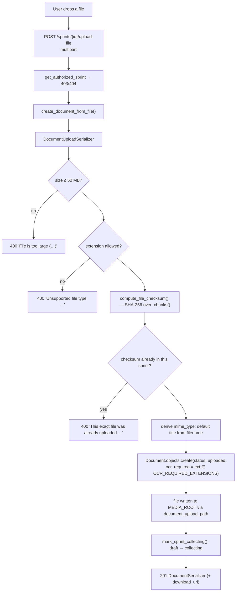

**Two independent size limits, on purpose:**
`DATA_UPLOAD_MAX_MEMORY_SIZE` / `FILE_UPLOAD_MAX_MEMORY_SIZE` (Django's low-level
request-parsing limits) **and** `MAX_DOCUMENT_UPLOAD_SIZE` (the business rule that
produces a clean `400` from the serializer). All three default to 50 MB.
nginx is separately configured with `client_max_body_size 100m`.

## 10.3 Storage

- **Local filesystem**, `MEDIA_ROOT = backend/media`, mounted in production as the
  `media_data` Docker volume shared between the `backend` and `celery` containers.
- **No S3 / GCS / object storage.** **Not found in the codebase.**
- **`MEDIA_URL` is deliberately NOT served**, even under `DEBUG`. `config/urls.py`
  says so explicitly: uploaded documents are institution-confidential and
  `static()` serves a directory with *no* authentication. Every download goes
  through `GET /documents/{id}/download`, gated by `IsInstitutionMember`.

## 10.4 Google Drive import

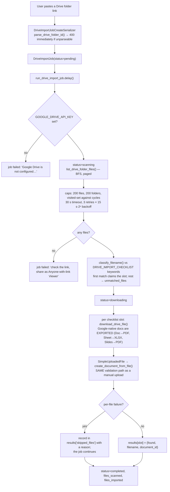

## 10.5 Tracing one uploaded file end to end

**`NAAC_SSR_2025.pdf`, 14 MB, 180 pages, uploaded to sprint `SPR-3FC78B7B`:**

1. `POST /sprints/{id}/upload-file` with `document_type=naac_ssr`.
2. Serializer: 14 MB < 50 MB ✓; `.pdf` allowed ✓; SHA-256 computed, not a duplicate ✓.
3. `Document` row created — `status=uploaded`, `ocr_required=True` (extension guess),
   `title="Naac Ssr 2025"` (humanised from the filename), file written to `media/`.
4. Sprint `draft → collecting`.
5. User clicks **Start AI Processing** → `ExtractionJob(status=pending)` created,
   `run_extraction_job.delay(job_id)` published to Redis; API returns `201` at once.
6. Worker picks it up → `status=running`, `started_at` set.
7. **Stage 1:** classifier reads pages 1–3, one AI call → `{document_type: "naac_ssr",
   confidence: 0.94, …}`; `processing_status='classified'`.
8. **Stage 2:** pdfplumber reads all 180 pages. Say 174 have real text and 6 are
   scanned images → `page_count=180`, `ocr_required` **corrected to `True`** with 6
   `ocr_warnings`; the null OCR provider performs no OCR (honest, not silent).
9. **Stage 3:** 174 pages → ~28 chunks at 12 000 chars → **capped at 20**, warning
   logged. 20 AI calls. Suppose 143 raw facts come back; 9 are dropped by
   `_validate_fact` (bad page citation, out-of-range confidence, unparseable number);
   duplicates merge by `field_key` → **97 facts**.
10. **Stage 4:** pass-through → 97 `ExtractedFact` rows inserted, each with
    `document` **and** `source_document` set to this document.
11. **Stage 5:** per fact — 22 below 0.7 → `low_confidence` gaps (6 of those below
    0.5 → `high` priority); the other 75 → `unconfirmed_fact` gaps. Uploaded today,
    so no `stale_data` gap. All routed through `create_gap_if_new`.
12. **Stage 6:** candidate pairs against other documents in the sprint; capped at 10
    AI calls; confirmed conflicts become `CONFLICT` gaps carrying immutable
    `conflict_value_a`/`_b` snapshots.
13. **Stage 7:** `document.status = processed`, `processed_at` set; job
    `completed`, `progress_percentage = 100`.
14. Last active job in the sprint → sprint `processing → reviewing`, and
    `generate_gaps_for_sprint()` adds `missing_document` gaps for whichever of the
    six `REQUIRED_DOCUMENT_TYPES` are absent.
15. **Only if Pinecone is configured** — `_queue_vector_indexing(document)` writes a
    `VectorDocumentIndex` row and queues `index_document_vectors`. The document is
    re-read, split into roughly 300 page-bounded chunks, embedded, and upserted under
    ids `college_…_document_…_chunk_0 … 299`. Wrapped in a bare `except`, so a
    missing SDK, an unconfigured index or a down broker is logged and dropped — step
    13's result is already committed and does not depend on this.
16. The monitor screen's next 3-second poll shows everything complete. *(The monitor
    does not surface indexing state; only `GET /sprints/{id}/vector-index/status`
    does, and no screen calls it.)*

---

# 11. Background jobs — Celery & Redis

## 11.1 Why background processing

A single document can trigger **up to 31 AI calls** plus a full PDF parse — minutes
of wall-clock time. Gunicorn's timeout is 120 s. Doing this in-request would time
out, hold a worker, and give the user no progress feedback. Instead the API returns
`201` immediately with a job row the frontend polls.

## 11.2 Configuration

`config/celery.py` — `Celery('aios_backend')`,
`config_from_object('django.conf:settings', namespace='CELERY')`,
`autodiscover_tasks()`.

| Setting | Value |
|---|---|
| `CELERY_BROKER_URL` | `redis://redis:6379/0` (prod) / `redis://localhost:6379/0` (default) |
| `CELERY_RESULT_BACKEND` | same |
| `CELERY_ACCEPT_CONTENT` / serializers | `json` |
| `CELERY_TIMEZONE` | `UTC` |
| **`CELERY_TASK_IGNORE_RESULT`** | **`True`** |
| Beat schedule | **none — deliberately** |

`CELERY_TASK_IGNORE_RESULT = True` carries an unusually good comment: nothing in the
project calls `.get()`/`.result` — every outcome is tracked in its own DB row — and
without this, a `.delay()` against a **down Redis** triggers the result backend's
~20-attempt reconnect cascade (~100 s) *before* the broker-unreachable error the
code already handles gracefully ever gets a chance to raise.

**Celery Beat is not configured, deliberately.** Every task is triggered on demand
from an API call. `config/settings.py` and `backend/README.md` both say to add
`CELERY_BEAT_SCHEDULE` only if a recurring job is ever introduced.

## 11.3 The five tasks

| Task | Module | Trigger | Retries | Backoff | On exhaustion |
|---|---|---|---|---|---|
| `run_extraction_job(job_id)` | `apps/extraction/tasks.py` | `POST /sprints/{id}/extraction-jobs` | **3** (`EXTRACTION_MAX_RETRIES`), `acks_late=True` | `30 s × 2ⁿ` → 30/60/120 | `ExtractionJob.status=failed`, `Document.status=failed` |
| `run_drive_import_job(job_id)` | `apps/documents/tasks.py` | `POST /sprints/{id}/drive-import-jobs` | **3** (`GOOGLE_DRIVE_IMPORT_MAX_RETRIES`), `acks_late=True` | `15 s × 2ⁿ` → 15/30/60 | `DriveImportJob.status=failed` |
| `generate_report_task(report_id)` | `apps/reports/tasks.py` | `POST /sprints/{id}/reports` | **none, by design** | — | `Report.status=failed`, error stored in `report_data['error']` |
| `index_document_vectors(document_id, force)` | `apps/vector_store/tasks.py` | End of a successful extraction, **or** `POST /sprints/{id}/vector-index` | **3** (`VECTOR_INDEX_MAX_RETRIES`), `acks_late=True` | `20 s × 2ⁿ` → 20/40/80 | `VectorDocumentIndex.status=failed` + the reason on the row |
| `index_sprint_vectors(sprint_id, force)` | `apps/vector_store/tasks.py` | Fan-out helper | — | — | Queues one task per document and returns the count |

`generate_report_task`'s docstring explains the asymmetry: unlike extraction (an
inherently flaky pipeline over external documents), report generation reads
already-validated data, so *"a failure here is a real bug to surface immediately,
not a transient condition worth retrying blindly."*

The two vector tasks follow extraction's policy exactly — recoverable errors back
off, permanent and *unrecognised* ones fail immediately rather than hiding a real
bug behind a retry loop. `index_sprint_vectors` fans out **one task per document**
rather than running one long task per sprint, so a single bad document costs one
document and each gets its own retry budget.

**Extraction never fails because of indexing.** The hand-off in
`apps/extraction/tasks.py` is wrapped whole:

```python
def _queue_vector_indexing(document):
    try:
        from apps.vector_store.services import indexer
        indexer.queue_document(document)
    except Exception as exc:
        logger.error('extraction.task.vector_queue_failed document_id=%s error=%s', document.id, exc)
```

A missing `pinecone` package, an unconfigured index, or a down broker is logged and
dropped — the extraction result is already committed and stands on its own.

## 11.4 Job status tracking

There is **no polling of Celery's own result backend**. Each task owns a DB row:

| Job | Status values | Progress signal |
|---|---|---|
| `ExtractionJob` | pending → running → retrying → completed / failed / cancelled | `current_step` (7 stages) + `progress_percentage` (15/30/45/60/75/90/100) |
| `DriveImportJob` | pending → scanning → downloading → completed / failed | `files_scanned`, `files_imported`, `results` JSON |
| `Report` | draft → generating → ready / failed | `status` alone |
| `VectorDocumentIndex` | pending → processing → indexed / failed | `vector_count`, `embedding_model`, `indexed_at`, `error_message` |

`celery_task_id` is stored on the first two so `SprintExtractionCancelView` can call
`current_app.control.revoke(task_id, terminate=True)`.

## 11.5 Failure handling when Redis is down

Every dispatch site wraps `.delay()` in `try/except Exception`:

```python
except Exception as exc:
    logger.error('…broker_unreachable job_id=%s error=%s', job.id, exc)
    job.status = FAILED
    job.error_message = f'Could not reach the Celery broker: {exc}'
    job.save(...)
```

The API still returns `201`/`202` with a job row whose `error_message` explains the
problem — **no 500, no hang**. The frontend's `humanizeExtractionError()` then
renders it readably.

Each dispatch site also catches `celery.exceptions.Retry`, which is only reachable
under `CELERY_TASK_ALWAYS_EAGER` (tests / a synchronous worker), where `.delay()`
runs the task inline; the code `refresh_from_db()`s so the response reflects what
actually happened rather than the stale in-memory row.

## 11.6 The queue flow

```mermaid
sequenceDiagram
    actor U as User
    participant API as Django (gunicorn)
    participant DB as PostgreSQL
    participant R as Redis (broker)
    participant W as Celery worker (concurrency 2)
    participant EXT as AI provider / Drive

    U->>API: POST /sprints/{id}/extraction-jobs
    API->>DB: INSERT ExtractionJob(status=pending)
    API->>R: run_extraction_job.delay(job_id)
    alt broker reachable
        R-->>API: AsyncResult(id)
        API->>DB: UPDATE job.celery_task_id
    else broker DOWN
        API->>DB: UPDATE job → failed + "Could not reach the Celery broker: …"
    end
    API-->>U: 201 [ExtractionJob]   (immediate)

    R->>W: deliver (acks_late — redelivered if the worker dies)
    W->>DB: job → running, started_at
    loop 7 stages
        W->>DB: UPDATE current_step, progress_percentage
        W->>EXT: AI / Drive calls
    end
    alt success
        W->>DB: job → completed; document → processed
        W->>DB: if no active jobs left → sprint → reviewing + sprint-wide gap pass
    else RecoverableExtractionError, attempt ≤ 3
        W->>DB: job → retrying, retry_count, error_message
        W->>R: retry with countdown 30·2ⁿ
    else Permanent / unknown / retries exhausted
        W->>DB: job → failed; document → failed
    end

    loop every 3 s
        U->>API: GET /sprints/{id}/extraction-jobs
        API->>DB: SELECT
        API-->>U: current_step + progress_percentage
    end
```

---

# 12. External services

| Service | Purpose | Where used | Authentication | Data sent | Data received |
|---|---|---|---|---|---|
| **OpenAI API** (`chat.completions`) | Document classification, fact extraction, conflict adjudication | `apps/extraction/services/openai_client.py` via `ai_service.get_ai_service()` | `AI_API_KEY` / `OPENAI_API_KEY` bearer (SDK) | System prompt + extracted document text (≤12 000 chars/chunk) + a JSON schema | Schema-constrained JSON: facts / classification / conflict verdict |
| **Anthropic API** (`messages`) | Same three call sites | `apps/extraction/services/anthropic_client.py` | `AI_API_KEY` (SDK) | Same, as a forced tool call with `input_schema` | The tool call's `.input` |
| **OpenAI-compatible endpoint** | Local router / self-hosted gateway / multi-provider proxy | Same `OpenAIExtractionService`, with `base_url` | `AI_API_KEY` | Same | Same — **requires genuine `response_format=json_schema` support**; the `.env` comment records that a previously-configured router returned prose instead of JSON |
| **Google Drive REST v3** | Import a shared folder of institutional documents | `apps/documents/drive_import.py` | **Single server-side API key** (`GOOGLE_DRIVE_API_KEY`) as a query param | Folder id, page tokens, file ids | File metadata (`id,name,mimeType,size`) and raw/exported bytes |
| **Redis 7** | Celery broker (and nominal result backend) | `config/celery.py` | none (container network only) | Task name + `job_id` | Task delivery |
| **PostgreSQL 16** | Primary datastore | `dj-database-url` | `POSTGRES_USER`/`POSTGRES_PASSWORD` | All application data | — |
| **Pinecone** *(optional)* | Vector index for college-evidence retrieval | `apps/vector_store/services/pinecone_client.py` — **the only module that imports the SDK, and lazily** | `PINECONE_API_KEY` (SDK) | Chunk text (≤1 200 chars) + 9 metadata keys, or a raw embedding vector; queries carry text/vector + the metadata filter | Matches: id, score, metadata. **Never the original file** |
| **OpenAI embeddings** *(optional)* | Vector generation, **manual mode only** | `apps/vector_store/services/embeddings.py` | `EMBEDDING_API_KEY`, falling back to `OPENAI_API_KEY` / `AI_API_KEY` | Chunk text | Float vectors (`text-embedding-3-small` = 1 536 d by default) |
| **GitHub Container Registry** | Image hosting | `.github/workflows/ci-cd.yml`, `docker-compose.yml` | `GITHUB_TOKEN` | Built images | Pulled images |

Neither Pinecone row is reached unless it is configured. In **integrated** mode
Pinecone embeds server-side and the OpenAI embeddings row does not apply at all.

**Not present:** S3/GCS/object storage, any email/SMTP provider, SMS, payment
gateway, analytics/telemetry, error tracking (Sentry), or feature flags — all
**Not found in the codebase**.

**Data-privacy note.** Institutional document text is sent to a third-party AI
provider. There is no PII redaction step, no per-institution consent record, and no
configurable data-residency control in the code. **Enabling the vector store widens
this**: the same text is also sent to Pinecone (and, in manual mode, to an embedding
provider), and the chunk text is *stored* there rather than merely passed through.
`PINECONE_CLOUD` / `PINECONE_REGION` give an operator control over where the index
lives, which is the only data-residency lever in the codebase. Whether any of this is
acceptable is a contractual question, but it is worth stating explicitly.
---

# 13. Configuration & environment variables

All configuration is read via `os.getenv` in `config/settings.py`, loaded from
`.env` by `python-dotenv`. **No values are reproduced here.**

## 13.1 Full variable table

| Variable | Purpose | Required? | Used where | Sensitive? |
|---|---|---|---|---|
| `SECRET_KEY` | Django cryptographic signing | **Yes in prod** — but has an insecure fallback | `settings.py`; also the JWT fallback key | **Yes** |
| `JWT_SECRET_KEY` | Signs access/refresh tokens | **Yes in prod** — falls back to `SECRET_KEY` | `SIMPLE_JWT['SIGNING_KEY']` | **Yes** |
| `DEBUG` | Debug mode; **`!DEBUG` switches on all production hardening** | No (default `False`) | `settings.py` | No |
| `ALLOWED_HOSTS` | Host allowlist, comma-separated | **Yes in prod** | `settings.py` | No |
| `CORS_ALLOWED_ORIGINS` | Browser origins allowed to call the API | **Yes in prod** | `corsheaders` | No |
| `DATABASE_URL` | Postgres DSN; **unset ⇒ SQLite fallback** | **Yes in prod** | `dj_database_url.config()` | **Yes** (embeds the password) |
| `POSTGRES_DB` / `POSTGRES_USER` / `POSTGRES_PASSWORD` | Postgres container init | **Yes in prod** | `docker-compose.yml` | **Yes** (password) |
| `REDIS_URL` | Redis DSN (informational) | No | `.env` | No |
| `CELERY_BROKER_URL` | Task broker | **Yes** | `config/celery.py` | No |
| `CELERY_RESULT_BACKEND` | Result backend (unused — `IGNORE_RESULT=True`) | No | same | No |
| `JWT_ACCESS_TOKEN_LIFETIME_MINUTES` | Access TTL (default **60**) | No | `SIMPLE_JWT` | No |
| `JWT_REFRESH_TOKEN_LIFETIME_DAYS` | Refresh TTL (default **1**) | No | `SIMPLE_JWT` | No |
| **`AI_API_KEY`** | The AI provider key; **provider is auto-detected from its prefix** | **Yes, for extraction** | `ai_service.get_ai_service()` | **Yes** |
| `AI_MODEL` | Model override; **mandatory when `AI_BASE_URL` is set** | No | same | No |
| `AI_BASE_URL` | OpenAI-compatible endpoint; **wins over key detection** | No | same | No |
| `OPENAI_API_KEY` | Legacy key (pre-multi-provider) | No | same | **Yes** |
| `OPENAI_EXTRACTION_MODEL` | Legacy model; **only honoured for OpenAI keys** | No | `_resolve_model` | No |
| `GOOGLE_DRIVE_API_KEY` | Drive REST v3 key | **Yes, for Drive import** | `documents/tasks.py` | **Yes** |
| `OPENAI_CLASSIFICATION_SAMPLE_PAGES` | Pages sampled for classification (**3**) | No | `openai_classifier.py` | No |
| `PDF_MIN_TEXT_CHARS_PER_PAGE` | OCR-required threshold (**40**) | No | `pdf_reader.py` | No |
| `OPENAI_FACT_EXTRACTION_MAX_CHUNK_CHARS` | Chunk size (**12 000**) | No | `openai_fact_extractor.py` | No |
| `OPENAI_FACT_EXTRACTION_MAX_CHUNKS` | **Hard AI-call cap per document (20)** | No | same | No |
| `GAP_CONFLICT_CHECK_MAX_PAIRS` | AI conflict calls per document (**10**) | No | `conflict_checker.py` | No |
| `EXTRACTION_MAX_RETRIES` | Retry count (**3**) | No | `extraction/tasks.py` | No |
| `EXTRACTION_RETRY_BACKOFF_SECONDS` | Base backoff (**30**) | No | same | No |
| `GOOGLE_DRIVE_IMPORT_MAX_FILES` | Files per import (**200**) | No | `drive_import.py` | No |
| `GOOGLE_DRIVE_IMPORT_MAX_FOLDERS` | Folders walked (**200**) | No | same | No |
| `GOOGLE_DRIVE_IMPORT_MAX_RETRIES` / `..._RETRY_BACKOFF_SECONDS` | Drive retry policy (**3** / **15**) | No | `documents/tasks.py` | No |
| `GAP_LOW_CONFIDENCE_THRESHOLD` | Low-confidence gap trigger (**0.7**) | No | `gaps`, `gap_detector` | No |
| `GAP_VERY_LOW_CONFIDENCE_THRESHOLD` | Escalate to `high` (**0.5**) | No | same | No |
| `GAP_STALE_DATA_DAYS` | Stale-document age (**365**) | No | same | No |
| `MAX_DOCUMENT_UPLOAD_SIZE` | Business size cap (**50 MB**) | No | `documents/serializers.py` | No |
| `DATA_UPLOAD_MAX_MEMORY_SIZE` / `FILE_UPLOAD_MAX_MEMORY_SIZE` | Django parse limits (**50 MB**) | No | `settings.py` | No |
| `SECURE_SSL_REDIRECT` | Force HTTPS when `DEBUG=False` (**default `True`**) | No | `settings.py` | No |
| `DJANGO_LOG_LEVEL` / `APP_LOG_LEVEL` / `CELERY_LOG_LEVEL` | Log levels (all default `INFO`) | No | `LOGGING` | No |
| `RUN_OPENAI_INTEGRATION_TESTS` | Enables the opt-in **real-API** test (spends quota) | No | `extraction/tests.py` | No |
| **`PINECONE_API_KEY`** | Pinecone auth. **Unset ⇒ the whole vector store is off** | No — optional feature | `vector_store/services/pinecone_client.py` | **Yes** |
| **`PINECONE_INDEX_NAME`** | Which index to read/write. Also required to enable | No | same | No |
| `PINECONE_CLOUD` / `PINECONE_REGION` | Recorded for the operator who **creates** the index (`aws` / `us-east-1`); the SDK resolves the index by name at runtime | No | same | No |
| `PINECONE_NAMESPACE` | Optional namespace (default `''`). Isolation does **not** depend on it — metadata filtering does | No | same | No |
| `PINECONE_EMBEDDING_MODE` | `auto` (default) / `integrated` / `manual` — who generates the embedding, and therefore which Pinecone API is used | No | same | No |
| **`EMBEDDING_API_KEY`** | Embedding provider key, **manual mode only**. Separate from `AI_API_KEY` because Anthropic has no embedding endpoint; falls back to `OPENAI_API_KEY` / `AI_API_KEY` | No | `vector_store/services/embeddings.py` | **Yes** |
| `EMBEDDING_MODEL` | Embedding model (**`text-embedding-3-small`**) | No | same | No |
| `EMBEDDING_DIMENSIONS` | Override only for a model whose width this app does not know; blank ⇒ derived | No | same | No |
| `EMBEDDING_BASE_URL` | Point at any OpenAI-compatible embedding endpoint | No | same | No |
| `VECTOR_CHUNK_MAX_CHARS` / `..._OVERLAP_CHARS` / `..._MIN_CHARS` | Chunking (**1 200** / **150** / **40**). Overlap must stay below max or chunking cannot terminate — enforced in `chunking.py` | No | `vector_store/services/chunking.py` | No |
| `VECTOR_INDEX_MAX_RETRIES` / `..._RETRY_BACKOFF_SECONDS` | Indexing retry policy (**3** / **20**) | No | `vector_store/tasks.py` | No |
| `VECTOR_SEARCH_DEFAULT_TOP_K` / `VECTOR_SEARCH_MAX_TOP_K` | Result count (**5**) and its hard ceiling (**50**), so a caller cannot ask for an unbounded set | No | `vector_store/services/search.py` | No |

> Integer vector settings go through a `_int_env()` helper rather than bare `int()`,
> so an env var that is *present but empty* (`EMBEDDING_DIMENSIONS=`) falls back to
> the default instead of crashing Django at import time.

## 13.2 Configuration by environment

| Concern | Local development | CI (GitHub Actions) | Production |
|---|---|---|---|
| Settings module | `config.settings` (single module) | same | same |
| `DEBUG` | `True` | `True` | `False` |
| Database | **SQLite** `db.sqlite3` (no `DATABASE_URL`) | SQLite | **Postgres 16** container via `DATABASE_URL` |
| Redis / Celery | `redis-server` locally (this machine uses **port 6380** — the `.env` comment explains WSL loopback forwarding on 6379 was unreliable) | Not started — Celery paths run eagerly / are mocked | `redis:7-alpine` container |
| Worker on Windows | `celery -A config worker -l info --pool=solo` (prefork does not work) | — | `--concurrency=2`, default pool |
| Secrets | `backend/.env` (**git-ignored**) | `SECRET_KEY`/`JWT_SECRET_KEY` injected as literal CI values | `/opt/ai-ready/.env` next to `docker-compose.yml` |
| AI calls | Real, if `AI_API_KEY` is set | **Mocked**, unless `RUN_OPENAI_INTEGRATION_TESTS=true` | Real |
| Security hardening | Off (`DEBUG=True`) | Off | **On** — SSL redirect, secure cookies, HSTS 1 year + preload, nosniff, XSS filter, `SECURE_PROXY_SSL_HEADER` |
| Static files | Served by Django | — | `collectstatic` at container start → `static_data` volume → nginx |
| API docs | `/api/docs` open | disabled in test settings | **still enabled** (`SERVE_INCLUDE_SCHEMA: False` only hides the schema endpoint from itself) |

---

# 14. Deployment architecture

## 14.1 The pipeline

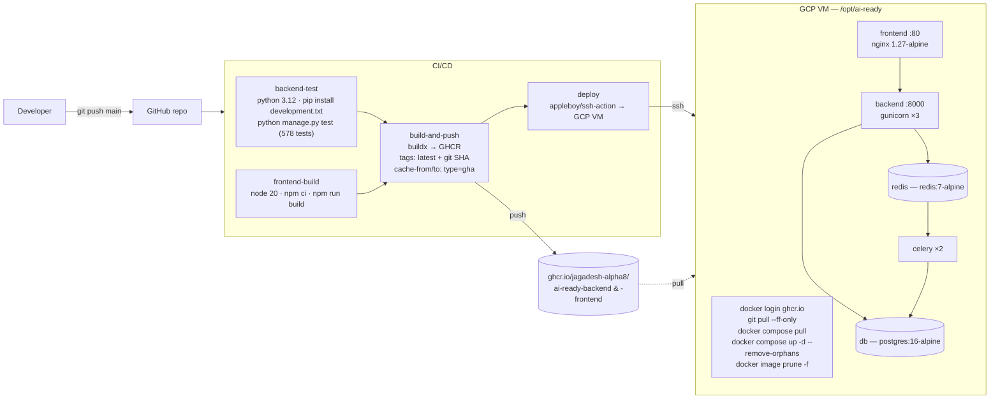

## 14.2 The five services

| Service | Image | Restart | Ports | Depends on | Command |
|---|---|---|---|---|---|
| `db` | `postgres:16-alpine` | `unless-stopped` | internal | — | default; **healthcheck `pg_isready`** every 10 s ×5 |
| `redis` | `redis:7-alpine` | `unless-stopped` | internal | — | default |
| `backend` | `ghcr.io/…/ai-ready-backend:latest` | `unless-stopped` | internal `:8000` | `db` (healthy), `redis` | `gunicorn config.wsgi:application --bind 0.0.0.0:8000 --workers 3 --timeout 120` |
| `celery` | **same image** | `unless-stopped` | — | `db` (healthy), `redis`, `backend` | `celery -A config worker -l info --concurrency=2` |
| `frontend` | `ghcr.io/…/ai-ready-frontend:latest` | `unless-stopped` | **`80:80`** | `backend` | nginx |

**Volumes:** `postgres_data`, `redis_data`, `media_data` (shared **backend + celery**
— essential, since the worker reads uploaded PDFs and writes rendered reports),
`static_data` (shared **backend + frontend**, read-only on the nginx side).

## 14.3 Migration safety

`backend/docker-entrypoint.sh`:

```sh
if [ "$1" = "gunicorn" ]; then
  python manage.py migrate --noinput
  python manage.py collectstatic --noinput
fi
exec "$@"
```

Only the **web** process migrates. The `celery` service shares the same image but
its command starts with `celery`, so it does not race the web container's migration
on every deploy. This is a correct and deliberate design.

## 14.4 nginx (`frontend/nginx.conf`)

| Location | Behaviour |
|---|---|
| `/static/` | `alias /usr/share/nginx/html/static/` — the shared `static_data` volume; `access_log off`, `expires 30d` |
| `/api/` | `proxy_pass http://backend:8000/api/` with `Host`, `X-Real-IP`, `X-Forwarded-For`, `X-Forwarded-Proto` |
| `/admin/` | same proxy to the Django admin |
| `/` | `try_files $uri $uri/ /index.html` — React Router SPA fallback |
| global | `client_max_body_size 100m` — the 1 MB nginx default would reject 50 MB uploads before they reached Django |

## 14.5 Infrastructure inventory

| Layer | Choice |
|---|---|
| Cloud provider | **GCP** (`GCP_HOST` / `GCP_SSH_USER` / `GCP_SSH_KEY` / `GCP_SSH_PORT` secrets) |
| Server | A single VM, deploy root `/opt/ai-ready` |
| OS | Linux with Docker + Compose v2 (`docker compose`). Exact distro: **Not found in the codebase** |
| Orchestration | **Docker Compose** — no Kubernetes |
| Web server | nginx 1.27-alpine (SPA + reverse proxy) |
| App server | Gunicorn, 3 sync workers, 120 s timeout |
| Database | PostgreSQL 16 in a container, `postgres_data` volume |
| Object storage | **None** — local `media_data` volume |
| Cache / broker | Redis 7 in a container |
| Worker | Celery, concurrency 2 |
| Domain / DNS | **Not found in the codebase** (`.env.production.example` says "your-vm-ip-or-domain") |
| SSL/TLS | **Not found in the codebase** — no certbot, no TLS listener, port 80 only. But `SECURE_SSL_REDIRECT` defaults to `True` when `DEBUG=False` ⇒ see §17 |
| Firewall / security groups | **Not found in the codebase** — configured outside the repo |
| CI/CD | GitHub Actions → GHCR → SSH |
| Registry | GitHub Container Registry |
| Backups | **Not found in the codebase** |
| Monitoring / alerting | **Not found in the codebase** — container logs only |
| Healthcheck | Only on `db` (`pg_isready`). **No healthcheck on `backend`, `celery`, or `frontend`**, and no post-deploy verification step in the workflow |

## 14.6 Deployment concerns worth flagging

1. **`git pull --ff-only` on the VM** means the VM holds a full checkout purely to
   get `docker-compose.yml`. If someone edits a file on the server, the deploy
   fails on a non-fast-forward. A single-file fetch or a baked-in compose file
   would be more robust.
2. **`docker compose up -d` with no healthcheck on `backend`** means the deploy job
   reports success as soon as containers start — even if Django then fails to boot
   (bad migration, missing env var). Nothing verifies the app actually serves.
3. **No rollback path.** Images are tagged with the SHA, so a rollback is possible
   manually, but the workflow only ever pulls `:latest`.
4. **`SECURE_SSL_REDIRECT` + port 80 only.** With `DEBUG=False` and no TLS
   terminator in front, Django will 301 every HTTP request to HTTPS, which nothing
   is listening on. Either set `SECURE_SSL_REDIRECT=False` in `.env` or put TLS in
   front. This is the single most likely "it deployed but the site is broken" trap.

---

# 15. Complete user journeys

## Workflow 1 — Consultant signs in and opens the dashboard

1. **User:** opens the app, is redirected `/` → `/dashboard` → (no session) `/login`.
2. **Frontend:** `Login.tsx`. Types `consultant@ingage.ai` + password, or clicks the
   "InGage Lead Consultant" quick-login tile.
3. **API:** `POST /api/v1/auth/login` `{email, password}` — **no auth required**.
4. **Backend:** `LoginView` → `LoginSerializer.validate()` → Django `authenticate()`
   with `username=email` → checks `is_active`.
5. **DB:** `SELECT … FROM accounts_user WHERE email = …`; PBKDF2 verify.
6. **Response:** `200 {access_token, refresh_token, user}`.
7. **Frontend:** `AuthContext.login()` writes `aios_token` + `aios_refresh_token` to
   `localStorage`, sets `token`, which fires the effect → `GET /auth/me` →
   `setUser`. `LoginRoute` sees a user and `<Navigate to="/dashboard">`.
8. **Dashboard:** `useApiResource(() => getDashboard(), [])` → `GET /api/v1/dashboard`.
9. **Backend:** `get_accessible_institution_ids(user)` returns `None` (consultant is
   cross-institution) → **no filtering** → seven metric queries + the annotated,
   prefetched sprint list.
10. **User sees:** platform-wide tiles (active sprints, avg completion, reports
    ready, pending confirmations, high-priority gaps, sprint count, institution
    count) and every sprint, newest-updated first.
11. **60 minutes later** the access token expires; the next call 401s, the axios
    interceptor silently refreshes and replays it. The user notices nothing.

## Workflow 2 — Main business operation: documents → CRI score

1. **Screen 1 (`/sprint/setup`):** the consultant picks *M. Kumarasamy College of
   Engineering*, mode `verified_cri`, academic year `2026-27`.
   → `POST /sprints` → `201`, `sprint_code = SPR-…`, `status=draft`.
2. **Screen 2 (`/sprint/{id}/upload`):** uploads NAAC SSR, AQAR, AICTE approval,
   faculty list, student strength, placement report.
   → six `POST /sprints/{id}/upload-file` calls. Each validates size/extension/
   checksum, writes to `media/`, and the first one flips `draft → collecting`.
   *(Alternative: paste one Drive folder link → `POST /drive-import-jobs` → Celery
   walks the folder, keyword-matches filenames, and imports through the same path.)*
3. **Screen 3 (`/sprint/{id}/monitor`):** clicks **Start AI Processing**.
   → `POST /sprints/{id}/extraction-jobs` → sprint `collecting → processing`, six
   `ExtractionJob` rows, six `.delay()` publishes, `201` returned immediately.
   The screen polls every 3 s and shows a 7-stage bar per document.
4. **Worker (per document):** classify (1 AI call) → pdfplumber reads pages →
   chunk + extract facts (≤20 AI calls) → persist `ExtractedFact` rows → rule-based
   gaps → AI conflict adjudication (≤10 calls) → `document → processed`.
   When the last job finishes: sprint `processing → reviewing` and the sprint-wide
   gap pass adds `missing_document` gaps for absent required types.
5. **Screen 4 (`/sprint/{id}/facts`):** the IQAC Coordinator reviews. For each fact
   they see the value, the pillar, the confidence, and **the exact source snippet
   and page**. They confirm most, correct one ("Total faculty" 312 → 318).
   → `POST /facts/{id}/confirm` and `POST /facts/{id}/correct {corrected_value}`.
   Each writes a `FactReviewHistory` row capturing the **previous** value first.
6. **Screen 5 (`/sprint/{id}/gaps`):** works the gap list — resolves what they can,
   marks genuinely-unavailable items `unavailable`, skips the rest.
7. **Screen 6 (`/sprint/{id}/confirmation`):** the owner-role queue — the Registrar
   confirms enrolment facts, the HR Officer confirms faculty facts, and so on.
8. **Screen 7 (`/sprint/{id}/score`):** `POST /sprints/{id}/score`.
   → the nine-step engine reads only `confirmed`/`corrected` facts and
   `open`/`in_progress` gaps, evaluates 8 pillars against their criteria, subtracts
   the gap penalties, writes 8 `PillarScore` rows + 1 `ScoringRun`, denormalises
   `overall_cri`/`confidence_score` onto the sprint, and moves `reviewing → scoring`.
9. **User sees:** e.g. **CRI 63.4 / 100, confidence 71%**, with
   *Infrastructure & Digital Capability* `strong` and *Research & Innovation*
   `at_risk`, plus the live evidence metrics and any unresolved blocking gaps.

## Workflow 3 — Data/file processing: one Drive folder to a downloadable report

1. **Paste** `https://drive.google.com/drive/folders/1AbC…` on Screen 2.
   `DriveImportJobCreateSerializer` parses the folder id **immediately** — a
   malformed link is a `400` before any job is created.
2. **`DriveImportJob(status=pending)`** created; `run_drive_import_job.delay()`.
3. **Worker:** checks `GOOGLE_DRIVE_API_KEY` (missing ⇒ job fails with a clear
   admin-facing message) → `status=scanning` → BFS walk of the folder tree, paging
   each folder, capped at 200 files / 200 folders, cycle-guarded.
4. **No files?** → job fails with *"check the link, and make sure the folder is
   shared as 'Anyone with the link — Viewer'."*
5. **Classification:** each filename is lowercased and keyword-matched against
   `DRIVE_IMPORT_CHECKLIST`; the first match claims a slot; the rest go to
   `results['unmatched_files']`.
6. **`status=downloading`:** per claimed slot, `download_drive_file()` — a
   Google-native Doc is **exported** to PDF, a Sheet to XLSX, Slides to PDF; a raw
   file is fetched with `alt=media`.
7. **Import:** wrapped in `SimpleUploadedFile` and pushed through
   **`create_document_from_file()` — the same validation as a manual upload**. A
   per-file failure is recorded in `results['skipped_files']` with a reason and the
   job continues.
8. **Completion:** `results` now maps every checklist slot to `found`/`missing`;
   the UI ticks the checklist. Extraction then runs exactly as in Workflow 2.
9. **Screen 8 — approval:** `GET /sprints/{id}/baseline` bootstraps a `PENDING`
   Baseline pinned to the latest `ScoringRun` and moves the sprint to
   `baseline_pending`. If any blocking gap is open, `can_approve` is `false` and
   full approval is refused server-side; the consultant either resolves them,
   approves **provisionally**, or **returns for correction** with a mandatory reason
   (sending the sprint back to `reviewing`).
10. **Screen 9 — recommendations:** `POST /recommendations/generate` runs three
    idempotent generators (open blocking/high gaps; confirmed-but-low-confidence
    facts; at-risk/not-started pillars). Each recommendation states the exact data
    point that triggered it and an `expected_cri_lift`. A consultant may `PATCH`
    the wording — **no other role can**.
11. **Screen 10 — report:** `POST /sprints/{id}/reports` → new version row →
    `generate_report_task.delay()` → `202`. The worker assembles the 11 sections,
    renders a PDF with fpdf2 (Latin-1-sanitised) and a DOCX with python-docx, saves
    both to `media/`, sets `status=ready`, and moves the sprint
    `baseline_approved → report_ready`.
12. **Download:** the page polls every 3 s until `ready`, then
    `GET /reports/{id}/download?file=pdf` streams the file as an attachment through
    the authenticated endpoint.

**The 11 report sections** (`reports/services.py::build_report_data`):
institution · sprint · baseline status · executive summary · overall CRI &
confidence · 8 pillar scorecards · strengths · areas for improvement ·
missing-data appendix · recommendations · 90-day action plan · 12-month roadmap ·
how InGage can help · evidence metrics.

Every one is derived from real rows; the module docstring is explicit that an empty
source produces an honest empty section, never placeholder text.
---

# 16. Error handling

## 16.1 By layer

| Layer | Mechanism | Behaviour |
|---|---|---|
| **Frontend — network/API** | `utils/errors.ts::getErrorMessage()` | Normalises DRF's three shapes (`{detail}`, `{non_field_errors:[…]}`, `{field:[msg]}`) into one string; falls back to `err.message` |
| **Frontend — extraction** | `humanizeExtractionError(message, willRetry)` | Rewrites known backend errors (rate limit/quota, timeout, unreachable, corrupt PDF, no file, unconfigured key, server error) into user guidance; correctly **suppresses "will retry automatically" once retries are exhausted**; unknown messages pass through untouched |
| **Frontend — 401** | axios response interceptor | Silent single-flight refresh + replay; on failure, clears tokens and redirects to `/login` |
| **Frontend — render** | `components/ApiStates.tsx` + `useApiResource`'s `error` | Shared loading / error-with-retry / empty states |
| **Backend — validation** | DRF serializers | `400 {"field": ["message"]}` |
| **Backend — auth** | `JWTAuthentication` | `401 {"detail": …}` |
| **Backend — permission** | permission classes / `require_institution_access` | `403 {"detail": <class .message>}` |
| **Backend — missing** | `get_object_or_404` | `404 {"detail": "Not found."}` |
| **Backend — business rules** | `raise ValidationError(...)` in views/services | `400` with an explanatory message |
| **Celery — extraction** | typed exception taxonomy | Recoverable → retry ×3 with exponential backoff; permanent/unknown → fail immediately; **all state recorded on the job row** |
| **Celery — Drive import** | same shape | Per-file failures are **recorded and skipped**, not fatal to the job |
| **Celery — reports** | broad `except Exception` | `status=failed`, error stored in `report_data['error']`; **no retry, deliberately** |
| **Celery — vector indexing** | typed taxonomy mirroring extraction's | Recoverable → retry ×3 at 20/40/80 s; permanent/unknown → fail immediately, reason written to `VectorDocumentIndex.error_message`. **Classification is by HTTP status code**, not by string-matching the exception text — an earlier keyword approach misread a `400`'s header dump as transient |
| **Broker down** | `try/except` around every `.delay()` | Job marked failed with `"Could not reach the Celery broker: …"`; **API still returns 201/202** |
| **Logging** | `LOGGING` in settings | Console handler, `{asctime} {levelname} {name} {message}`; `django`/`apps`/`celery` loggers at INFO, root at WARNING. The comment notes that without this block, `apps.*` module loggers would silently vanish into Python's last-resort handler |

## 16.2 What happens when each thing fails

| Failure | Result |
|---|---|
| **Wrong password** | `400 {"non_field_errors": ["Invalid login credentials"]}` — inline on the login form |
| **Disabled account** | `400 ["This account has been disabled"]` |
| **Access token expired** | Transparent refresh + replay; user sees nothing |
| **Refresh token expired/blacklisted** | Tokens cleared, hard redirect to `/login` |
| **Wrong institution** | `403 "You do not have access to this institution."` |
| **Wrong role for a write** | `403` with the gate's own message, e.g. *"Only InGage consultants can edit recommendations."* |
| **Upload too large / wrong type / duplicate** | `400` with a specific, human message naming the size or the existing document |
| **Corrupt or password-protected PDF** | `PermanentExtractionError("Could not parse PDF: …")` → job fails immediately (no wasted retries) → frontend shows *"This document could not be read — it may be corrupted, password-protected, or not a valid PDF."* |
| **Non-PDF document** | Read returns `format_supported: False`; pipeline completes with **zero facts**. **The UI does not explain this** — see §17/§27 |
| **AI rate limit / timeout / 5xx** | Recoverable → 3 retries at 30/60/120 s → then failed; UI: *"The AI service is temporarily unavailable…"* |
| **AI 4xx (bad key)** | Permanent → immediate failure; UI: *"The AI service is not configured on the server. Contact your administrator."* |
| **AI returns malformed/truncated JSON** | `AIResponseError` (permanent) — retrying identical input cannot help |
| **AI returns one bad fact** | **That fact only** is dropped with a warning; the chunk and document continue |
| **AI invents a page number** | The fact is rejected by `_validate_fact` |
| **Redis down** | Job row created + marked failed with a clear message; API returns normally |
| **Drive folder not shared** | Job fails with explicit guidance to share as "Anyone with the link — Viewer" |
| **One Drive file fails to export** | Recorded in `results['skipped_files']` with a reason; the rest import |
| **Report render fails** | `Report.status=failed`, exception text in `report_data['error']`; the polling page stops |
| **Approve with blocking gaps open** | `400` naming the count and pointing at approve-provisionally |
| **Recalculate a locked baseline** | `400` explaining the baseline must be returned for correction first |
| **Delete an active sprint** | `400` *"Archive it first (or delete it while still a draft)."* |
| **Delete a non-failed extraction job** | `400` *"Only failed jobs can be deleted."* |
| **Delete an institution** | Hard cascade inside a transaction. `Baseline` rows are cleared first to avoid a `ProtectedError` from the `PROTECT`-vs-`CASCADE` collector interaction on `Baseline.scoring_run` |
| **Pinecone unconfigured (or the SDK not installed)** | No task is queued and no row is written — the rest of the platform is unaffected. The three vector endpoints return `503` naming the missing variables, so *"not configured"* is never mistaken for *"no results"* |
| **Pinecone rate-limited / timing out / down** | Indexing retries; a *search* returns `503 "Evidence search is temporarily unavailable: …"` so the caller knows to retry rather than assuming the college has no evidence |
| **A document re-indexed with unchanged text** | No-op — the content hash matches, so nothing is re-embedded and no cost is incurred |
| **Indexing fails for one document** | That document alone is marked `failed` with its reason; the sprint's other documents index normally, each having its own task and retry budget |

## 16.3 Missing error handling

| Gap | Impact |
|---|---|
| **No global frontend `ErrorBoundary`** | A render-time exception in any page blanks the whole SPA |
| **No user-facing signal for unreadable file types** | A DOCX/XLSX/CSV/ZIP upload processes "successfully" with zero facts and no explanation |
| **No dead-letter / stuck-job sweeper** | A job whose worker is killed mid-run stays `running` forever. `acks_late=True` gets the *message* redelivered, but nothing reconciles the DB row — and there is no Beat to run a sweeper |
| **No structured/centralised error reporting** | Console logs only; no Sentry or equivalent |
| **`_advance_sprint_if_all_jobs_done` is not transactional** | Two workers finishing simultaneously could both see "nothing active" and both run `generate_gaps_for_sprint` — the gap constraints prevent duplicate rows, so it is wasted work rather than corruption |
| **Classification result is discarded** | Stage 1 spends a full AI call, logs the answer, and writes nothing but `processing_status='classified'` |

---

# 17. Security analysis

## Good

| # | Finding |
|---|---|
| 1 | **Secrets are not committed.** `git ls-files` shows only `.env.example` files tracked; `backend/.env`, `db.sqlite3`, and `media/` are all correctly git-ignored. |
| 2 | **`DEFAULT_PERMISSION_CLASSES = (IsAuthenticated,)`** — endpoints are private by default; only `LoginView` opts out. |
| 3 | **Two-layer authorization**, consistently applied: a role gate plus an institution check, with the nested-route helper (`get_authorized_sprint`) ensuring sub-resources are not missed. |
| 4 | **Media is never served statically**, even under `DEBUG` — `config/urls.py` documents the reason. Downloads go through an authenticated `FileResponse` endpoint. |
| 5 | **Upload hardening:** extension allowlist, 50 MB business cap plus Django parse limits, SHA-256 dedupe, and `document_type` constrained by regex. |
| 6 | **AI secrets never logged.** Both clients log only model + duration + outcome, explicitly *not* the key, prompt, or response body. The Drive module keeps the API key out of exception messages. |
| 7 | **Every AI field is re-validated in Python** — the model cannot inject an out-of-range confidence, an unknown pillar, an unknown owner role, or a fabricated page citation. |
| 8 | **Refresh-token blacklisting is real** — `token_blacklist` is installed and `logout` uses it. |
| 9 | **Production hardening is automatic** when `DEBUG=False`: SSL redirect, secure session/CSRF cookies, HSTS 1 year + subdomains + preload, nosniff, XSS filter, `SECURE_PROXY_SSL_HEADER`. |
| 10 | **SQL injection is structurally prevented** — every query goes through the Django ORM; there is no `raw()`, no `extra()`, no string-built SQL anywhere. |
| 11 | **XSS is structurally low-risk** — React escapes by default and there is **no `dangerouslySetInnerHTML`** anywhere in the frontend. |
| 12 | **Password validation** uses Django's four validators on change-password. |
| 13 | **CORS is explicitly allowlisted** (`CORS_ALLOWED_ORIGINS`), not `CORS_ALLOW_ALL_ORIGINS`. |
| 14 | **Immutable audit trails** — `FactReviewHistory`, `BaselineDecisionHistory`, `ScoringRun.pillar_snapshot`, `Report.version`, and the `PROTECT` FK on `Baseline.scoring_run`. |
| 15 | **Only failed extraction jobs are deletable**, and only draft/completed/archived sprints — history cannot be quietly destroyed. |
| 16 | **578 tests** across 12 apps, including permission and institution-scoping tests. |
| 17 | **Cross-institution vector retrieval is structurally prevented.** The `college_id` filter is built server-side in `search.build_filter()`, never accepted from the caller; the institution comes from the URL's sprint, not the request body; and `pinecone_client._require_filter()` refuses to issue an unfiltered query at all. Filtering happens **inside Pinecone**, not by discarding rows after retrieval. |
| 18 | **Pinecone internals never reach the client** — no index name, host, key or raw match object is serialized. Unconfigured deployments get a `503` with a stated reason, not a `500` stack trace. |

## Needs improvement

| # | Finding | Detail |
|---|---|---|
| 1 | **No rate limiting anywhere** | DRF `DEFAULT_THROTTLE_CLASSES`/`_RATES` are not configured. `POST /auth/login` accepts unlimited attempts. |
| 2 | **No account lockout** | Combined with #1, credential stuffing is unimpeded. |
| 3 | **Tokens in `localStorage`** | Standard SPA trade-off, but XSS-readable. The 60-minute access TTL limits the window; the 1-day refresh token does not. |
| 4 | **Refresh tokens are not rotated** | `ROTATE_REFRESH_TOKENS: False` and `BLACKLIST_AFTER_ROTATION: False` — a stolen refresh token is valid for its full day and is only revoked by an explicit logout. |
| 5 | **`viewer` can read everything in its institution** | Every role gate returns `True` for `SAFE_METHODS`, so a "Trustee Board" viewer can read raw facts, gaps, and unpublished reports — not only approved ones, as the persona description implies. |
| 6 | **No frontend role gating** | `ProtectedLayout` checks only for a session; every screen is reachable by every role, failing only on the action. |
| 7 | **Uploaded file content is never inspected** | Only the extension is checked. A renamed executable, a zip bomb, or a malicious PDF is accepted (though only PDFs are ever parsed, by pdfplumber, in the worker). `.zip` is allowed but never processed. |
| 8 | **No PII redaction before AI calls** | Full document text — potentially containing student and staff personal data — is sent to a third-party provider with no consent record or residency control. |
| 9 | **Drive import requires public link-sharing** | An API-key-only integration cannot read a private folder, so institutions must expose the folder to anyone with the link for the duration. A service account would remove this. |
| 10 | **API docs are enabled in production** | `/api/docs` and `/api/schema` are unauthenticated and not disabled when `DEBUG=False`. |
| 11 | **`GOOGLE_DRIVE_API_KEY` travels as a URL query parameter** | Inherent to the Drive REST API-key flow; it is kept out of logs and exceptions, but it will appear in any intermediary's request logs. |
| 12 | **No database encryption at rest / no backups in the repo** | `postgres_data` and `media_data` are plain Docker volumes. |
| 13 | **No `SECURE_REFERRER_POLICY` or CSP** | Neither is set; `X-Frame-Options` is on via middleware. |
| 14 | **`ALLOWED_HOSTS` defaults to `localhost,127.0.0.1`** | Safe by default, but a misconfigured deploy fails confusingly rather than loudly. |

## High priority

| # | Finding | Why it matters | Where |
|---|---|---|---|
| **H1** | **`SECRET_KEY` has an insecure fallback and never fails fast.** `SECRET_KEY = os.getenv('SECRET_KEY', 'django-insecure-default-key-change-me')` — and `JWT_SECRET_KEY` falls back to `SECRET_KEY`. A deployment that forgets both env vars boots happily and **signs every JWT with a key published in this repository**, letting anyone mint a `super_admin` token. | Total authentication bypass | `backend/config/settings.py` |
| **H2** | **The production login page ships 11 real account emails and a hardcoded password.** `frontend/src/pages/auth/Login.tsx` defines `SEEDED_ROLES` with quick-login buttons that call `login(email, 'Password123!')`, and the email/password fields are **pre-filled** with `superadmin@ingage.ai` / `Password123!`. `AuthContext.login()` also *defaults* its password parameter to `'Password123!'`. This is in the built bundle. If `seed_demo_users` was ever run against production, anyone visiting the site is one click from super-admin. | Full account takeover | `Login.tsx`, `AuthContext.tsx`, `seed_demo_users.py` |
| **H3** | **`SECURE_SSL_REDIRECT` is on by default with no TLS anywhere.** With `DEBUG=False`, Django 301-redirects every request to `https://`, but compose exposes only `80:80` and there is no certificate, no certbot, and no TLS terminator in the repo. Either the site is unreachable, or `SECURE_SSL_REDIRECT=False` is set and **all traffic — including JWTs — is plaintext HTTP**. | Credential/token interception, or an unusable deploy | `settings.py`, `docker-compose.yml`, `nginx.conf` |
| **H4** | **No throttling on authentication.** With H2's known emails, an unthrottled `POST /auth/login` is a ready-made credential-stuffing target. | Brute force | `settings.py` (REST_FRAMEWORK) |
| **H5** | **Django admin is exposed at `/admin/` over the same nginx** with session auth, no IP restriction, and no 2FA. Combined with H1/H3 this is the highest-value target on the box. | Privilege escalation | `nginx.conf`, `config/urls.py` |

> **Also worth naming (correctness, not security):** the `DRIVE_IMPORT_CHECKLIST`
> slugs (`aqar_report`, `faculty_master`, `research_publications`) do **not** match
> `REQUIRED_DOCUMENT_TYPES` (`aqar`, `faculty_master_list`, …). A Drive-imported
> AQAR therefore does **not** satisfy the `missing_document` gap check, so a sprint
> that imported everything correctly can still show blocking gaps and be refused
> full baseline approval. The divergence is documented in `constants.py` as
> pre-existing and out of scope, but it is a live functional defect.

---

# 18. Performance analysis

## 18.1 Database

| # | Issue | Location | Impact |
|---|---|---|---|
| P1 | **N+1 in the conflict pre-filter.** `_candidate_pairs()` loops over every fact of the document and runs a **separate query per fact**. With 97 facts that is 98 queries — and the pair list can grow to O(n²) before being sliced to `max_pairs`. | `extraction/services/conflict_checker.py` | Slow, per document |
| P2 | **N+1 in gap generation.** `_detect_low_confidence_facts` and `_detect_unconfirmed_facts` call `create_gap_if_new()` per fact, each doing an `exists()` then an `INSERT`. ~200 queries for 100 facts. | `gaps/services.py` | Slow at the end of every sprint |
| P3 | **N+1 in recommendation generation.** `_derive_gap_owner_role(gap)` touches `gap.source_fact.owner_role` / `gap.related_document.owner_role` with **no `select_related`** on the gaps queryset. | `recommendations/services.py` | One extra query per gap |
| P4 | **~32 queries per scoring run.** `_evaluate_pillar` runs `count()`, `count()`, and `aggregate()` on the gaps queryset **separately** — three round trips × 8 pillars — plus the per-criterion fact reads. | `scoring/services/cri_engine.py` | Moderate; every recalculation |
| P5 | **~20 `count()` queries in one request.** `SprintViewSet.overview` counts documents (7 buckets), facts (6), gaps (5), recommendations (3), reports (1) individually, then serialises every document, recommendation, and the scorecard. | `sprints/views.py` | The heaviest single endpoint |
| P6 | **Almost no composite indexes.** The hot filters — `facts(sprint_id, status)`, `gaps(sprint_id, status, priority)`, `documents(sprint_id, status)`, `extraction_jobs(sprint_id, status)` — rely on single-column FK indexes only. `vector_store` is the one app that declares the index for its own filter (`ix_vecidx_sprint_status`), which is the pattern the others should follow. | all migrations | Grows with data volume |
| P7 | **`_detect_conflicting_facts` loads every fact into memory** and groups in Python. | `gaps/services.py` | Memory + time on large sprints |

**Recommendations:** batch P1 into one `field_key__in=[…]` query; use `bulk_create`
with `ignore_conflicts=True` (backed by the existing partial unique constraints) for
P2; add `.select_related('source_fact','related_document')` for P3; collapse P4's
three gap queries into one `.aggregate(Count(...), Count(..., filter=...), Sum(...))`;
replace P5's counts with a single `.aggregate()` of conditional `Count`s (carefully —
the dashboard's own comment warns about fanning out reverse-FK joins); add the
composite indexes in P6.

## 18.2 AI cost and latency

| Metric | Value |
|---|---|
| Calls per document | 1 (classify) + ≤20 (extract) + ≤10 (conflicts) = **≤31** |
| Repeated system prompt | **~1 500 tokens × up to 20 chunks** per document, uncached |
| Timeout per call | 60 s |
| Worker concurrency | **2** |
| Serial worst case, 6 documents | 6 × 31 = 186 calls; at ~3 s each and concurrency 2 ≈ **5 minutes** |

**Biggest wins, in order:** (1) prompt caching on the fact-extraction system block;
(2) batch the conflict checker into one multi-pair request; (3) reuse stage 2's page
read for stage 1 instead of re-parsing the PDF; (4) consider a cheaper model for
classification. All four are behaviour-preserving. See §9.5.

### Indexing cost, when the vector store is enabled

| Metric | Value |
|---|---|
| Chunks per document | Roughly `chars / 1 050` per page (1 200 max less 150 overlap), rounded up at each sentence boundary — a 180-page PDF runs to a few hundred |
| Embedding calls | Batched: **96** records per `upsert_records` (integrated) or **100** vectors per `upsert` (manual). ~300 chunks → 3–4 calls |
| Re-index cost when nothing changed | **Zero.** The SHA-256 content-hash check short-circuits before any embedding, which is what makes "re-index this sprint" safe to press repeatedly |
| Search | One embedding call (manual mode only) + one filtered `query`; `top_k` is capped at 50 |
| Effect on the user's request | **None** — all indexing is on Celery; only search is synchronous, and it is a single round trip |

The batch caps are not cosmetic: `upsert_records` rejects a batch above **96**
outright, which is why the integrated store carries a different constant from the
manual one.

## 18.3 Frontend

| # | Issue |
|---|---|
| F1 | **No code splitting.** Every one of the 15 pages is a static top-level import in `App.tsx`. `React.lazy` + `Suspense` per route would materially cut the initial bundle. |
| F2 | **3-second polling with no backoff.** Both `AIProcessingMonitor` and `ReportPreviewExport` poll unconditionally. A 20-minute extraction is ~400 requests per open tab. Exponential backoff, or stopping once every job is terminal, would cut this by an order of magnitude. |
| F3 | **No request caching or deduplication.** Every mount refetches; `useApiResource` has no cache. React Query/SWR would remove most redundant calls. |
| F4 | **Full list refetch after every single action.** Confirming one fact refetches the whole fact list. |
| F5 | **No virtualisation.** A sprint with a thousand facts renders a thousand DOM rows; pagination exists on the API but the frontend never passes `?page`. |

## 18.4 Infrastructure

| # | Issue |
|---|---|
| I1 | **Gunicorn: 3 sync workers.** Every request occupies a worker for its full duration; the heavy `overview` endpoint can starve the pool. Consider `gthread` or more workers. |
| I2 | **Celery concurrency 2** — at most two documents process at once. Fine for a single sprint, a bottleneck for concurrent engagements. |
| I3 | **`conn_max_age=600`** persistent connections × (3 gunicorn + 2 celery) processes — well within Postgres defaults, but worth watching if worker counts rise. |
| I4 | **No caching layer.** Redis is present but used **only** as a Celery broker. `GET /dashboard`, `GET /sprints/{id}/overview`, and `GET /scoring/config` are all excellent cache candidates. |
| I5 | **`media_data` is a local volume** — no CDN, no offload; every report download streams through Django and Gunicorn. |

---

# 19. Project folder structure

```text
D:\AI READY\
├── .github/workflows/ci-cd.yml     # test → build → push to GHCR → SSH deploy
├── docker-compose.yml              # PRODUCTION compose: db, redis, backend, celery, frontend
├── .env.production.example         # template for /opt/ai-ready/.env on the VM
├── .gitignore                      # ignores dump.rdb, *.rdb, .env, .env.production
├── dump.rdb                        # stray local Redis snapshot (untracked, ignorable)
│
├── backend/                        # Django 5 + DRF + Celery
│   ├── manage.py
│   ├── Dockerfile                  # python:3.12-slim + libpq5
│   ├── docker-entrypoint.sh        # migrate + collectstatic ONLY for the gunicorn process
│   ├── .env / .env.example         # .env is git-ignored
│   ├── db.sqlite3                  # local dev database (git-ignored)
│   ├── media/                      # uploads + rendered reports (git-ignored)
│   ├── requirements/
│   │   ├── base.txt                # 19 runtime packages
│   │   ├── development.txt         # + pytest-django, black, flake8
│   │   └── production.txt          # + gunicorn, uvicorn
│   ├── docs/
│   │   ├── API_CONTRACT.md         # hand-written contract, audited against the frontend
│   │   ├── VECTOR_STORE.md         # vector-store architecture + operator setup
│   │   └── openapi.yaml
│   ├── config/                     # PROJECT configuration (not an app)
│   │   ├── settings.py             # single settings module, heavily commented
│   │   ├── urls.py                 # root router + spectacular; deliberately no media serving
│   │   ├── celery.py               # Celery('aios_backend')
│   │   ├── pagination.py           # OptionalPageNumberPagination
│   │   └── wsgi.py / asgi.py       # gunicorn uses wsgi; asgi is unused
│   └── apps/                       # TWELVE domain apps
│       ├── accounts/               # User (11 roles) · permissions.py · tokens · seed_demo_users
│       ├── institutions/           # the tenant + Institution DNA (leaders, departments, IT systems)
│       ├── sprints/                # state machine · overview · access.py · composes nested URLs
│       ├── documents/              # upload validation · Drive import · secure download
│       │   ├── services.py         #   create_document_from_file() — the ONE ingestion path
│       │   ├── tasks.py            #   run_drive_import_job
│       │   ├── drive_import.py     #   Drive REST v3 client
│       │   └── constants.py        #   DOCUMENT_TYPES · REQUIRED_… · DRIVE_IMPORT_CHECKLIST
│       ├── extraction/             # THE AI PIPELINE
│       │   ├── tasks.py            #   run_extraction_job + retry policy
│       │   ├── exceptions.py       #   Recoverable / Permanent / AIResponseError
│       │   └── services/
│       │       ├── base.py         #     7 ABCs — every stage is swappable
│       │       ├── ai_service.py   #     provider factory (key-prefix / base-URL detection)
│       │       ├── openai_client.py / anthropic_client.py
│       │       ├── pipeline.py     #     the 7-stage orchestrator
│       │       ├── pdf_reader.py   #     pdfplumber
│       │       ├── openai_classifier.py
│       │       ├── openai_fact_extractor.py   # prompt + schema + Python validation
│       │       ├── gap_detector.py #     deterministic, NO AI
│       │       ├── conflict_checker.py        # deterministic pre-filter + AI verdict
│       │       └── stub.py         #     honest no-op defaults
│       ├── facts/                  # 4 review actions + append-only history
│       ├── gaps/                   # 5 detectors + create_gap_if_new + 3 partial constraints
│       ├── scoring/                # Pillar/Criterion/PillarScore/ScoringRun/Baseline
│       │   └── services/
│       │       ├── cri_engine.py   #   the 9-step deterministic engine
│       │       └── baseline.py     #   approve / approve-provisional / return
│       ├── recommendations/        # 3 idempotent generators
│       ├── reports/                # 11-section builder + fpdf2 PDF + python-docx DOCX
│       ├── dashboard/              # aggregation only — OWNS NO MODELS
│       └── vector_store/           # OPTIONAL — Pinecone evidence retrieval
│           ├── models.py           #   VectorDocumentIndex (tracking only, no vectors)
│           ├── tasks.py            #   index_document_vectors + index_sprint_vectors
│           ├── exceptions.py       #   Recoverable / Permanent, mirroring extraction's
│           ├── urls.py             #   DELIBERATELY EMPTY — routes live in sprints/urls.py
│           └── services/
│               ├── chunking.py     #     page-aware, sentence-aware splitting
│               ├── embeddings.py   #     EmbeddingService ABC + OpenAI implementation
│               ├── pinecone_client.py  # THE ONLY MODULE THAT IMPORTS THE SDK (lazily)
│               ├── indexer.py      #     read → hash → chunk → embed → upsert
│               └── search.py       #     build_filter() — the isolation boundary
│
└── frontend/                       # React 18 + TypeScript + Vite
    ├── Dockerfile                  # node:20 build → nginx:1.27-alpine
    ├── nginx.conf                  # SPA fallback + /api and /admin proxy + 100m body
    ├── vite.config.ts              # dev proxy /api → localhost:8000
    ├── tailwind.config.js / postcss.config.js
    └── src/
        ├── main.tsx / App.tsx      # bootstrap + all 17 route entries (no lazy loading)
        ├── api/                    # 14 axios modules; client.ts holds the interceptors
        ├── context/                # AuthContext (the only global state) · ThemeContext
        ├── hooks/useApiResource.ts # the single fetch hook
        ├── layouts/AppShell.tsx
        ├── components/             # Navbar · Sidebar (2 nav groups, 12 modules) · ApiStates
        ├── pages/                  # 14 screens in 11 folders
        │   ├── institutions/       #   Institution DNA — 3 tabs, editable
        │   ├── status/             #   Project Status Dashboard — build progress, no API
        │   └── …                   #   auth · dashboard · sprints · documents · facts · gaps
        │                           #   · scoring · recommendations · reports
        ├── types/                  # 12 type modules
        └── utils/errors.ts         # getErrorMessage + humanizeExtractionError
```

### Purpose of each important folder

| Folder | Why it exists |
|---|---|
| `backend/config/` | Project-level wiring only — settings, root URLs, Celery app, shared pagination. No business logic. |
| `backend/apps/<domain>/` | One bounded context each: its own models, serializers, views, filters, services. |
| `backend/apps/<domain>/services/` | Business logic kept out of views so it can be unit-tested without HTTP — used by `extraction`, `scoring`, `gaps`, `documents`, `recommendations`, `reports`. |
| `backend/apps/extraction/services/base.py` | The seam that makes every pipeline stage replaceable without touching orchestration or retry logic. |
| `backend/apps/sprints/urls.py` | Composes every nested `/sprints/<id>/…` route by importing views from their owning app — the URL shape the frontend expects without collapsing logic into one app. |
| `backend/apps/dashboard/` | Deliberately model-free: a read-only aggregation view over other apps. |
| `frontend/src/api/` | One module per backend domain; all share `client.ts`, so auth and refresh live in exactly one place. |
| `frontend/src/pages/` | One folder per wizard stage, mirroring the sidebar's numbering. |
| `frontend/src/types/` | Mirrors the backend serializers; `types/index.ts` re-exports everything. |

---

# 20. Architecture diagrams

*(The high-level architecture is in §1, the request/data flow in §2.2, the sprint
state machine in §2.1, the ERD in §6.2, the auth flows in §8.2–8.5, the AI provider
selection and pipeline in §9.1–9.2, the upload and Drive flows in §10.2/10.4, the
queue flow in §11.6, and the deployment pipeline in §14.1. The remaining two are
below.)*

## 20.1 Layered component view

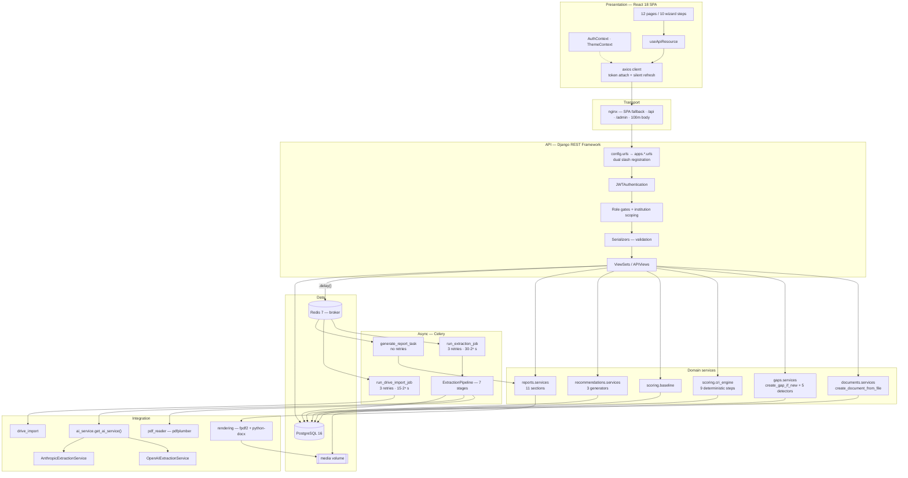

## 20.2 The AI pipeline in detail

```mermaid
flowchart TD
    START(["run_extraction_job(job_id)"]) --> LOAD["load ExtractionJob<br/>status=running, started_at"]
    LOAD --> S1["① classifying_documents — 15%"]
    S1 --> S1a["PDFPageReader: first 3 pages"]
    S1a --> S1b["🤖 get_ai_service().extract_structured_data<br/>CLASSIFICATION_SCHEMA"]
    S1b --> S1c["_validate(): confidence ∈ [0,1],<br/>nullable strings are strings-or-null"]
    S1c --> S2["② reading_pages — 30%"]
    S2 --> S2a{"extension == .pdf?"}
    S2a -->|no| S2b["format_supported=False — honest, not empty"]
    S2a -->|yes| S2c["pdfplumber: text + tables per page<br/>< 40 chars ⇒ requires_ocr"]
    S2c --> S2d["NullOCRProvider → returns None<br/>(no OCR backend yet — never a fabricated guess)"]
    S2d --> S2e["correct Document.ocr_required + ocr_warnings"]
    S2b --> S3
    S2e --> S3["③ extracting_facts — 45%"]
    S3 --> S3a["_build_chunks: ≤12 000 chars,<br/>never split a page, skip empty pages"]
    S3a --> S3b{"chunks > 20?"}
    S3b -->|yes| S3c["warn + truncate to 20"]
    S3b -->|no| S3d
    S3c --> S3d["per chunk: 🤖 FACT_EXTRACTION_SCHEMA"]
    S3d --> S3e["_validate_fact per fact<br/>types · enums · page citation · confidence"]
    S3e --> S3f["_merge_fact by field_key — keep highest confidence"]
    S3f --> S4["④ mapping_audit_fields — 60%<br/>IdentityAuditFieldMapper (pass-through)"]
    S4 --> S4a["INSERT ExtractedFact rows"]
    S4a --> S5["⑤ detecting_gaps — 75%<br/>RuleBasedGapDetector — NO AI"]
    S5 --> S5a["low_confidence / unconfirmed_fact per fact<br/>+ stale_data per document"]
    S5a --> S5b["create_gap_if_new — dedup + IntegrityError guard"]
    S5b --> S6["⑥ checking_conflicts — 90%"]
    S6 --> S6a["deterministic pre-filter:<br/>same field_key, different normalized_value"]
    S6a --> S6b{"pairs > 10?"}
    S6b -->|yes| S6c["warn + truncate to 10"]
    S6b -->|no| S6d
    S6c --> S6d["🤖 CONFLICT_SCHEMA per pair<br/>{is_conflict, confidence, explanation}"]
    S6d --> S6e["is_conflict=false ⇒ discard<br/>true ⇒ GapItem with immutable value snapshots"]
    S6e --> S7["⑦ preparing_review_workspace — 100%<br/>Document → processed"]
    S7 --> DONE["job → completed"]
    DONE --> ADV{"any job still active in this sprint?"}
    ADV -->|no| ADV1["sprint processing → reviewing<br/>+ generate_gaps_for_sprint()<br/>(adds missing_document gaps)"]
    ADV -->|yes| END(["end"])
    ADV1 --> END

    S1b -.->|"RecoverableExtractionError"| RETRY["retry ×3 — 30/60/120 s<br/>job status = retrying"]
    S3d -.->|"Recoverable"| RETRY
    S6d -.->|"Recoverable"| RETRY
    RETRY -.->|"exhausted"| FAIL["job → failed<br/>document → failed"]
    S1b -.->|"Permanent / unknown"| FAIL
```
---

# 21. Technology stack

| Layer | Technology | Version (as pinned) | Purpose |
|---|---|---|---|
| **Frontend** | React | `^18.2.0` | UI library |
| | TypeScript | `^5.2.2` | Type safety; `npm run build` runs `tsc` before Vite |
| | Vite | `^5.1.0` | Dev server (port 3000, `/api` proxy) + production bundler |
| | React Router DOM | `^6.22.0` | Client-side routing, 17 route entries — 15 screens plus two redirects |
| | Axios | `^1.6.7` | HTTP client + auth/refresh interceptors |
| | Tailwind CSS | `^3.4.1` | Styling (with `postcss` + `autoprefixer`) |
| | lucide-react | `^0.330.0` | Icon set |
| **Backend** | Python | 3.12 (Docker base + CI) | Runtime |
| | Django | `>=5.0,<5.1` | Web framework, ORM, admin, migrations |
| | Django REST Framework | `>=3.15.0` | API layer, serializers, permissions |
| | djangorestframework-simplejwt | `>=5.3.0` | JWT issue/verify + **token blacklist** |
| | django-cors-headers | `>=4.3.0` | CORS allowlist |
| | django-filter | `>=24.2` | Query filtering on list endpoints |
| | drf-spectacular | `>=0.27.0` | OpenAPI 3 schema, Swagger UI, ReDoc |
| | python-dotenv | `>=1.0.0` | `.env` loading |
| **Database** | PostgreSQL | 16 (`postgres:16-alpine`) | Primary datastore |
| | SQLite | bundled | Local-dev fallback when `DATABASE_URL` is unset |
| | psycopg2-binary | `>=2.9.0` | Postgres driver |
| | dj-database-url | `>=2.1.0` | DSN parsing, `conn_max_age=600` |
| **AI** | openai | `>=1.50.0,<2.0.0` | OpenAI + any OpenAI-compatible endpoint |
| | anthropic | `>=0.40.0,<1.0.0` | Claude, via forced tool call |
| | *default models* | `gpt-4o-mini` / `claude-haiku-4-5-20251001` | Per-provider defaults when no `AI_MODEL` is set |
| **Documents** | pdfplumber | `>=0.11.0,<0.12.0` | PDF text + table extraction (pure Python) |
| | fpdf2 | `>=2.7.0` | PDF report rendering |
| | python-docx | `>=1.1.0` | DOCX report rendering |
| | Pillow | `>=10.2.0` | Image handling (Django `ImageField` support) |
| | requests | `>=2.31.0` | Google Drive REST v3 calls |
| **Vector search** | pinecone | `>=5.0.0,<7.0.0` | Vector index for college-evidence retrieval. **Optional at runtime** — imported lazily, only when configured |
| | *embedding model* | `text-embedding-3-small` (manual mode) | Default embedding model; integrated indexes embed server-side instead (e.g. `llama-text-embed-v2`) |
| **Storage** | Local filesystem | — | `MEDIA_ROOT`, mounted as the `media_data` Docker volume. **No S3/GCS.** |
| **Queue** | Celery | `>=5.3.0` | Async task execution |
| | Redis | 7 (`redis:7-alpine`); client `>=5.0.0` | Broker (result backend nominally configured but ignored) |
| **Web server** | nginx | `1.27-alpine` | SPA serving, `/api` + `/admin` reverse proxy, static |
| **App server** | Gunicorn | `>=21.2.0` | WSGI, 3 workers, 120 s timeout |
| | uvicorn | `>=0.27.0` | Present in production requirements but **not used** — compose runs WSGI |
| **Deployment** | Docker + Compose v2 | — | Five services |
| | GitHub Actions | — | test → build → push → SSH deploy |
| | GHCR | — | Image registry |
| | GCP VM | — | Single host, `/opt/ai-ready` |
| **Dev tooling** | pytest-django `>=4.7.0`, black `>=24.1.0`, flake8 `>=7.0.0` | — | In `development.txt`; **CI runs `manage.py test`, not pytest, and never runs black/flake8** |

---

# 22. Dependencies

## 22.1 Backend (`requirements/base.txt` — 19 packages)

| Package | Why it is here |
|---|---|
| `Django>=5.0,<5.1` | Framework. Minor-pinned to 5.0.x — a deliberate, conservative range |
| `djangorestframework>=3.15.0` | The entire API layer |
| `django-cors-headers>=4.3.0` | The SPA is served from a different origin in dev |
| `djangorestframework-simplejwt>=5.3.0` | JWT + the blacklist app that makes logout real |
| `python-dotenv>=1.0.0` | `.env` loading in `settings.py` |
| `Pillow>=10.2.0` | Required by Django for image fields; images are in the upload allowlist |
| `celery>=5.3.0` | The three async tasks |
| `redis>=5.0.0` | Celery's broker transport |
| `drf-spectacular>=0.27.0` | OpenAPI schema + Swagger/ReDoc |
| `psycopg2-binary>=2.9.0` | Postgres driver (binary wheel — fine here; `psycopg2` source is preferred by some for production) |
| `dj-database-url>=2.1.0` | Single-variable DB config, with the SQLite fallback |
| `django-filter>=24.2` | `filterset_class` on facts, gaps, sprints, institutions, scoring config |
| `fpdf2>=2.7.0` | PDF rendering. Chosen over WeasyPrint/wkhtmltopdf because it needs **no system binaries** — the trade is Latin-1-only core fonts, handled by `_latin1()` |
| `python-docx>=1.1.0` | DOCX rendering (full UTF-8, unlike the PDF path) |
| `openai>=1.50.0,<2.0.0` | OpenAI SDK; **major-pinned** — sensible, the v1→v2 boundary is breaking |
| `anthropic>=0.40.0,<1.0.0` | Anthropic SDK; **major-pinned** for the same reason |
| `pdfplumber>=0.11.0,<0.12.0` | PDF reading; **tightly pinned** — its API moves between minors |
| `requests>=2.31.0` | Google Drive REST calls (the only place `requests` is used) |
| `pinecone>=5.0.0,<7.0.0` | Vector store; **major-bounded**. Listed as a runtime requirement but imported **lazily**, only when Pinecone is actually configured — the project boots, migrates and passes its full suite with the package absent |

**Development adds:** `pytest-django`, `black`, `flake8`.
**Production adds:** `gunicorn`, `uvicorn`.

## 22.2 Frontend (`package.json` — 5 runtime, 9 dev)

Runtime: `react`, `react-dom`, `react-router-dom`, `axios`, `lucide-react`.
Dev: `@vitejs/plugin-react`, `vite`, `typescript`, `@types/react`, `@types/react-dom`,
`tailwindcss`, `postcss`, `autoprefixer`.

**This is an unusually lean dependency set** — no UI kit, no state library, no form
library, no date library, no chart library. Everything is hand-rolled on Tailwind.

## 22.3 Assessment

| Observation | Detail |
|---|---|
| **Well-pinned where it matters** | The four volatile packages (`openai`, `anthropic`, `pdfplumber`, `pinecone`) all carry upper bounds; Django is minor-bounded |
| **One dependency is optional at runtime** | `pinecone` is the only package the code guards against being missing (a lazy import behind a configuration check). Everything else is imported unconditionally at startup |
| **Loosely pinned elsewhere** | Most packages are `>=` with no ceiling, and there is **no lockfile for Python** (no `requirements.lock`, no Poetry/uv/pip-tools). Two builds a month apart can resolve differently — the CI image and the deployed image may not match |
| **Frontend is locked** | `package-lock.json` is committed and CI uses `npm ci` — reproducible |
| **`uvicorn` is unused** | Listed in `production.txt`; compose runs `gunicorn config.wsgi`. `config/asgi.py` exists but nothing routes to it. Dead weight |
| **Dev tools are never enforced** | `black` and `flake8` are installed in CI (via `development.txt`) but no workflow step runs them |
| **`pytest-django` is installed but unused** | CI runs `python manage.py test`; there is no `pytest.ini`/`setup.cfg`/`pyproject.toml` configuring pytest |
| **`redis` (Python client) is a direct dependency** | Correct — Celery needs it for the Redis transport |
| **`Pillow`** | Justified by the image extensions in the upload allowlist, though no `ImageField` is actually declared |
| **No security scanning** | No `pip-audit`, `safety`, `npm audit`, or Dependabot config in the repo |

---

# 23. Important files

| File | Why it matters |
|---|---|
| `backend/config/settings.py` | **The single most informative file in the repo.** Every tunable, plus long comments explaining *why* each default was chosen (`APPEND_SLASH`, `CELERY_TASK_IGNORE_RESULT`, the AI provider strategy, the two upload limits, the production hardening block) |
| `backend/apps/accounts/models.py` | The `User` model, the 11 roles, and `CROSS_INSTITUTION_ROLES` — the root of the whole authorization model |
| `backend/apps/accounts/permissions.py` | Every reusable permission class and the institution-scoping helpers. Read this to understand who can do what |
| `backend/apps/sprints/models.py` | `ALLOWED_TRANSITIONS`, `BASELINE_LOCKED_STATUSES`, `STATUS_COMPLETION_MILESTONES` — the workflow's rulebook |
| `backend/apps/sprints/urls.py` | The full nested URL surface in one place |
| `backend/apps/extraction/services/ai_service.py` | Provider selection. Change this to add a provider |
| `backend/apps/extraction/services/pipeline.py` | The 7-stage orchestrator |
| `backend/apps/extraction/services/base.py` | The 7 ABCs that make every stage swappable |
| `backend/apps/extraction/services/openai_fact_extractor.py` | **The prompt, the JSON schema, the chunking, and the Python validation** — the highest-risk, highest-value file |
| `backend/apps/extraction/services/conflict_checker.py` | The "deterministic pre-filter, AI only for judgement" pattern |
| `backend/apps/extraction/tasks.py` | The retry policy and the sprint-advance trigger |
| `backend/apps/scoring/services/cri_engine.py` | The 9-step CRI calculation — the product's core intellectual property |
| `backend/apps/scoring/services/baseline.py` | The approval workflow and its locking rules |
| `backend/apps/scoring/constants.py` | The 8 pillar keys, engine version, and status thresholds |
| `backend/apps/gaps/services.py` | `create_gap_if_new` — the shared idempotency primitive |
| `backend/apps/gaps/models.py` | The three partial unique constraints |
| `backend/apps/documents/services.py` | `create_document_from_file()` — **the single ingestion path** for both upload and Drive import |
| `backend/apps/documents/constants.py` | Document types, required types, and the Drive checklist — **including the documented slug divergence** |
| `backend/apps/institutions/models.py` | Institution + the three DNA models, and the comment explaining which counts are stored vs. derived |
| `backend/apps/institutions/views.py` | `InstitutionScopedMixin` and the two institution permission classes — why DELETE differs between an institution and its sub-resources |
| `backend/apps/institutions/constants.py` | The five digital-maturity level descriptions |
| `backend/apps/reports/services.py` | The 11-section report builder |
| `backend/apps/vector_store/services/search.py` | `build_filter()` — the vector-side tenant boundary. **Read this to understand why one college cannot retrieve another's documents** |
| `backend/apps/vector_store/services/pinecone_client.py` | The only module importing the Pinecone SDK; both store classes, the deterministic id scheme, the metadata contract, and the error taxonomy |
| `backend/apps/vector_store/services/indexer.py` | read → hash → chunk → embed → upsert, and the content-hash short-circuit that makes re-indexing cheap |
| `backend/apps/vector_store/models.py` | Why the tracking row exists and why it holds no vectors |
| `backend/docs/VECTOR_STORE.md` | The vector store's own architecture document and operator setup guide |
| `backend/config/urls.py` | Root routing, **and the comment explaining why media is never served** |
| `backend/docs/API_CONTRACT.md` | A hand-written, frontend-audited contract; the best single reference for the API |
| `backend/apps/accounts/management/commands/seed_demo_users.py` | The 11 demo personas and the shared demo password |
| `frontend/src/api/client.ts` | Token attachment + the single-flight silent-refresh interceptor |
| `frontend/src/context/AuthContext.tsx` | The only global state |
| `frontend/src/App.tsx` | All routes + the session guard |
| `frontend/src/components/Sidebar.tsx` | The whole product plan in one file — two nav groups, which modules are live vs. inert, and the 10 audit steps |
| `frontend/src/pages/institutions/InstitutionList.tsx` | The Institution DNA landing page: the list, the create form, and per-row hard delete — plus the two role sets mirroring the backend's |
| `frontend/src/pages/institutions/InstitutionDetail.tsx` | One institution's workspace: 3 tabs, the derived-vs-stored count distinction, all editing |
| `frontend/src/pages/status/StatusDashboard.tsx` | Build-progress report. **Hand-maintained constants, no API** — read §25 before trusting its numbers |
| `frontend/src/utils/errors.ts` | DRF error normalisation + extraction-error humanisation |
| `frontend/src/pages/documents/UploadDataPack.tsx` | The largest screen; holds the frontend twin of the Drive checklist |
| `docker-compose.yml` | The five production services and their volumes |
| `.github/workflows/ci-cd.yml` | The full pipeline |
| `backend/docker-entrypoint.sh` | Why only the web process migrates |
| `frontend/nginx.conf` | SPA fallback, proxy rules, and the 100 MB body limit |
| `.env.production.example` | The complete production variable list |

---

# 24. Project execution guide

> Every command below is taken from `backend/README.md`, `docker-compose.yml`,
> `.github/workflows/ci-cd.yml`, `package.json`, or `backend/.env.example`.
> Nothing here is invented.

## Prerequisites

- **Python 3.12+**
- **Node.js 20+** (CI uses 20; the Dockerfile uses `node:20-alpine`)
- **Redis** (for Celery) — a local install or `docker run --rm -p 6379:6379 redis:7`
- **PostgreSQL 16** — *optional locally*; without `DATABASE_URL` the project falls
  back to SQLite
- **Docker + Docker Compose v2** — only for the production-shaped run

## Installation — backend

```bash
cd backend
python -m venv .venv
```

```bash
source .venv/bin/activate
```

On Windows use `.venv\Scripts\activate` instead.

```bash
pip install -r requirements/development.txt
```

## Environment setup

```bash
cp .env.example .env
```

Then edit `backend/.env`. The minimum for the app to boot is nothing at all (every
value has a default), but for a *useful* local run set:

- `SECRET_KEY` and `JWT_SECRET_KEY` — long random values
- `DEBUG=True`
- `ALLOWED_HOSTS=localhost,127.0.0.1`
- `CORS_ALLOWED_ORIGINS=http://localhost:3000`
- `CELERY_BROKER_URL` / `CELERY_RESULT_BACKEND` — point at your Redis
- `AI_API_KEY` — an OpenAI (`sk-…`) **or** Anthropic (`sk-ant-…`) key; the provider
  is auto-detected. Without it, extraction jobs fail with a clear configuration error
- `GOOGLE_DRIVE_API_KEY` — only if you want the Drive import path

**The vector store needs nothing here.** Leave `PINECONE_*` and `EMBEDDING_*` unset
and the app runs exactly as it did before that app existed. To switch it on you need
`PINECONE_API_KEY` and `PINECONE_INDEX_NAME` (create the index yourself first — this
app reads an index, it never creates one), plus `EMBEDDING_API_KEY` **only** if your
index does not embed server-side. `pip install -r requirements/base.txt` brings in
`pinecone`; without it the app still boots, and the endpoints answer `503`. Full
setup, including how to choose a dimension and metric, is in
`backend/docs/VECTOR_STORE.md`.

## Database setup

```bash
python manage.py migrate
```

This creates the schema **and** runs `scoring/0002_seed_pillars.py`, which seeds the
eight CRI pillars — without it, scoring produces zeros.

Then create a login. Either a superuser:

```bash
python manage.py createsuperuser
```

or the full 11-persona demo set (institution + one user per role):

```bash
python manage.py seed_demo_users
```

## Backend startup

```bash
python manage.py runserver
```

The API is at `http://localhost:8000/api/v1/…`; Swagger at `http://localhost:8000/api/docs`.

## Redis startup

```bash
redis-server
```

Or, containerised:

```bash
docker run --rm -p 6379:6379 redis:7
```

## Celery startup

In a second terminal, from `backend/` with the same environment:

```bash
celery -A config worker -l info
```

**On Windows the default prefork pool does not work** — use:

```bash
celery -A config worker -l info --pool=solo
```

**Celery Beat is not required and must not be started** — there are no periodic
tasks. If Redis or the worker is down, `POST /sprints/<id>/extraction-jobs` still
returns normally; the job row is marked `failed` with a clear `error_message`.

## Frontend startup

```bash
cd frontend
```

```bash
npm install
```

```bash
npm run dev
```

Runs on `http://localhost:3000` with `/api` proxied to `http://localhost:8000`.

## Build process

Frontend production bundle (type-check then build):

```bash
npm run build
```

Backend container image:

```bash
docker build -t ai-ready-backend ./backend
```

## Testing

```bash
python manage.py test
```

**578 tests** across 12 apps — `Ran 578 tests … OK (skipped=1)`, the single skip
being the opt-in real-API test below. **The AI, the embedding provider and Pinecone
are all mocked throughout**; no test makes a network call by default. To additionally
run the opt-in test that makes a **real, quota-spending API call**, set
`RUN_OPENAI_INTEGRATION_TESTS=true` first.

The suite takes roughly **14 minutes** on a developer machine against SQLite.

CI runs exactly this with `SECRET_KEY`, `JWT_SECRET_KEY`, `DEBUG=True`, and
`ALLOWED_HOSTS=localhost,127.0.0.1` set.

> There are **no frontend tests** — no test runner is configured in `package.json`.

## Production startup

On the deploy host (`/opt/ai-ready`), with a filled-in `.env` beside the compose file:

```bash
docker compose pull
```

```bash
docker compose up -d --remove-orphans
```

The backend container's entrypoint runs `migrate` and `collectstatic` automatically
(only for the gunicorn process — the celery container skips both). The app is served
on port **80** by the frontend container.

To create the first production account:

```bash
docker compose exec backend python manage.py createsuperuser
```

> **Do not run `seed_demo_users` in production** — it creates eleven accounts with a
> shared, publicly-known password (see §17 H2).

---

# 25. Dead / unused / scaffold code

| Item | Location | Assessment |
|---|---|---|
| `uvicorn` dependency + `config/asgi.py` | `requirements/production.txt`, `config/asgi.py` | **Unused.** Compose runs `gunicorn config.wsgi`. Django generates `asgi.py` by default, so it is scaffold rather than a mistake |
| `debug_task` | `config/celery.py` | **Unused.** Celery's standard scaffold task; harmless |
| `CELERY_RESULT_BACKEND` | `settings.py` | **Configured but deliberately inert** — `CELERY_TASK_IGNORE_RESULT = True` and nothing reads a result |
| `services/stub.py` classes | `apps/extraction/services/stub.py` | **Partially live.** `NullOCRProvider` is the active default inside `PDFPageReader`; the other stubs (`KnownMetadataClassifier`, `NullAuditFieldMapper`, …) are superseded by the real implementations and remain as documented fallbacks/test doubles |
| `OCRProvider` implementations | `services/base.py` | **`[PARTIAL]`** — the interface exists and is wired in, but no real OCR backend has been written. Scanned pages are honestly flagged, never guessed |
| Classification result | `pipeline.py` stage 1 | **Computed and discarded.** A full AI call produces `{document_type, document_title, reporting_year, institution_name, confidence, reasoning}`; only `processing_status='classified'` is saved. `Document.quality_score` is never written either |
| `Document.quality_score` | `documents/models.py` | **Never populated** by any code path |
| `page.extract_tables()` output | `pdf_reader.py` | **Computed but never consumed** — no downstream stage reads `page['tables']` |
| `pytest-django` | `requirements/development.txt` | **Installed, never used** — CI runs `manage.py test` and there is no pytest config file |
| `black`, `flake8` | `requirements/development.txt` | **Installed, never run** — no CI step, no pre-commit config |
| `IsSuperAdmin`, `IsConsultant`, `IsInstitutionAdmin`, `IsReadOnly` | `accounts/permissions.py` | **Defined but not referenced** by any view — the composite gates are used instead. Reasonable to keep as a toolkit |
| **Status Dashboard data** | `pages/status/StatusDashboard.tsx` | **Hand-maintained, not measured.** `PLAN_MODULES`, `AUDIT_STEPS`, `OPS_READINESS`, `ACTIVITY` and `BUILD_QUEUE` are module-level constants; the page makes **no API call**. Nothing in the backend computes a "% complete", and the file says so. The headline figures (modules live, plan coverage, modules not started) *are* derived from `PLAN_MODULES` rather than typed, so they cannot contradict the list beneath them — but the per-step percentages are engineering judgement and go stale unless someone updates them. Treat it as a status *report*, not a metric |
| `SprintMode` enum + `Sprint.mode` column | `sprints/models.py` | **No longer reachable from the UI.** The setup screen's mode picker was removed; every new sprint takes the model default. The column and enum remain, so reviving the choice is a UI change only |
| `Institution.is_active` | `institutions/models.py` | **Effectively vestigial.** DELETE is now a hard cascade, so nothing sets it `False` any more; it only lingers on rows removed before that change. Still read by the list page, which hides its Status column when no inactive row exists |
| `apps/vector_store/urls.py` | `vector_store/` | **Empty by design**, and says so — every route lives in `sprints/urls.py` with the other nested sub-resources. The module exists so the app owns a URLConf if a non-nested route is ever needed |
| **Vector store endpoints** | `vector_store/views.py` | **Implemented and tested, but no frontend calls them.** All three are reachable only via the API or the OpenAPI docs; no page in the SPA triggers indexing or renders evidence results yet |
| `index_sprint_vectors` | `vector_store/tasks.py` | **Not triggered by any endpoint** — `POST /vector-index` queues per-document tasks directly. It exists as the fan-out entry point for a scheduled or management-command re-index |
| `PineconeVectorStore` (manual mode) + `OpenAIEmbeddingService` | `vector_store/services/pinecone_client.py`, `services/embeddings.py` | **Implemented and unit-tested, but only one of the two modes runs in any given deployment.** Against an *integrated* index this whole path — and the embedding provider with it — is never entered. Not dead: the mode is a real deployment choice, selected by `PINECONE_EMBEDDING_MODE` |
| `dump.rdb` (root and `backend/`) | repo root, `backend/` | **Stray local Redis snapshots.** Correctly git-ignored (`dump.rdb`, `*.rdb`); safe to delete |
| `.e2e_sprint2`, `.e2e_token2` | `backend/` | **Leftover local scratch files** from manual end-to-end testing. Untracked; safe to delete |
| `celery_worker.log` | `backend/` | **Leftover local log file** |
| `db.sqlite3` (2.1 MB) | `backend/` | **Local dev database.** Correctly git-ignored |
| Trailing-slash duplicate routes | every `urls.py` | **Intentional, not dead** — documented as accommodating the frontend's inconsistent calls with `APPEND_SLASH=False` |
| `Recommendation.consultant_notes` | `recommendations/models.py` | Declared and serialised, but no generator writes it — it exists for consultant editing via `PATCH` |
| `DriveImportJob.Status.PENDING` | `documents/models.py` | Set at creation but the task immediately moves to `SCANNING`; effectively transient |

**Genuinely dead code is minimal.** Most of what looks unused is either a documented
seam for future work (the OCR provider, the stub implementations) or deliberate
scaffolding. The two real inefficiencies are the **discarded classification result**
and the **unused table extraction**.

## Implementation-status summary

| Status | Items |
|---|---|
| **Implemented** | Auth, institutions, **Institution DNA**, sprints + state machine, uploads, Drive import, the full 7-stage AI pipeline, multi-provider AI, fact review + history, 5 gap detectors + AI conflicts, the 9-step CRI engine, baseline approval, 3 recommendation generators, versioned PDF/DOCX reports, dashboard, **Project Status Dashboard**, plan-shaped navigation, **the Pinecone vector store (backend + API)**, OpenAPI docs, 578 tests, Docker/CI/CD |
| **Partial** | OCR (interface + honest flagging, no backend); non-PDF documents (accepted and stored, but unreadable and unexplained to the user); classification (called, validated, then discarded); **vector store — backend complete and tested, but no UI consumes it** |
| **Planned / absent** | User registration, password reset, email/notifications, Celery Beat, object storage, caching, monitoring, TLS, backups, frontend tests, rate limiting, **the benchmarking framework the vector store was built to feed** |
| **Dead / stray** | `uvicorn`, `debug_task`, unused permission classes, `dump.rdb`, `.e2e_*`, `celery_worker.log`, unread `tables` payload |
---

# 26. "How the project works" — presentation script

*A 5–10 minute explanation for a manager or a new team member. Read it top to bottom.*

---

### What is this project?

This is the **AIOS AI Readiness Discovery Sprint Platform**, built by InGage
Technologies. It answers one question for a college or university: *"How ready is
this institution to adopt AI?"* — and it produces a number, an explanation, and a
plan.

The output is a **Campus Readiness Index**: a score out of 100 across eight areas,
backed by a separate confidence figure that says how much real evidence sits behind
that score.

---

### Why was it built?

Because doing this by hand takes weeks. A consultant reads hundreds of pages of
accreditation paperwork — NAAC self-study reports, AQAR returns, AICTE approvals,
faculty lists, placement reports — pulls numbers out, chases the right person on
campus to confirm each one, and writes a bespoke report.

This platform compresses that to **24 to 48 hours**, and — importantly — makes the
result *traceable*. Every number in the final report can be followed back to the
exact sentence, on the exact page, of the exact document it came from.

---

### Who uses it?

Two groups.

**InGage's own staff** — consultants and super admins — who can see across every
institution on the platform.

**Campus staff** at the institution being assessed — the Principal, the IQAC
Coordinator, the Registrar, HODs, the HR Officer, the Lab Admin, the Placement
Officer, faculty, and a read-only Trustee viewer. They can only ever see their own
institution's data; that boundary is enforced on every single request.

The reason there are so many campus roles is that **data ownership is distributed**.
The person who can confirm "how many faculty hold AI certifications" is the HR
Officer, not whoever happened to upload the file. The platform routes each fact to
the role that can actually vouch for it.

---

### What happens when a user starts?

They sign in and land on a dashboard showing every sprint they can see. Then they
walk a **ten-step wizard** — literally numbered 1 to 10 in the sidebar:

1. **Sprint Setup** — pick the institution, name the engagement.
2. **Upload Data Pack** — drag in documents, *or* paste one Google Drive folder link
   and let the system fetch everything.
3. **AI Processing Monitor** — click start, then watch a live progress bar.
4. **Extracted Facts Review** — check what the AI found.
5. **Gap Dashboard** — work through what's missing or contradictory.
6. **Owner Workspace** — each campus role confirms their own facts.
7. **Live CRI Preview** — see the score.
8. **Baseline Approval** — a consultant signs it off.
9. **Recommendations** — the system proposes actions with expected score gains.
10. **Report & Export** — download the PDF or Word document.

---

### What are the major modules?

On the backend, **eleven Django apps**, each owning one part of the domain:
accounts (people and permissions), institutions, sprints, documents, extraction,
facts, gaps, scoring, recommendations, reports, and dashboard.

On the frontend, a **React single-page app**. Its navigation is the approved
12-module product plan; four modules are built, and the ten-step audit wizard is
the deepest of them.

The three that matter most:

- **`extraction`** — the AI pipeline. This is where the intelligence lives.
- **`scoring`** — the CRI engine. This is the product's core intellectual property.
- **`accounts`** — the permission model. This is what keeps institutions apart.

---

### How does data move through the system?

Start to finish:

A user uploads a PDF. The API validates it — size, file type, and a checksum so the
same file can't be uploaded twice — and saves it.

The user clicks "Start AI Processing." The API creates a **job record**, hands the
job to a **background queue**, and returns immediately. It does not wait — a single
document can take minutes.

A **background worker** picks the job up and runs seven stages: classify the
document, read every page, extract facts, map them, detect gaps, check for
conflicts, and finish. It updates the job's progress after each stage, so the
browser — which polls every three seconds — can show a live bar.

When the facts land in the database, campus staff confirm or correct them. **Only
confirmed or corrected facts count toward the score** — an unreviewed AI guess
scores nothing.

Then the scoring engine reads those confirmed facts, weighs them against eight
configurable pillars, subtracts points for unresolved gaps, and produces the CRI.
A consultant approves it, recommendations are generated from the same data, and a
report is rendered as PDF and Word.

---

### Where is the database used?

Everywhere — it is the system's memory and its audit trail. PostgreSQL holds the
institutions, users, sprints, documents, every extracted fact, every gap, every
score, every approval, and every report.

Two things are worth pointing out.

First, **history is never overwritten.** Every time someone corrects a fact, the old
value is written to a history table first. Every scoring run is a new row, never an
update. Every report is a new version. When a baseline is approved, it is pinned to
one specific scoring run, and the database physically prevents that run from being
deleted.

Second, **the rules are in the database, not just the code.** "A student can't have
two active gaps of the same type for the same fact" isn't a check in Python that
could be raced — it's a constraint the database enforces.

---

### Where is AI used?

In exactly **three places**, and deliberately nowhere else.

1. **Classifying a document** — one call, reading the first three pages.
2. **Extracting facts** — the main event. The document is split into chunks and each
   chunk is sent with a strict schema the model must fill in.
3. **Deciding whether two facts genuinely contradict each other** — and only after
   plain code has already found that they disagree.

Everything else — gap detection, scoring, recommendations — is **deterministic
business logic with no AI at all**. That's a stated design principle in the code:
don't replace a rule with a model unless the task actually needs judgement.

Two more things about the AI worth telling anyone technical:

**The provider is swappable by changing one environment variable.** Paste an OpenAI
key and it uses OpenAI; paste an Anthropic key and it uses Claude. The system reads
the key's format and picks. No code change.

**The AI is not trusted.** The prompt tells it never to invent a number and always
to quote its source — but then Python re-checks every single field it returns. If it
cites a page that wasn't in the text we sent it, that fact is thrown away. If its
confidence score isn't between 0 and 1, thrown away. If it names a pillar that
doesn't exist, thrown away. One bad fact is dropped; the rest of the document
continues.

---

### Where are files stored?

On the server's own disk, in a Docker volume shared between the web process and the
background worker. Uploaded documents and generated reports live there.

Critically, **that folder is never exposed to the web.** There's a comment in the
code explaining why: these are confidential institutional documents, and serving the
folder directly would mean no authentication at all. Every download goes through an
API endpoint that checks who you are and whether you belong to that institution.

---

### What happens in the background?

Three jobs run on a queue, using Redis as the message broker and Celery as the
worker:

1. **Document extraction** — the AI pipeline. Retries three times with increasing
   delays if the AI service is rate-limited or times out.
2. **Google Drive import** — walks the folder, matches filenames against a
   checklist, downloads and imports. If one file fails, it's recorded with a reason
   and the rest continue.
3. **Report generation** — builds the eleven sections and renders PDF and Word.
   Deliberately does *not* retry, because it only reads data that's already been
   validated — a failure there is a real bug worth surfacing, not a hiccup.

There are **no scheduled or recurring jobs**. Everything is triggered by a user
action.

And if the queue is down entirely, the API doesn't crash — it creates the job
record, marks it failed with a clear message, and returns normally.

---

### How is the project deployed?

Push to `main` on GitHub. GitHub Actions runs the full backend test suite — 578
tests — and builds the frontend. If both pass, it builds two Docker images, pushes
them to GitHub's container registry, then SSHes into a Google Cloud VM and pulls
them.

Five containers run there: the database, Redis, the Django API, the Celery worker,
and nginx serving the React app and proxying the API.

Database migrations run automatically when the web container starts — and only the
web container, so the worker can't race it.

---

### If you remember three things

1. **Every number is traceable.** Fact → snippet → page → document → upload → person
   who confirmed it. Nothing in the final report is unsourced.
2. **AI proposes; humans decide; code scores.** The AI never sets a score, never
   picks a winner in a conflict, and never has its output trusted without
   re-validation.
3. **History is append-only.** Corrections, approvals, scoring runs, and reports all
   accumulate rather than overwrite — which is what makes an approved baseline
   defensible months later.

---

# 27. Final project summary

## Architecture summary

A **containerised, monolithic Django REST API** with a **React SPA** and a **Celery
worker sharing the same image**, on **PostgreSQL** and **Redis**, behind **nginx**,
deployed to a single **GCP VM** via **GitHub Actions → GHCR → SSH**.

The backend is organised as **twelve domain apps**, with business logic pushed into
`services/` modules that are independent of HTTP and Celery — so the CRI engine, the
gap detectors, the report builder and the vector indexer can all be unit-tested
directly. The **extraction pipeline is built on seven abstract interfaces**, making
each stage individually replaceable without touching orchestration or retry logic;
the vector store follows the same pattern with `EmbeddingService` and its two
Pinecone store classes.

The twelfth app, `vector_store`, is **strictly additive**: unconfigured, it queues
nothing, writes nothing, and changes no other subsystem's behaviour.

## Main workflows

1. **Intake** — upload files or import a Google Drive folder, through one shared,
   validated ingestion path.
2. **Extraction** — a 7-stage async pipeline: classify → read → extract → map →
   detect gaps → check conflicts → prepare workspace.
3. **Review** — confirm/correct/reject facts and resolve gaps, all append-only.
4. **Scoring** — a deterministic 9-step engine over 8 configurable pillars.
5. **Approval** — baseline sign-off that locks the score against further drift.
6. **Delivery** — data-derived recommendations and a versioned PDF/DOCX report.

*Optional, off the main line:* **indexing** — a processed document's text is chunked
and embedded into Pinecone, and **evidence search** returns the college's own
passages for a natural-language query, each cited to a document and page. Nothing in
workflows 1–6 depends on it.

## Key technologies

Python 3.12 · Django 5 · DRF · SimpleJWT · Celery · Redis · PostgreSQL 16 ·
OpenAI + Anthropic SDKs · Pinecone (optional) · pdfplumber · fpdf2 · python-docx ·
React 18 · TypeScript · Vite · Tailwind · Axios · Docker Compose · nginx · Gunicorn ·
GitHub Actions.

## Critical components

| Component | Why critical |
|---|---|
| `extraction/services/openai_fact_extractor.py` | Prompt, schema, chunking, and validation — the product's accuracy lives here |
| `scoring/services/cri_engine.py` | The scoring IP; deterministic and version-fingerprinted |
| `accounts/permissions.py` | The entire multi-tenant boundary |
| `documents/services.py` | The single ingestion path for both upload routes |
| `gaps/services.py::create_gap_if_new` | The shared idempotency primitive |
| `extraction/services/ai_service.py` | Provider swappability |
| `vector_store/services/search.py::build_filter` | The vector-side tenant boundary — the `college_id` filter no call site can omit |
| `frontend/src/api/client.ts` | Auth and silent refresh in one place |
| `docker-entrypoint.sh` | Migration safety across two containers sharing an image |

## External dependencies

An AI provider (OpenAI, Anthropic, or an OpenAI-compatible endpoint), Google Drive
REST v3, Redis, PostgreSQL, and GHCR — plus **Pinecone and an embedding provider,
both optional** and both inert unless configured. **No email, no object storage, no
payment, no analytics, no error-tracking service.**

## Current strengths

1. **Exceptional in-code documentation.** Nearly every non-obvious decision carries
   a comment explaining *why*, including the alternatives rejected. This is rare and
   genuinely valuable.
2. **A serious anti-hallucination posture.** Strict schemas, "prefer null over
   guessing", mandatory source snippets, verified page citations, and full Python
   re-validation of every AI field.
3. **AI used surgically.** Deterministic rules everywhere they suffice; AI only for
   the one judgement that needs it.
4. **Append-only audit trails throughout**, including a `PROTECT` FK that makes an
   approved baseline's scoring run undeletable.
5. **Invariants enforced in the database**, not only in services — three partial
   unique constraints on gaps, checksum uniqueness on documents, version uniqueness
   on reports.
6. **578 backend tests**, covering permissions, institution scoping, and the AI
   paths (mocked), plus an opt-in real-API integration test.
7. **Graceful degradation.** Broker down, Drive misconfigured, AI unconfigured,
   Pinecone unconfigured, SDK not even installed, non-PDF document — each produces a
   clear, actionable message rather than a 500.
8. **A configurable scoring rubric** whose version fingerprint changes automatically
   when an admin retunes a weight.
9. **A clean, lean frontend** with a correctly-implemented single-flight token
   refresh.
10. **The newest subsystem was added without disturbing the old ones.** The vector
    store is a leaf: a lazy SDK import, a guarded hand-off from extraction, a filter
    it builds rather than accepts, and a feature flag that is simply the absence of
    configuration. Turning it off is not a code path — it is the default.

## Current weaknesses

1. **No TLS anywhere in the repo**, combined with `SECURE_SSL_REDIRECT` defaulting on.
2. **Demo credentials shipped in the production login bundle.**
3. **No rate limiting, no account lockout, no monitoring, no backups.**
4. **Insecure `SECRET_KEY` fallback** with no fail-fast.
5. **No frontend tests at all**, and no code splitting.
6. **Checklist slug divergence** between Drive import and required document types —
   a live functional defect that can block baseline approval.
7. **Only PDFs are actually readable**, but five other formats are accepted with no
   user-facing explanation.
8. **No OCR backend**, so scanned documents yield nothing.
9. **N+1 query patterns** in conflict checking, gap generation, and recommendations.
10. **Aggressive 3-second polling** with no backoff.
11. **No Python lockfile** — builds are not reproducible.
12. **Institutional document text is sent to a third-party AI provider** with no
    redaction or consent record.

## Technical debt

| Item | Cost |
|---|---|
| `DRIVE_IMPORT_CHECKLIST` ↔ `DOCUMENT_TYPES` slug divergence, kept in sync by hand across two repos' worth of files | Silent functional breakage |
| Classification result computed then discarded | A wasted AI call per document |
| `page.extract_tables()` computed then discarded | Wasted parse time and memory |
| `uvicorn` + `asgi.py` shipped but unused | Confusion |
| `pytest-django`, `black`, `flake8` installed but never run | False assurance |
| Dual slash-registration on every route | Doubles the URL surface; a frontend cleanup would remove it |
| Single 300-line `settings.py` with no environment split | Harder to reason about as environments diverge |
| No lockfile for Python dependencies | Build drift |
| `IsSuperAdmin`/`IsConsultant`/`IsInstitutionAdmin`/`IsReadOnly` unused | Dead API surface |

## Security risks

| Rank | Risk |
|---|---|
| 1 | Insecure `SECRET_KEY`/`JWT_SECRET_KEY` fallback → forgeable admin tokens |
| 2 | Demo emails + hardcoded `Password123!` with one-click login in the shipped bundle |
| 3 | No TLS; `SECURE_SSL_REDIRECT` on by default with nothing listening on 443 |
| 4 | No login throttling or lockout |
| 5 | Django admin publicly exposed, no IP restriction, no 2FA |
| 6 | Non-rotating 1-day refresh tokens in `localStorage` |
| 7 | API docs (`/api/docs`, `/api/schema`) unauthenticated in production |
| 8 | Drive import requires public link-sharing of institutional folders |
| 9 | No content inspection of uploads (`.zip` accepted, never processed) |
| 10 | No PII redaction before third-party AI calls |
| 11 | No encryption at rest, no backups |
| 12 | `viewer` role can read all raw facts, gaps, and unpublished reports |

## Performance risks

| Rank | Risk |
|---|---|
| 1 | Uncached ~1 500-token system prompt resent up to 20× per document |
| 2 | N+1 in `conflict_checker._candidate_pairs` (one query per fact) |
| 3 | N+1 in gap generation (two queries per fact) |
| 4 | `~20 count()` queries in `GET /sprints/{id}/overview` |
| 5 | 3-second polling with no backoff or termination |
| 6 | No composite indexes on the hot filter columns (except `vector_store`'s own) |
| 7 | Celery concurrency 2 caps throughput at two documents at a time |
| 8 | Gunicorn's 3 sync workers can be starved by the heavy overview endpoint |
| 9 | No caching layer, despite Redis already being deployed |
| 10 | No frontend code splitting; every page in the initial bundle |
| 11 | Unvirtualised lists; the API supports pagination the frontend never requests |

## Recommended improvements

### P0 — Critical (do before, or immediately after, any real deployment)

1. **Remove the `SECRET_KEY` fallback and fail fast.** Raise `ImproperlyConfigured`
   when `SECRET_KEY` or `JWT_SECRET_KEY` is missing and `DEBUG` is off. A refused
   boot is far better than a live app signing tokens with a published key.
2. **Strip the demo credentials from the production bundle.** Remove `SEEDED_ROLES`
   and the quick-login buttons (or gate them behind `import.meta.env.DEV`), clear the
   pre-filled email/password, and delete the `password = 'Password123!'` default in
   `AuthContext.login`. Then rotate every seeded account's password on any host where
   `seed_demo_users` has run.
3. **Terminate TLS.** Add a certificate (certbot or a managed load balancer), expose
   443, and keep `SECURE_SSL_REDIRECT=True`. If TLS genuinely cannot be added yet,
   set `SECURE_SSL_REDIRECT=False` explicitly and treat the deployment as
   non-production.
4. **Add DRF throttling**, especially a tight `AnonRateThrottle` on `/auth/login`.
5. **Restrict `/admin/`** by IP at the nginx layer, or remove the proxy block
   entirely and reach it over an SSH tunnel.
6. **Fix the checklist slug divergence** so Drive-imported required documents
   actually satisfy the `missing_document` gap check.

### P1 — High

7. **Enable prompt caching** on the fact-extraction system prompt — the single
   largest cost reduction available, with no behaviour change.
8. **Disable `/api/docs` and `/api/schema` when `DEBUG=False`**, or put them behind
   authentication.
9. **Rotate refresh tokens** (`ROTATE_REFRESH_TOKENS=True` +
   `BLACKLIST_AFTER_ROTATION=True`).
10. **Fix the three N+1 patterns** (conflict pre-filter, gap generation,
    recommendation owner-role derivation).
11. **Add database backups** — a scheduled `pg_dump` off the VM at minimum.
12. **Add error tracking** (Sentry or equivalent) and container healthchecks for
    `backend`, `celery`, and `frontend`, plus a post-deploy verification step in the
    workflow.
13. **Tell the user when a file type cannot be read.** Surface
    `format_supported: False` in the monitor screen instead of silently producing
    zero facts.
14. **Add a stuck-job sweeper** — either a management command run by cron, or
    introduce Beat for this one purpose.

### P2 — Medium

15. **Batch the conflict checker** into one multi-pair AI call.
16. **Reuse stage 2's page read in stage 1**, saving a redundant PDF parse per document.
17. **Persist the classification result** (or drop the call) — currently a full AI
    call is spent and thrown away.
18. **Add composite indexes** on `facts(sprint_id, status)`,
    `gaps(sprint_id, status, priority)`, `documents(sprint_id, status)`.
19. **Cache `GET /dashboard`, `/sprints/{id}/overview`, and `/scoring/config`** in
    the Redis that is already deployed.
20. **Add code splitting** (`React.lazy` per route) and an `ErrorBoundary`.
21. **Add polling backoff** and stop polling once every job is terminal.
22. **Pin Python dependencies** with a lockfile (pip-tools, uv, or Poetry).
23. **Run `black` and `flake8` in CI**, since they are already installed.
24. **Add frontend tests** — Vitest + Testing Library, starting with the auth
    interceptor and the wizard guards.
25. **Add role-aware frontend routing** so a `viewer` isn't shown actions that will 403.

### P3 — Low

26. Remove `uvicorn`, `asgi.py`, `debug_task`, and the unused permission classes.
27. Delete the stray `dump.rdb`, `.e2e_sprint2`, `.e2e_token2`, and `celery_worker.log`.
28. Stop extracting `page.tables` until something consumes it.
29. Consolidate the dual slash-registered routes once the frontend calls are
    normalised.
30. Split `settings.py` into `base/dev/prod` modules.
31. Set an explicit AI `temperature` for reproducible extraction.
32. Add a `README.md` at the repository root — there currently isn't one; only
    `backend/README.md` exists.
33. Consider a Google **service account** for Drive import, so institutions no longer
    have to share folders publicly.

---

*End of report.*
